# Folder Structure

## Metadata

- **Name**: Folder Structure
- **Type**: Enabler
- **ID**: ENB-782116
- **Approval**: Approved
- **Capability ID**: CAP-290474
- **Owner**: Product Team
- **Status**: Ready for Implementation
- **Priority**: High
- **Analysis Review**: Required
- **Code Review**: Not Required

## Technical Overview
### Purpose
Ensure the project maintains a clean folder structure with implementation separated from specifications and documentation. All implementation must reside in a dedicated subfolder named after the project (e.g., objectstorage_impl/), keeping the root directory organized and preventing mixing of specifications with implementation files.

## Functional Requirements

| ID | Name | Requirement | Priority | Status | Approval |
|----|------|-------------|----------|--------|----------|
| FR-097067 | Separate Implementation Folder | Create a dedicated subfolder named after the project (e.g., `objectstorage_impl/`) that contains ALL environment and compose files. The root folder must only contain specifications/, documentation, and project-level files. | Must Have | Ready for Implementation | Approved |

## Non-Functional Requirements

| ID | Name | Type | Requirement | Priority | Status | Approval |
|----|------|------|-------------|----------|--------|----------|
| | | | | | | |

## Dependencies

### Internal Upstream Dependency

| Enabler ID | Description |
|------------|-------------|
| | |

### Internal Downstream Impact

| Enabler ID | Description |
|------------|-------------|
| | |

### External Dependencies

**External Upstream Dependencies**: None identified.

**External Downstream Impact**: None identified.

## Technical Specifications (Template)

### Enabler Dependency Flow Diagram

```mermaid
flowchart TD
    ENB_ID["ENB-ID<br/>Enabler Name<br/>📡"]
    
    %% Add your dependency flows here
    
    classDef enabler fill:#e3f2fd,stroke:#1976d2,stroke-width:2px
    class ENB_ID enabler
```

### API Technical Specifications (if applicable)

| API Type | Operation | Channel / Endpoint | Description | Request / Publish Payload | Response / Subscribe Data |
|----------|-----------|---------------------|-------------|----------------------------|----------------------------|
| | | | | | |

### Data Models

### Class Diagrams

### Sequence Diagrams

### Dataflow Diagrams

### State Diagrams

