# RESTful API

## Metadata

- **Name**: RESTful API
- **Type**: Capability
- **System**: pc
- **Component**: web-service
- **ID**: CAP-847291
- **Approval**: Approved
- **Owner**: Product Team
- **Status**: Ready for Implementation
- **Priority**: High
- **Analysis Review**: Required

## Technical Overview
### Purpose
Standard web service template

## Enablers

| Enabler ID |
|------------|
| ENB-979148 |

## Dependencies

### Internal Upstream Dependency

| Capability ID | Description |
|---------------|-------------|
| N/A | No upstream dependencies |
| CAP-978643 | Web Service capability runs within this environment |

### Internal Downstream Impact

| Capability ID | Description |
|---------------|-------------|
| CAP-978746 | Player Character CRUD API |

### External Dependencies

**External Upstream Dependencies**: None identified.

**External Downstream Impact**: None identified.

## Technical Specifications

### Capability Dependency Flow Diagram

```mermaid
flowchart TD
    %% Current Capability
    CURRENT["CAP-847291<br/>RESTful API<br/>🔌"]
    
    %% Internal Supporting Capabilities
    INT1["CAP-978643<br/>Environments<br/>🌐"]
    INT2["CAP-978542<br/>Implementation Practices<br/>⚙️"]
    
    %% Downstream Impacts
    DOWN1["CAP-978441<br/>Unit Testing<br/>🎯"]
    
    %% Dependencies Flow
    INT1 --> INT2
    INT2 --> CURRENT
    CURRENT --> DOWN1
    
    %% Styling
    classDef current fill:#e3f2fd,stroke:#1976d2,stroke-width:3px
    classDef internal fill:#e8f5e8,stroke:#388e3c,stroke-width:2px
    classDef downstream fill:#fff3e0,stroke:#f57c00,stroke-width:2px
    
    class CURRENT current
    class INT1,INT2 internal
    class DOWN1 downstream
    
    %% Capability Grouping
    subgraph ORG1 ["Internal Organization - Web Service"]
        subgraph DOMAIN1 ["Foundation Domain"]
            INT1
            INT2
        end
        subgraph DOMAIN2 ["API Domain"]
            CURRENT
        end
        subgraph DOMAIN3 ["Quality Assurance Domain"]
            DOWN1
        end
    end
```



### Design Overview

This capability provides the core RESTful API functionality for the web service, including HTTP routing, request validation, authentication, health monitoring, and interactive documentation.

**Key Design Principles:**
- **RESTful Standards**: Follow OpenAPI 3.0 specification and HTTP best practices
- **Security First**: JWT authentication for protected endpoints
- **Documentation**: Auto-generated interactive Swagger UI
- **Observability**: Health check endpoints for monitoring and orchestration
- **Validation**: Request/response validation with structured error handling

**API Architecture:**
- **Base Path**: `/api/v1` for all API endpoints
- **Documentation**: `/api-docs` for Swagger UI
- **Health Checks**: `/health`, `/health/live`, `/health/ready`
- **Authentication**: `/auth/login`, `/auth/refresh`, `/auth/logout`

**Response Format:**
```json
{
  "data": {...},
  "success": true,
  "message": "Operation completed"
}
```

**Error Format:**
```json
{
  "error": "error_code",
  "message": "Human-readable message",
  "statusCode": 400,
  "details": [...]
}
```

