# Unit Testing

## Metadata

- **Name**: Unit Testing
- **Type**: Capability
- **System**: pc
- **Component**: web-service
- **ID**: CAP-978441
- **Approval**: Approved
- **Owner**: Product Team
- **Status**: Ready for Implementation
- **Priority**: High
- **Analysis Review**: Required

## Technical Overview
### Purpose
Ensures all API call have unit tests and integration tests that exercise the specification functional requirements

## Enablers

| Enabler ID |
|------------|
| ENB-979855 |

## Dependencies

### Internal Upstream Dependency

| Capability ID | Description |
|---------------|-------------|
| | |

### Internal Downstream Impact

| Capability ID | Description |
|---------------|-------------|
| | |

### External Dependencies

**External Upstream Dependencies**: None identified.

**External Downstream Impact**: None identified.

## Technical Specifications

### Capability Dependency Flow Diagram

```mermaid
flowchart TD
    %% Current Capability
    CURRENT["CAP-978441<br/>Unit Testing<br/>🎯"]

    %% Internal Supporting Capabilities
    INT1["CAP-847291<br/>RESTful API<br/>�"]
    INT2["CAP-978542<br/>Implementation Practices<br/>⚙️"]
    INT3["CAP-978643<br/>Environments<br/>🌐"]

    %% Dependencies Flow - Unit Testing validates API implementation
    INT3 --> INT2
    INT2 --> INT1
    INT1 --> CURRENT

    %% Styling
    classDef current fill:#e3f2fd,stroke:#1976d2,stroke-width:3px
    classDef internal fill:#e8f5e8,stroke:#388e3c,stroke-width:2px

    class CURRENT current
    class INT1,INT2,INT3 internal

    %% Capability Grouping
    subgraph ORG1 ["Internal Organization - Web Service"]
        subgraph DOMAIN1 ["Quality Assurance Domain"]
            CURRENT
        end
        subgraph DOMAIN2 ["Implementation Domain"]
            INT1
            INT2
            INT3
        end
    end
```

### Design Overview

This capability ensures quality and correctness of the web service through comprehensive automated testing. The testing strategy validates all API operations, business logic, and error handling scenarios to prevent regressions and ensure specification compliance.

**Key Design Principles:**
- Test all API endpoints (GET, POST, PUT, DELETE, PATCH)
- Validate request/response formats and status codes
- Test error scenarios and edge cases
- Achieve minimum 90% code coverage
- Fast execution (< 5 seconds for all unit tests)
- Isolated tests (no dependencies between tests)

