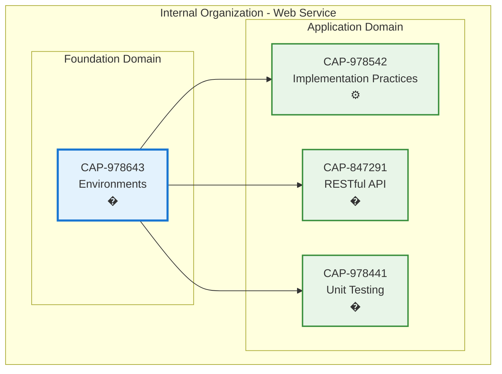

# Environments

## Metadata

- **Name**: Environments
- **Type**: Capability
- **System**: pc
- **Component**: web-service
- **ID**: CAP-978643
- **Approval**: Approved
- **Owner**: Product Team
- **Status**: Ready for Implementation
- **Priority**: High
- **Analysis Review**: Required

## Technical Overview
### Purpose
Provide a comprehensive environment support and configuraiton across development, testing, and production.

## Enablers

| Enabler ID |
|------------|
| ENB-979552 |

## Dependencies

### Internal Upstream Dependency

| Capability ID | Description |
|---------------|-------------|
| N/A | No upstream dependencies |

### Internal Downstream Impact

| Capability ID | Description |
|---------------|-------------|
| CAP-847291 | Web Service capability runs within this environment |

### External Dependencies

**External Upstream Dependencies**: Operating system, runtime engines (Node.js, Python, .NET, etc.), package managers

**External Downstream Impact**: All application capabilities depend on this environment for execution

## Technical Specifications

### Capability Dependency Flow Diagram

### Design Overview

This capability provides the foundational runtime environment and configuration management for the web service, ensuring consistent execution across development, staging, and production environments.

**Key Design Principles:**
- **Multi-Environment Support**: Development, staging, production configurations
- **Configuration Hierarchy**: Environment variables override file-based config
- **Secrets Management**: Secure handling of sensitive configuration data
- **Runtime Flexibility**: Support for different Go versions and dependencies
- **Validation**: Schema-based configuration validation before startup

**Configuration Strategy:**
- **Primary**: `.env` files for environment-specific variables
- **Secondary**: `config.yaml` for structured application settings
- **Secrets**: Environment variables or secure vaults for sensitive data
- **Defaults**: Sensible defaults for all configuration values

**Supported Environments:**
- **Development**: Local development with hot-reload and debug logging
- **Testing**: Automated test execution with isolated configurations
- **Staging**: Pre-production environment mirroring production setup
- **Production**: Optimized performance and security settings

**Configuration Loading Priority** (highest to lowest):
1. Environment variables (highest priority)
2. `.env` file (environment-specific)
3. `config.yaml` (application defaults)
4. Hardcoded defaults (lowest priority)

