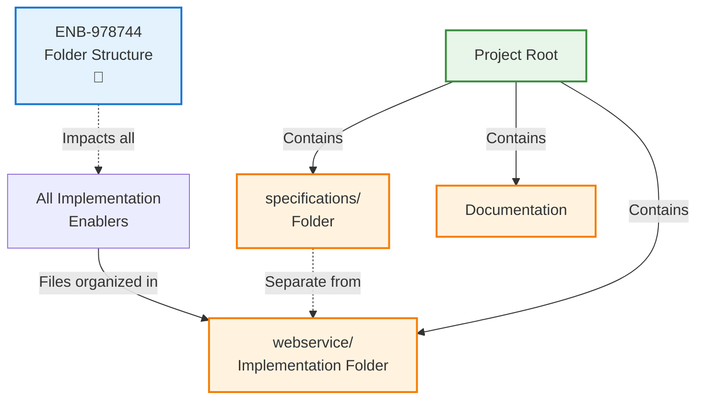
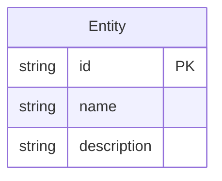
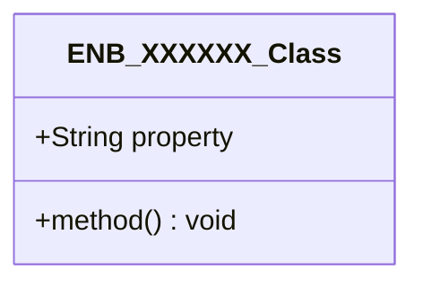
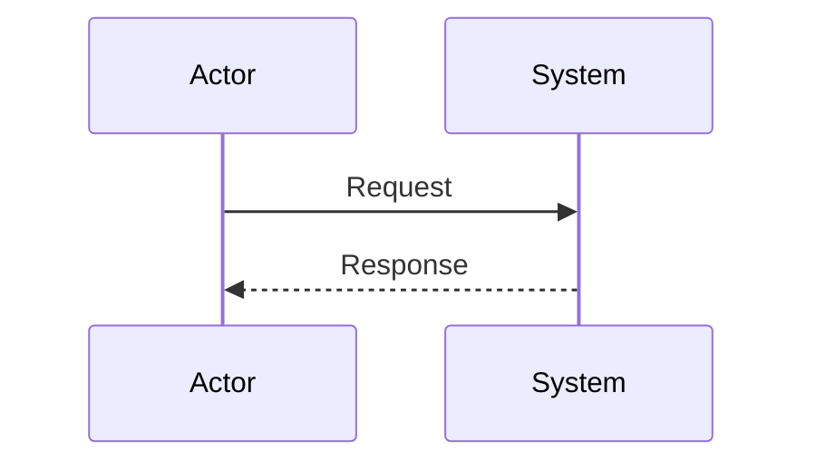
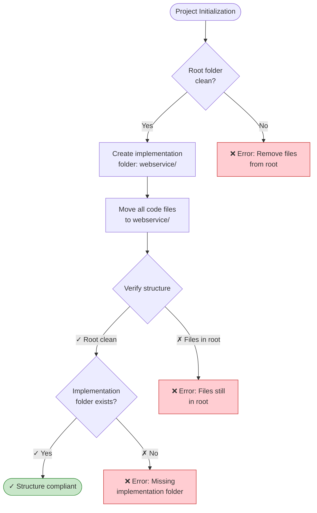
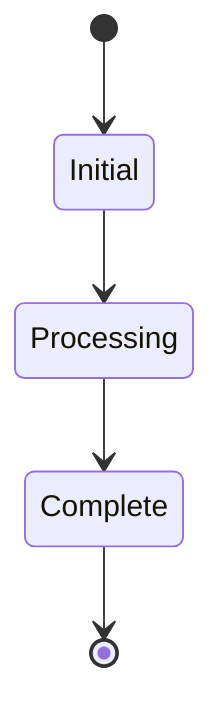

# Folder Structure

## Metadata

- **Name**: Folder Structure
- **Type**: Enabler
- **ID**: ENB-978744
- **Approval**: Approved
- **Capability ID**: CAP-978542
- **Owner**: Product Team
- **Status**: Implemented
- **Priority**: High
- **Analysis Review**: Required
- **Code Review**: Not Required

## Technical Overview
### Purpose
Ensure the project maintains a clean folder structure with implementation code separated from specifications and documentation. All implementation code must reside in a dedicated subfolder named after the project (e.g., `webservice/`), keeping the root directory organized and preventing mixing of specifications with implementation files.

## Functional Requirements

| ID | Name | Requirement | Priority | Status | Approval |
|----|------|-------------|----------|--------|----------|
| FR-097047 | Separate Implementation Folder | Create a dedicated subfolder named after the project (e.g., `webservice/`) that contains ALL implementation code, dependencies, and build files. The root folder must only contain specifications/, documentation, and project-level files. | Must Have | Implemented | Approved |
| FR-097048 | Clear Naming Convention | The implementation folder name must clearly identify the project/component being implemented (avoid generic names like `src/`, `code/`, or `app/`). | Must Have | Implemented | Approved |
| FR-097049 | No Root Implementation Files | Implementation files (source code, go.mod, package.json, etc.) must NOT exist in the project root directory. Only documentation and specification folders are permitted at root level. | Must Have | Implemented | Approved |

## Non-Functional Requirements

| ID | Name | Type | Requirement | Priority | Status | Approval |
|----|------|------|-------------|----------|--------|----------|
| NFR-097050 | Maintainability | Organization | The folder structure must make it immediately clear where implementation code resides vs specifications, enabling easy navigation and reducing confusion. | Must Have | Implemented | Approved |
| NFR-097051 | Scalability | Organization | The structure must support multiple implementations or sub-projects by allowing additional named folders alongside the main implementation folder. | Must Have | Implemented | Approved |
| NFR-097052 | Consistency | Standards | All future implementations must follow the same pattern: root-level specifications and documentation, with implementation in named subfolders. | Must Have | Implemented | Approved |

## Dependencies

### Internal Upstream Dependency

| Enabler ID | Description |
|------------|-------------|
| | |

### Internal Downstream Impact

| Enabler ID | Description |
|------------|-------------|
| | |

### External Dependencies

**External Upstream Dependencies**: None identified.

**External Downstream Impact**: None identified.

## Technical Specifications (Template)

### Enabler Dependency Flow Diagram

### API Technical Specifications (if applicable)

| API Type | Operation | Channel / Endpoint | Description | Request / Publish Payload | Response / Subscribe Data |
|----------|-----------|---------------------|-------------|----------------------------|----------------------------|
| | | | | | |

### Data Models

### Class Diagrams

### Sequence Diagrams

### Dataflow Diagrams

### State Diagrams

