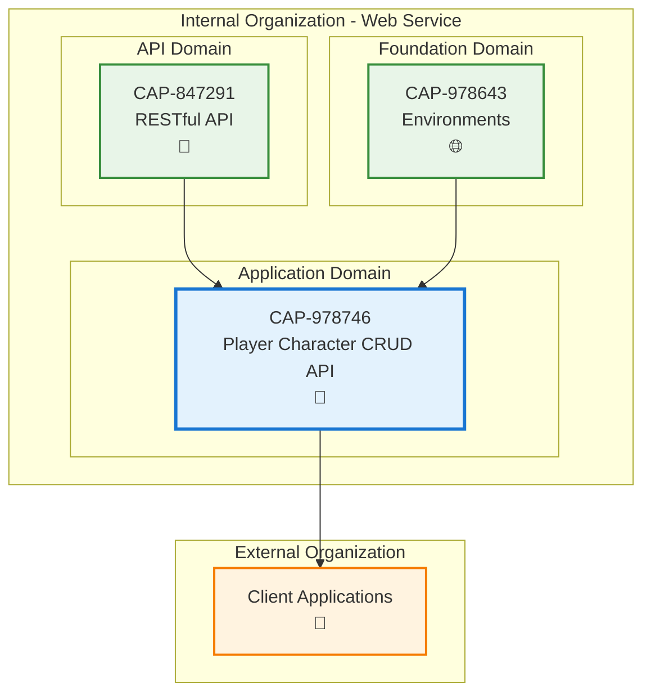

# Player Character CRUD API

## Metadata

- **Name**: Player Character CRUD API
- **Type**: Capability
- **System**: pc
- **Component**: web-service
- **ID**: CAP-978746
- **Approval**: Approved
- **Owner**: Product Team
- **Status**: Ready for Implementation
- **Priority**: High
- **Analysis Review**: Required

## Technical Overview
### Purpose
Provide a RESTful API for performing Create, Read, Update, and Delete operations on player characters, with full data validation against the character schema.

## Enablers

| Enabler ID | Description |
|------------|-------------|
| ENB-979956 | Character CRUD Operations |
| ENB-979957 | Character Data Validation |

## Dependencies

### Internal Upstream Dependency

| Capability ID | Description |
|---------------|-------------|
| CAP-847291 | RESTful API base capability |
| CAP-978643 | Environments capability for runtime |

### Internal Downstream Impact

| Capability ID | Description |
|---------------|-------------|
| N/A | No downstream impacts identified |

### External Dependencies

**External Upstream Dependencies**: Character schema validation library, database storage.

**External Downstream Impact**: Client applications consuming the API.

## Technical Specifications

### Capability Dependency Flow Diagram

### API Endpoints

The API will provide the following RESTful endpoints for character management:

- `POST /api/characters` - Create a new character
- `GET /api/characters` - List all characters
- `GET /api/characters/{id}` - Get a specific character
- `PUT /api/characters/{id}` - Update a character
- `DELETE /api/characters/{id}` - Delete a character

### Data Validation

All character data will be validated against the comprehensive D&D 5e character schema, ensuring:
- Required fields are present
- Data types are correct
- Business rules are enforced (e.g., ability score ranges, valid races/classes)
- Referential integrity for related entities

### Success Criteria

- All CRUD operations function correctly
- Data validation prevents invalid character creation/updates
- API returns appropriate HTTP status codes and error messages
- Performance meets requirements for typical usage patterns
- Schema compliance is maintained across all operations