# Linter

## Metadata

- **Name**: Linter
- **Type**: Enabler
- **ID**: ENB-978845
- **Approval**: Approved
- **Capability ID**: CAP-978542
- **Owner**: Product Team
- **Status**: Implemented
- **Priority**: High
- **Analysis Review**: Required
- **Code Review**: Not Required

## Technical Overview
### Purpose
Ensure code quality by identifying and resolving ALL linting issues using golangci-lint. The codebase MUST have zero linting errors and zero linting warnings before completion.

## Functional Requirements

| ID | Name | Requirement | Priority | Status | Approval |
|----|------|-------------|----------|--------|----------|
| FR-301719 | Linter | Discover all linting issues with linter: golangci-lint v1.64.8 | Must Have | Ready for Implementation | Approved |
| FR-301720 | Linter Results | Resolve ALL errors found by the linter - zero errors required | Must Have | Ready for Implementation | Approved |
| FR-558145 | Linter Warnings | Resolve ALL warnings found by the linter - zero warnings required | Must Have | Ready for Implementation | Approved |
| FR-558146 | Code Formatting | Ensure all files are properly formatted with goimports (no formatting issues) | Must Have | Ready for Implementation | Approved |
| FR-558147 | Error Handling | Check all error return values (no unchecked errors allowed) | Must Have | Ready for Implementation | Approved |
| FR-558148 | Configuration | Use only current golangci-lint configuration options (no deprecated settings) | Must Have | Ready for Implementation | Approved |
| FR-558149 | Verification | Run `golangci-lint run` and verify output shows "✓" with zero issues | Must Have | Ready for Implementation | Approved |

## Non-Functional Requirements

| ID | Name | Type | Requirement | Priority | Status | Approval |
|----|------|------|-------------|----------|--------|----------|
| NFR-558150 | Zero Tolerance | Quality | No linting errors or warnings are acceptable - 100% clean code required | Must Have | Ready for Implementation | Approved |
| NFR-558151 | Build Gate | Quality | Linting must pass before any build or deployment | Must Have | Ready for Implementation | Approved |
| NFR-558152 | Continuous Compliance | Quality | All code changes must maintain zero linting issues | Must Have | Ready for Implementation | Approved |
| NFR-558153 | Complete Coverage | Quality | All Go files in the project must be linted with zero issues | Must Have | Ready for Implementation | Approved |

## Dependencies

### Internal Upstream Dependency

| Enabler ID | Description |
|------------|-------------|
| | |

### Internal Downstream Impact

| Enabler ID | Description |
|------------|-------------|
| | |

### External Dependencies

**External Upstream Dependencies**: None identified.

**External Downstream Impact**: None identified.

## Technical Specifications (Template)

### Enabler Dependency Flow Diagram

### API Technical Specifications (if applicable)

| API Type | Operation | Channel / Endpoint | Description | Request / Publish Payload | Response / Subscribe Data |
|----------|-----------|---------------------|-------------|----------------------------|----------------------------|
| | | | | | |

### Data Models

### Class Diagrams

### Sequence Diagrams

```mermaid
sequenceDiagram
    participant Dev as Developer
    participant CLI as golangci-lint
    participant Go as Go Toolchain
    participant Code as Codebase

    Dev->>CLI: golangci-lint run
    CLI->>Go: go mod download
    Go-->>CLI: Dependencies ready
    CLI->>Code: Analyze files
    Code-->>CLI: Source code
    CLI->>CLI: Run enabled linters
    CLI->>CLI: goimports check
    CLI->>CLI: errcheck analysis
    CLI->>CLI: staticcheck analysis
    CLI->>CLI: govet analysis
    CLI->>CLI: Check for warnings
    CLI-->>Dev: Report issues + warnings
    
    alt Issues or Warnings Found
        Note over Dev,CLI: MUST fix ALL issues AND warnings
        Dev->>Code: Fix all errors
        Dev->>Code: Fix all warnings
        Dev->>Go: goimports -w .
        Go-->>Code: Format all files
        Dev->>Code: Fix unchecked errors
        Dev->>Code: Fix deprecated config
        Dev->>CLI: golangci-lint run
        
        alt Still has issues
            CLI-->>Dev: ❌ Issues/warnings remain
            Note over Dev: Loop until zero issues
        else All clean
            CLI-->>Dev: ✓ No issues or warnings
            Dev->>Go: go build ./...
            Go-->>Dev: ✓ Build successful
            Dev->>Go: go test ./...
            Go-->>Dev: ✓ Tests pass
        end
    else No Issues or Warnings
        CLI-->>Dev: ✓ No issues or warnings
        Dev->>Go: go build ./...
        Go-->>Dev: ✓ Build successful
        Dev->>Go: go test ./...
        Go-->>Dev: ✓ Tests pass
    end
```

### Dataflow Diagrams

```mermaid
flowchart TD
    Start[Developer Initiates Lint] --> Install[Install golangci-lint v1.64.8]
    Install --> Download[go mod download]
    Download --> Tidy[go mod tidy]
    Tidy --> CheckConfig{Check .golangci.yml}
    
    CheckConfig -->|Has deprecated| FixConfig[Remove deprecated options]
    CheckConfig -->|Clean| RunLint
    FixConfig --> RunLint
    
    RunLint[Run: golangci-lint run] --> ParseOutput{Parse output}
    
    ParseOutput -->|Warnings found| FixWarnings[Fix ALL warnings]
    ParseOutput -->|Errors found| FixErrors[Fix ALL errors]
    ParseOutput -->|goimports issues| Format[Run: goimports -w .]
    ParseOutput -->|errcheck issues| HandleErrors[Check all error returns]
    ParseOutput -->|Clean output| Verify
    
    FixWarnings --> RunLint
    FixErrors --> RunLint
    Format --> RunLint
    HandleErrors --> RunLint
    
    Verify{Zero issues?} -->|No| Fail[❌ Linting Failed]
    Verify -->|Yes| Build[go build ./...]
    
    Build --> BuildCheck{Build OK?}
    BuildCheck -->|No| Fail
    BuildCheck -->|Yes| Test[go test ./...]
    
    Test --> TestCheck{Tests Pass?}
    TestCheck -->|No| Fail
    TestCheck -->|Yes| Complete[✓ Linting Complete: Zero Issues]
    
    Fail --> End[Must fix all issues]
    Complete --> End
```

### State Diagrams

```mermaid
stateDiagram-v2
    [*] --> NotLinted: Code Written
    NotLinted --> Linting: Run golangci-lint
    Linting --> CheckOutput: Parse output
    
    CheckOutput --> ErrorsFound: Errors detected
    CheckOutput --> WarningsFound: Warnings detected
    CheckOutput --> ZeroIssues: Zero errors + Zero warnings
    
    ErrorsFound --> CategorizeError: Identify type
    WarningsFound --> CategorizeWarning: Identify type
    
    CategorizeError --> GoimportsError: goimports issues
    CategorizeError --> ErrcheckError: unchecked errors
    CategorizeError --> StaticcheckError: static analysis
    CategorizeError --> OtherError: other linters
    
    CategorizeWarning --> ConfigWarning: deprecated config
    CategorizeWarning --> OtherWarning: other warnings
    
    GoimportsError --> FixingErrors: Run goimports -w .
    ErrcheckError --> FixingErrors: Check all errors
    StaticcheckError --> FixingErrors: Fix code issues
    OtherError --> FixingErrors: Apply fixes
    
    ConfigWarning --> FixingWarnings: Update .golangci.yml
    OtherWarning --> FixingWarnings: Fix warnings
    
    FixingErrors --> Linting: Re-run golangci-lint
    FixingWarnings --> Linting: Re-run golangci-lint
    
    ZeroIssues --> Verified: ✓ Confirmed clean
    Verified --> Building: go build ./...
    
    Building --> BuildSuccess: Build OK
    Building --> BuildFailed: Build Error
    
    BuildFailed --> FixingErrors: Fix and retry
    
    BuildSuccess --> Testing: go test ./...
    Testing --> TestSuccess: Tests Pass
    Testing --> TestFailed: Tests Fail
    
    TestFailed --> FixingErrors: Fix and retry
    
    TestSuccess --> Complete: ✓ Zero Issues Achieved
    Complete --> [*]
    
    note right of ZeroIssues
        REQUIRED STATE:
        - Zero errors
        - Zero warnings
        - All files formatted
        - All errors checked
    end note
```

