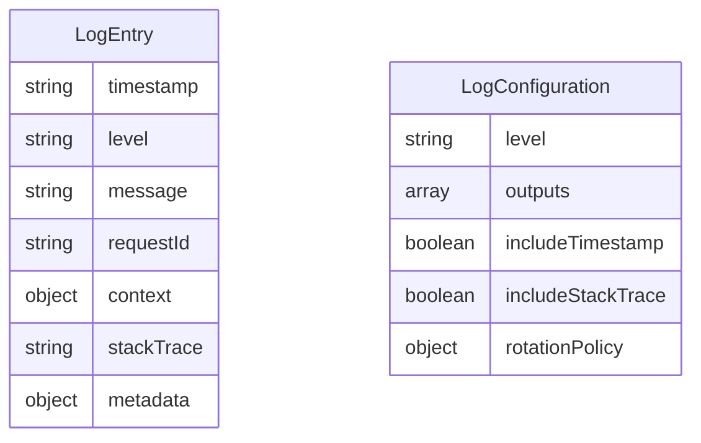
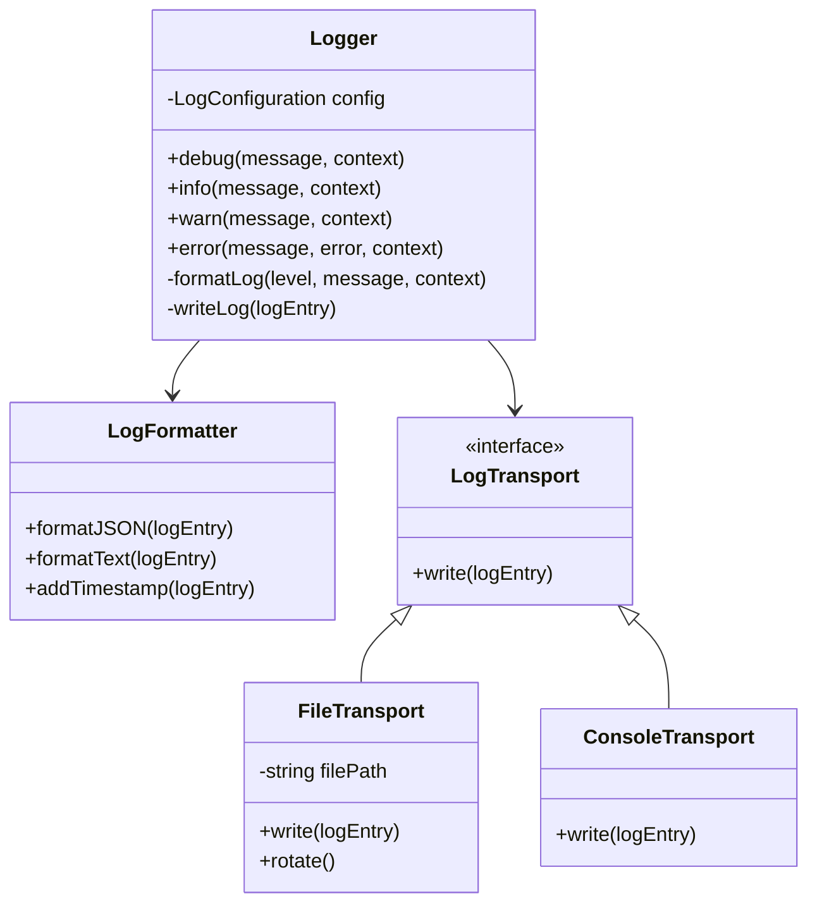
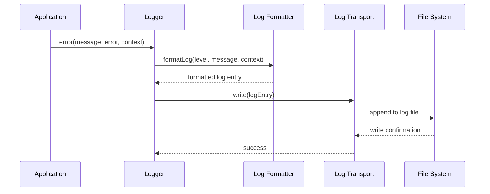
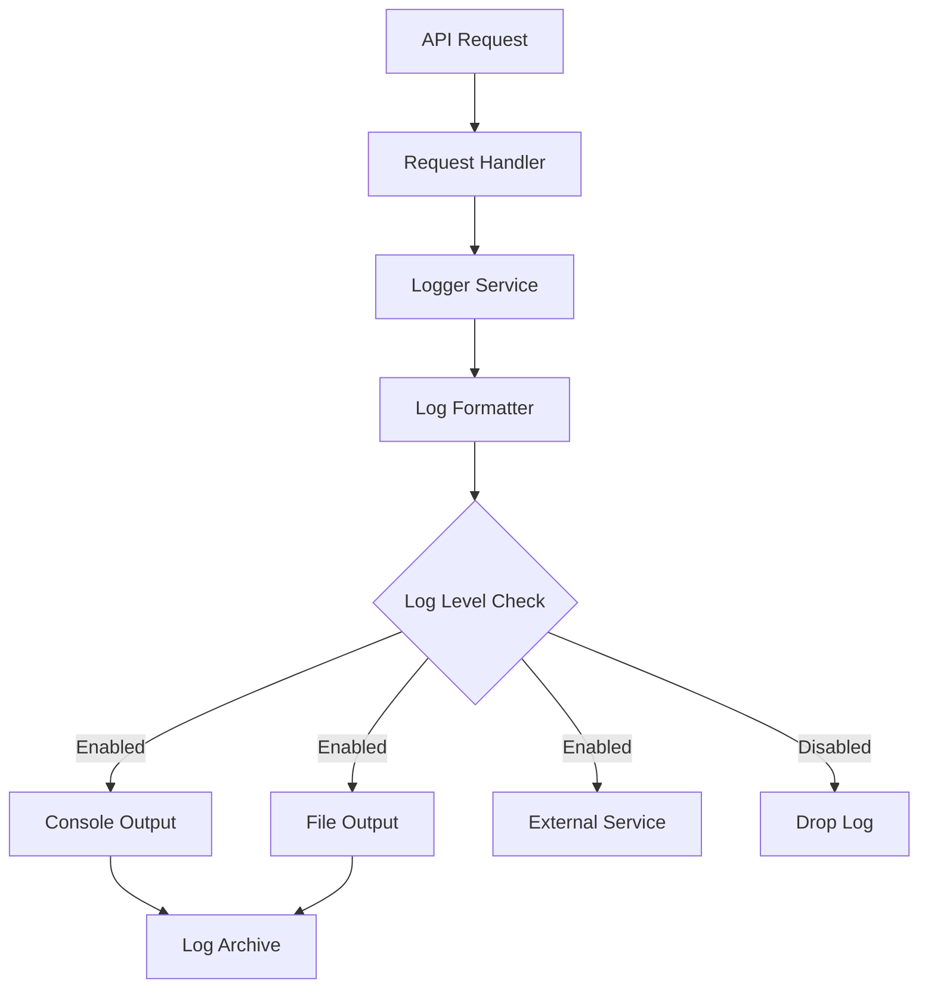
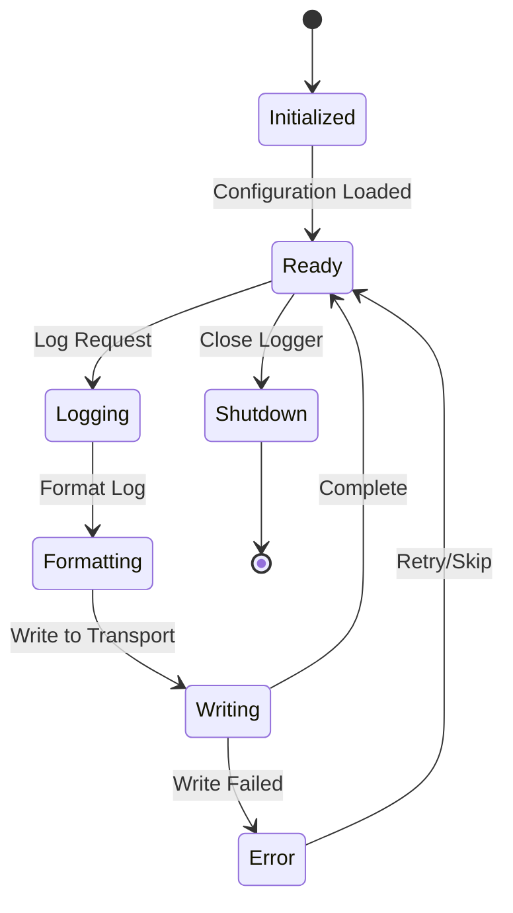

# Logging

## Metadata

- **Name**: Logging
- **Type**: Enabler
- **ID**: ENB-979047
- **Approval**: Approved
- **Capability ID**: CAP-978542
- **Owner**: Development Team
- **Status**: Ready for Implementation
- **Priority**: High
- **Analysis Review**: Not Required
- **Code Review**: Not Required

## Technical Overview
### Purpose
Provide centralized logging capabilities for tracking API requests, responses, errors, and system events with configurable log levels and output formats.

## Functional Requirements

| ID | Name | Requirement | Priority | Status | Approval |
|----|------|-------------|----------|--------|----------|
| FR-847400 | Log Levels | Support multiple log levels: DEBUG, INFO, WARN, ERROR, FATAL | Must Have | Ready for Implementation | Approved |
| FR-847433 | Request Logging | Log all incoming API requests with timestamp, endpoint, method, and client info | Must Have | Ready for Implementation | Approved |
| FR-847305 | Error Logging | Capture and log all errors with stack traces and context | Must Have | Ready for Implementation | Approved |
| FR-847306 | Structured Logging | Output logs in structured JSON format | Must Have | Ready for Implementation | Approved |

## Non-Functional Requirements

| ID | Name | Type | Requirement | Priority | Status | Approval |
|----|------|------|-------------|----------|--------|----------|
| NFR-847307 | Performance Impact | Performance | Logging operations should not add more than 5ms overhead per request | Must Have | Ready for Implementation | Approved |
| NFR-847308 | Log Rotation | Maintainability | Support automatic log file rotation based on size or time | Must Have | Ready for Implementation | Approved |
| NFR-847309 | Configurable Output | Flexibility | Allow configuration of log output destinations (console, file, external service) | Must Have | Ready for Implementation | Approved |

## Dependencies

### Internal Upstream Dependency

| Enabler ID | Description |
|------------|-------------|
| | |

### Internal Downstream Impact

| Enabler ID | Description |
|------------|-------------|
| | |

### External Dependencies

**External Upstream Dependencies**: None identified.

**External Downstream Impact**: None identified.

## Technical Specifications

### Enabler Dependency Flow Diagram

```mermaid
flowchart TD
    ENB_979047["ENB-979047<br/>Application Logging<br/>📝"]
    
    FILE["File System<br/>Log Files<br/>💾"]
    CONSOLE["Console Output<br/>Standard Output<br/>🖥️"]
    EXTERNAL["External Service<br/>Log Aggregation (Optional)<br/>☁️"]
    
    ENB_979047 --> FILE
    ENB_979047 --> CONSOLE
    ENB_979047 -.-> EXTERNAL

    classDef enabler fill:#e3f2fd,stroke:#1976d2,stroke-width:2px
    classDef output fill:#f3e5f5,stroke:#7b1fa2,stroke-width:2px
    
    class ENB_979047 enabler
    class FILE,CONSOLE,EXTERNAL output
```

### API Technical Specifications

| API Type | Operation | Channel / Endpoint | Description | Request / Publish Payload | Response / Subscribe Data |
|----------|-----------|---------------------|-------------|----------------------------|----------------------------|
| Internal | Method | logger.debug(message, context) | Log debug information | `{message: string, context: object}` | void |
| Internal | Method | logger.info(message, context) | Log informational message | `{message: string, context: object}` | void |
| Internal | Method | logger.warn(message, context) | Log warning message | `{message: string, context: object}` | void |
| Internal | Method | logger.error(message, error, context) | Log error with stack trace | `{message: string, error: Error, context: object}` | void |

### Data Models

### Class Diagrams

### Sequence Diagrams

### Dataflow Diagrams

### State Diagrams

