# Swagger/OpenAPI Documentation

## Metadata

- **Name**: Swagger/OpenAPI Documentation
- **Type**: Enabler
- **ID**: ENB-979148
- **Approval**: Approved
- **Capability ID**: CAP-847291
- **Owner**: Development Team
- **Status**: Implemented
- **Priority**: High
- **Analysis Review**: Not Required
- **Code Review**: Not Required

## Technical Overview
### Purpose
Provide interactive API documentation using OpenAPI 3.0 specification with Swagger UI for API exploration, testing, and client code generation.

**IMPORTANT**: This enabler MUST be implemented even when FR-847303 prohibits demonstration endpoints. At minimum, Swagger/OpenAPI documentation SHALL document infrastructure endpoints (health checks, readiness probes, etc.). The documentation provides essential operational visibility regardless of business endpoint count.

## Functional Requirements

| ID | Name | Requirement | Priority | Status | Approval |
|----|------|-------------|----------|--------|----------|
| FR-847310 | OpenAPI Specification | Generate OpenAPI 3.0 compliant specification from API endpoints using swag annotations and 'swag init' command | Must Have | Implemented | Approved |
| FR-847311 | Swagger UI Integration | Provide interactive Swagger UI interface for API exploration. CRITICAL: Must import generated docs package with blank import: `_ "your-module/docs"` in main.go to register Swagger handlers | Must Have | Implemented | Approved |
| FR-847312 | Endpoint Documentation | Document all API endpoints with parameters, request/response schemas. MUST include at minimum: health check endpoints (/health, /health/live, /health/ready) even when no business endpoints exist per FR-847303 | Must Have | Implemented | Approved |
| FR-847313 | Minimum Viable Documentation | ALWAYS implement Swagger/OpenAPI documentation regardless of endpoint count. Infrastructure-only services with only health endpoints still require full Swagger UI integration for operational visibility | Must Have | Implemented | Approved |

## Non-Functional Requirements

| ID | Name | Type | Requirement | Priority | Status | Approval |
|----|------|------|-------------|----------|--------|----------|
| NFR-847314 | Auto-Generation | Maintainability | Automatically update documentation when API changes | Must Have | Implemented | Approved |
| NFR-847315 | Accessibility | Usability | Documentation UI should be accessible via /api-docs or /swagger endpoint | Must Have | Implemented | Approved |
| NFR-847316 | Schema Validation | Quality | Validate API responses against documented schemas | Must Have | Implemented | Approved |
| NFR-847317 | FR-847303 Compatibility | Design | Swagger implementation MUST NOT conflict with FR-847303 "No Demo Code" requirement. Document infrastructure endpoints (health, metrics) even when business/demo endpoints are prohibited | Must Have | Implemented | Approved |

## Dependencies

### Internal Upstream Dependency

| Enabler ID | Description |
|------------|-------------|
| | |

### Internal Downstream Impact

| Enabler ID | Description |
|------------|-------------|
| | |

### External Dependencies

**External Upstream Dependencies**: None identified.

**External Downstream Impact**: None identified.

## Technical Specifications

### Enabler Dependency Flow Diagram

```mermaid
flowchart TD
    ENB_979148["ENB-979148<br/>Swagger/OpenAPI Documentation<br/>📚"]
    
    ENB_847292["ENB-847292<br/>RESTful API Endpoints<br/>🔌"]
    SWAGGER_UI["Swagger UI<br/>Interactive Documentation<br/>🌐"]
    OPENAPI_SPEC["OpenAPI Spec<br/>JSON/YAML Definition<br/>📄"]
    
    ENB_847292 --> ENB_979148
    ENB_979148 --> OPENAPI_SPEC
    ENB_979148 --> SWAGGER_UI

    classDef enabler fill:#e3f2fd,stroke:#1976d2,stroke-width:2px
    classDef output fill:#f3e5f5,stroke:#7b1fa2,stroke-width:2px
    
    class ENB_847292,ENB_979148 enabler
    class SWAGGER_UI,OPENAPI_SPEC output
```

### API Technical Specifications

| API Type | Operation | Channel / Endpoint | Description | Request / Publish Payload | Response / Subscribe Data |
|----------|-----------|---------------------|-------------|----------------------------|----------------------------|
| REST | GET | /api-docs | Serve Swagger UI interface | None | HTML (Swagger UI) |
| REST | GET | /api-docs/openapi.json | Retrieve OpenAPI specification | None | OpenAPI 3.0 JSON specification |
| REST | GET | /api-docs/openapi.yaml | Retrieve OpenAPI specification in YAML | None | OpenAPI 3.0 YAML specification |

### Data Models

### Class Diagrams

### Sequence Diagrams

### Dataflow Diagrams

### State Diagrams

