# Environment Configuration

## Metadata

- **Name**: Environment Configuration
- **Type**: Enabler
- **ID**: ENB-979552
- **Approval**: Approved
- **Capability ID**: CAP-978643
- **Owner**: Development Team
- **Status**: Ready for Implementation
- **Priority**: High
- **Analysis Review**: Not Required
- **Code Review**: Not Required

## Technical Overview
### Purpose
Configure and manage environment settings including environment variables, runtime versions, system paths, and platform-specific configurations to ensure consistent application execution across different environments of development, test, and production.

**Docker Environment Strategy**: Provide separate Docker Compose configuration files for each deployment environment:
- **Production** (`docker-compose.yml` or `docker-compose.prod.yml`): Optimized settings, minimal logging, security hardening, restart policies
- **Development** (`docker-compose.dev.yml`): Verbose logging, debug mode, volume mounts for hot-reload, exposed debug ports
- **Test** (`docker-compose.test.yml`): Test databases, mock services, CI/CD integration, ephemeral containers

Each environment SHALL have distinct configuration to prevent cross-environment contamination and enable environment-specific optimizations.

## Functional Requirements

| ID | Name | Requirement | Priority | Status | Approval |
|----|------|-------------|----------|--------|----------|
| FR-847436 | Environment Variables | Support configuration and management of environment variables for different runtime stages. Docker Deployments: Provide Docker Compose configurations for three environments: (1) docker-compose.yml or docker-compose.prod.yml for production, (2) docker-compose.dev.yml for development, (3) docker-compose.test.yml for testing. Each SHALL define environment-specific variables including log levels, database connections, API configurations, and feature flags appropriate to that environment. | Must Have | Ready for Implementation | Approved |
| FR-847347 | Runtime Version Management | Manage and configure specific runtime versions for Go and its dependencies | Must Have | Ready for Implementation | Approved |
| FR-847437 | Configuration Files | Support .env configuration file format with environment-specific variants (.env.development, .env.test, .env.production) for local development and Docker override files | Must Have | Ready for Implementation | Approved |
| FR-847409 | Environment Isolation | Provide complete isolation between development, testing, and production environments through separate configuration files, Docker Compose configurations, and environment variable namespacing to prevent configuration leakage across environments | Must Have | Ready for Implementation | Approved |
| FR-847410 | Docker Environment Profiles | Docker Compose files MUST support launching containers with environment-appropriate settings: development (verbose logging, debug mode, hot-reload), test (test databases, mock services, CI/CD integration), production (minimal logging, optimized settings, security hardening) | Must Have | Ready for Implementation | Approved |

## Non-Functional Requirements

| ID | Name | Type | Requirement | Priority | Status | Approval |
|----|------|------|-------------|----------|--------|----------|
| NFR-847350 | Configuration Security | Security | Sensitive configuration data must be encrypted or stored securely. Docker secrets or environment variable substitution (${VAR:-default}) SHALL be used for production deployments. Development and test environments MAY use plain-text configuration files with .gitignore protection. | Must Have | Ready for Implementation | Approved |
| NFR-847351 | Hot Reload | Performance | Support hot-reloading of configuration changes without full restart (development environment only) | Must Have | Ready for Implementation | Approved |
| NFR-847352 | Validation | Quality | Validate configuration values against schemas before application loading | Must Have | Ready for Implementation | Approved |
| NFR-847411 | Docker Compose Standards | Standards | All Docker Compose files MUST follow version 3.8+ specification with proper service definitions, volume mounts for development, health checks, and restart policies appropriate to each environment (unless-stopped for prod, no for dev/test) | Must Have | Ready for Implementation | Approved |

## Dependencies

### Internal Upstream Dependency

| Enabler ID | Description |
|------------|-------------|
| | |

### Internal Downstream Impact

| Enabler ID | Description |
|------------|-------------|
| ENB-847292 | RESTful API uses environment configuration |
| ENB-847293 | Logging service uses environment settings |

### External Dependencies

**External Upstream Dependencies**: Operating system environment, configuration management tools

**External Downstream Impact**: All application components depend on environment configuration

## Technical Specifications

### Enabler Dependency Flow Diagram

```mermaid
flowchart TD
    ENB_979552["ENB-979552<br/>Runtime Environment Config<br/>⚙️"]
    
    ENV_FILES[".env Files<br/>Environment Variables<br/>📄"]
    CONFIG_FILES["Config Files<br/>YAML/JSON/INI<br/>📋"]
    SECRETS["Secrets Management<br/>Encrypted Secrets<br/>🔐"]
    VALIDATOR["Config Validator<br/>Schema Validation<br/>✅"]
    
    ENV_FILES --> ENB_979552
    CONFIG_FILES --> ENB_979552
    SECRETS --> ENB_979552
    ENB_979552 --> VALIDATOR
    
    APP["Application Runtime<br/>Running Application<br/>🚀"]
    ENB_979552 --> APP

    classDef enabler fill:#e3f2fd,stroke:#1976d2,stroke-width:2px
    classDef source fill:#f3e5f5,stroke:#7b1fa2,stroke-width:2px
    classDef target fill:#e8f5e8,stroke:#388e3c,stroke-width:2px
    
    class ENB_979552 enabler
    class ENV_FILES,CONFIG_FILES,SECRETS,VALIDATOR source
    class APP target
```


### Docker Environment Configuration

**Required Docker Compose Files:**

| File | Environment | Purpose | Key Settings |
|------|-------------|---------|--------------|
| `docker-compose.yml` (or `.prod.yml`) | Production | Production deployment | Release mode, minimal logging (info/warn), restart: unless-stopped, no volume mounts, secrets via env substitution |
| `docker-compose.dev.yml` | Development | Local development | Debug mode, verbose logging (debug), restart: no, volume mounts for hot-reload, exposed debug ports |
| `docker-compose.test.yml` | Test | CI/CD testing | Test mode, structured logging, restart: no, ephemeral volumes, test database connections |

**Usage Examples:**
```bash
# Production
docker-compose up -d

# Development  
docker-compose -f docker-compose.dev.yml up

# Testing
docker-compose -f docker-compose.test.yml up --abort-on-container-exit
```

**Environment Variable Strategy:**
- `.env` - Default/shared variables (gitignored)
- `.env.example` - Template with placeholder values (committed)
- `.env.development` - Development overrides (gitignored, optional)
- `.env.test` - Test environment values (committed, non-sensitive)
- `.env.production` - Production values (NEVER committed, use secrets management)

### API Technical Specifications

| API Type | Operation | Channel / Endpoint | Description | Request / Publish Payload | Response / Subscribe Data |
|----------|-----------|---------------------|-------------|----------------------------|----------------------------|
| Internal | Method | config.get(key) | Retrieve configuration value | `{key: string}` | `any` |
| Internal | Method | config.set(key, value) | Set configuration value | `{key: string, value: any}` | `void` |
| Internal | Method | config.validate(schema) | Validate configuration against schema | `{schema: object}` | `{valid: boolean, errors: array}` |
| Internal | Method | config.reload() | Reload configuration from source | None | `void` |

### Data Models


### Class Diagrams


### Sequence Diagrams


### Dataflow Diagrams


### State Diagrams


