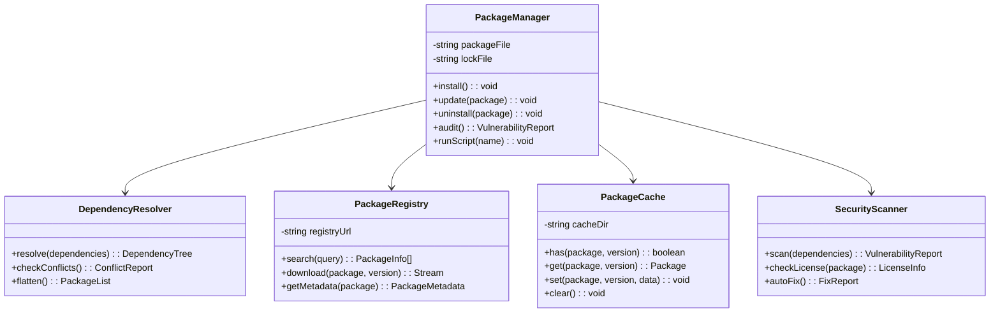

# Package Management

## Metadata

- **Name**: Package Management
- **Type**: Enabler
- **ID**: ENB-979653
- **Approval**: Approved
- **Capability ID**: CAP-978542
- **Owner**: Development Team
- **Status**: Implemented
- **Priority**: High
- **Analysis Review**: Not Required
- **Code Review**: Not Required

## Technical Overview
### Purpose
Manage application dependencies, third-party packages, and libraries using package managers (npm, pip, Maven, etc.) with version locking, vulnerability scanning, and automated updates.

## Functional Requirements

| ID | Name | Requirement | Priority | Status | Approval |
|----|------|-------------|----------|--------|----------|
| FR-847412 | Package Installation | Install and manage project dependencies using package managers | Must Have | Ready for Implementation | Approved |
| FR-847413 | Version Locking | Lock dependency versions to ensure reproducible builds | Must Have | Ready for Implementation | Approved |
| FR-847414 | Dependency Resolution | Resolve dependency conflicts and transitive dependencies | Must Have | Ready for Implementation | Approved |
| FR-847415 | Package Scripts | Support custom scripts for build, test, and deployment tasks | Must Have | Ready for Implementation | Approved |

## Non-Functional Requirements

| ID | Name | Type | Requirement | Priority | Status | Approval |
|----|------|------|-------------|----------|--------|----------|
| NFR-847367 | Vulnerability Scanning | Security | Scan dependencies for known security vulnerabilities | Must Have | Ready for Implementation | Approved |
| NFR-847416 | Install Performance | Performance | Optimize dependency installation time using caching | Must Have | Ready for Implementation | Approved |
| NFR-847417 | License Compliance | Compliance | Track and validate dependency licenses | Must Have | Ready for Implementation | Approved |
| NFR-847418 | Offline Support | Reliability | Support offline installation using cached packages | Must Have | Ready for Implementation | Approved |

## Dependencies

### Internal Upstream Dependency

| Enabler ID | Description |
|------------|-------------|
| | |

### Internal Downstream Impact

| Enabler ID | Description |
|------------|-------------|
| ENB-847329 | Docker containerization includes dependency installation |
| ENB-847343 | Development tools depend on installed packages |

### External Dependencies

**External Upstream Dependencies**: Package registries (npm, PyPI, Maven Central), package managers

**External Downstream Impact**: All application code depends on installed packages

## Technical Specifications

### Enabler Dependency Flow Diagram

```mermaid
flowchart TD
    ENB_979653["ENB-979653<br/>Package Management<br/>📦"]
    
    REGISTRY["Package Registry<br/>npm/PyPI/Maven<br/>🌐"]
    LOCKFILE["Lock File<br/>package-lock.json<br/>🔒"]
    CACHE["Package Cache<br/>Local Cache<br/>💾"]
    
    REGISTRY --> ENB_979653
    ENB_979653 --> LOCKFILE
    ENB_979653 --> CACHE
    
    INSTALL["Installed Packages<br/>node_modules<br/>📚"]
    SCANNER["Vulnerability Scanner<br/>Security Audit<br/>🔍"]
    
    ENB_979653 --> INSTALL
    ENB_979653 --> SCANNER
    INSTALL --> APP["Application<br/>Runtime Dependencies<br/>🚀"]

    classDef enabler fill:#e3f2fd,stroke:#1976d2,stroke-width:2px
    classDef source fill:#f3e5f5,stroke:#7b1fa2,stroke-width:2px
    classDef artifact fill:#e8f5e8,stroke:#388e3c,stroke-width:2px
    
    class ENB_979653 enabler
    class REGISTRY,LOCKFILE,CACHE source
    class INSTALL,SCANNER,APP artifact
```

### API Technical Specifications

| API Type | Operation | Channel / Endpoint | Description | Request / Publish Payload | Response / Subscribe Data |
|----------|-----------|---------------------|-------------|----------------------------|----------------------------|
| CLI | Command | npm install | Install all dependencies from package.json | None | Installation log |
| CLI | Command | npm install <package> | Install specific package | Package name and version | Installation confirmation |
| CLI | Command | npm update | Update dependencies to latest allowed versions | None | Update log |
| CLI | Command | npm audit | Scan for security vulnerabilities | None | Vulnerability report |
| CLI | Command | npm run <script> | Execute custom package script | Script name | Script output |

### Data Models

### Class Diagrams

### Sequence Diagrams

### Dataflow Diagrams

### State Diagrams

