# Go + Gin Framework

## Metadata

- **Name**: Go + Gin Framework
- **Type**: Enabler
- **ID**: ENB-979754
- **Approval**: Approved
- **Capability ID**: CAP-978542
- **Owner**: Development Team
- **Status**: Ready for Implementation
- **Priority**: High
- **Analysis Review**: Not Required
- **Code Review**: Not Required

## Technical Overview
### Purpose
Implement the web service backend using Go (Golang) programming language with the Gin web framework to provide high-performance RESTful API endpoints with strong typing, simple deployment, and efficient resource utilization.

## Functional Requirements

| ID | Name | Requirement | Priority | Status | Approval |
|----|------|-------------|----------|--------|----------|
| FR-847380 | Go Runtime | Implement backend service in Go 1.23+ for performance and type safety. Note: Go 1.23+ is required due to gin-contrib/sse dependency requirements | Must Have | Ready for Implementation | Approved |
| FR-847381 | Gin Framework Integration | Use Gin web framework for HTTP routing, middleware, and request handling | Must Have | Ready for Implementation | Approved |
| FR-847382 | Structured Project Layout | Organize code following Go best practices (cmd/, internal/, pkg/ structure) | Must Have | Ready for Implementation | Approved |
| FR-847383 | Dependency Management | Use Go modules (go.mod/go.sum) for dependency management and versioning. Run 'go mod tidy' to ensure all dependencies are properly tracked | Must Have | Ready for Implementation | Approved |

## Non-Functional Requirements

| ID | Name | Type | Requirement | Priority | Status | Approval |
|----|------|------|-------------|----------|--------|----------|
| NFR-847384 | Performance | Performance | API response times under 200ms for 95% of requests | Must Have | Ready for Implementation | Approved |
| NFR-847385 | Memory Efficiency | Performance | Minimal memory footprint with Go's efficient garbage collection | Must Have | Ready for Implementation | Approved |
| NFR-847386 | Compilation Speed | Performance | Fast build times with Go compiler for rapid development iterations | Must Have | Ready for Implementation | Approved |
| NFR-847387 | Single Binary Deployment | Deployment | Compile to single static binary for simplified deployment | Must Have | Ready for Implementation | Approved |
| NFR-847388 | Concurrent Request Handling | Scalability | Leverage Go goroutines for efficient concurrent request processing | Must Have | Ready for Implementation | Approved |

## Dependencies

### Internal Upstream Dependency

| Enabler ID | Description |
|------------|-------------|
| ENB-847341 | Runtime environment provides Go runtime and build tools |

### Internal Downstream Impact

| Enabler ID | Description |
|------------|-------------|
| ENB-847292 | RESTful API endpoints implemented using Gin framework |
| ENB-847293 | Logging service uses Go structured logging libraries |
| ENB-847294 | Swagger documentation generated from Go code annotations |
| ENB-847295 | Health check endpoint implemented as Gin route handler |
| ENB-847328 | JWT authentication implemented using Go JWT libraries |
| ENB-847329 | Docker container packages Go binary for deployment |

### External Dependencies

**External Upstream Dependencies**:  

**External Downstream Impact**: All Web Service enablers depend on Go + Gin implementation

## Technical Specifications

### Enabler Dependency Flow Diagram

```mermaid
flowchart TD
    ENB_979754["ENB-979754<br/>Go + Gin Framework<br/>🚀"]
    
    ENB_847341["ENB-847341<br/>Runtime Environment<br/>⚙️"]
    
    GO_RUNTIME["Go Runtime<br/>Go 1.21+<br/>🔧"]
    GIN_FW["Gin Framework<br/>Web Framework<br/>🌐"]
    GO_MODULES["Go Modules<br/>Dependency Mgmt<br/>📦"]
    
    ENB_847341 --> GO_RUNTIME
    GO_RUNTIME --> ENB_979754
    GIN_FW --> ENB_979754
    GO_MODULES --> ENB_979754
    
    ENB_847292["ENB-847292<br/>RESTful API<br/>🔌"]
    ENB_847293["ENB-847293<br/>Logging<br/>📝"]
    ENB_847294["ENB-847294<br/>Swagger Docs<br/>📚"]
    ENB_847295["ENB-847295<br/>Health Check<br/>🏥"]
    ENB_847328["ENB-847328<br/>JWT Auth<br/>🔐"]
    ENB_847329["ENB-847329<br/>Docker<br/>🐳"]
    
    ENB_979754 --> ENB_847292
    ENB_979754 --> ENB_847293
    ENB_979754 --> ENB_847294
    ENB_979754 --> ENB_847295
    ENB_979754 --> ENB_847328
    ENB_979754 --> ENB_847329

    classDef enabler fill:#e3f2fd,stroke:#1976d2,stroke-width:2px
    classDef runtime fill:#f3e5f5,stroke:#7b1fa2,stroke-width:2px
    classDef downstream fill:#e8f5e8,stroke:#388e3c,stroke-width:2px
    
    class ENB_847341,ENB_979754,ENB_847292,ENB_847293,ENB_847294,ENB_847295,ENB_847328,ENB_847329 enabler
    class GO_RUNTIME,GIN_FW,GO_MODULES runtime
```

### API Technical Specifications

| API Type | Operation | Channel / Endpoint | Description | Request / Publish Payload | Response / Subscribe Data |
|----------|-----------|---------------------|-------------|----------------------------|----------------------------|
| CLI | Command | go run cmd/server/main.go | Run development server | None | Server starts on port 8080 |
| CLI | Command | go build -o server cmd/server/main.go | Build production binary | None | Compiled binary executable |
| CLI | Command | go test ./... | Run all tests | None | Test results and coverage |
| CLI | Command | go mod tidy | Clean up dependencies | None | Updated go.mod/go.sum |
| Internal | Function | gin.Default() | Create Gin router instance | None | *gin.Engine |
| Internal | Function | router.GET(path, handler) | Register GET route | Path string, handler function | Route registration |
| Internal | Function | router.POST(path, handler) | Register POST route | Path string, handler function | Route registration |

### Data Models

### Class Diagrams

### Sequence Diagrams

### Dataflow Diagrams

### State Diagrams

