# API Unit Testing

## Metadata

- **Name**: API Unit Testing
- **Type**: Enabler
- **ID**: ENB-979855
- **Approval**: Approved
- **Capability ID**: CAP-978441
- **Owner**: Development Team
- **Status**: Ready for Implementation
- **Priority**: High
- **Analysis Review**: Not Required
- **Code Review**: Not Required

## Technical Overview
### Purpose
Implement comprehensive unit tests for all API operations defined in the specifications, covering all HTTP methods (GET, POST, PUT, DELETE, PATCH), request validation, response formatting, error handling, and edge cases to ensure API reliability and prevent regressions.

## Functional Requirements

| ID | Name | Requirement | Priority | Status | Approval |
|----|------|-------------|----------|--------|----------|
| FR-847419 | GET Endpoint Tests | Unit tests for all GET operations including success, not found, and error scenarios | Must Have | Ready for Implementation | Approved |
| FR-847438 | POST Endpoint Tests | Unit tests for all POST operations including validation, creation success, and conflict scenarios | Must Have | Ready for Implementation | Approved |
| FR-847439 | PUT Endpoint Tests | Unit tests for all PUT operations including updates, validation, and not found scenarios | Must Have | Ready for Implementation | Approved |
| FR-847440 | DELETE Endpoint Tests | Unit tests for all DELETE operations including success, not found, and cascade scenarios | Must Have | Ready for Implementation | Approved |
| FR-847420 | PATCH Endpoint Tests | Unit tests for PATCH operations including partial updates and validation | Must Have | Ready for Implementation | Approved |
| FR-847421 | Request Validation Tests | Tests for all input validation rules, schema validation, and constraint checking | Must Have | Ready for Implementation | Approved |
| FR-847422 | Error Response Tests | Tests for all error scenarios with proper status codes and error messages | Must Have | Ready for Implementation | Approved |
| FR-847423 | Edge Case Tests | Tests for boundary conditions, null values, empty requests, and malformed data | Must Have | Ready for Implementation | Approved |

## Non-Functional Requirements

| ID | Name | Type | Requirement | Priority | Status | Approval |
|----|------|------|-------------|----------|--------|----------|
| NFR-847357 | Test Coverage | Quality | Achieve minimum 90% code coverage for all API handlers | Must Have | Ready for Implementation | Approved |
| NFR-847424 | Test Execution Speed | Performance | All unit tests should complete within 5 seconds | Must Have | Ready for Implementation | Approved |
| NFR-847425 | Test Isolation | Quality | Each test should be independent and not affect other tests | Must Have | Ready for Implementation | Approved |
| NFR-847426 | Test Maintainability | Maintainability | Tests should be clear, well-documented, and easy to update | Must Have | Ready for Implementation | Approved |
| NFR-847361 | Automated Execution | Automation | Tests should run automatically on every code commit | Must Have | Ready for Implementation | Approved |

## Dependencies

### Internal Upstream Dependency

| Enabler ID | Description |
|------------|-------------|
| ENB-847292 | RESTful API endpoints being tested |
| ENB-847346 | Go + Gin framework testing utilities |

### Internal Downstream Impact

| Enabler ID | Description |
|------------|-------------|
| | |

### External Dependencies

**External Upstream Dependencies**:  

**External Downstream Impact**: CI/CD pipeline quality gates

## Technical Specifications (Template)

### Enabler Dependency Flow Diagram

```mermaid
flowchart TD
    ENB_ID["ENB-ID<br/>Enabler Name<br/>📡"]
    
    %% Add your dependency flows here
    
    classDef enabler fill:#e3f2fd,stroke:#1976d2,stroke-width:2px
    class ENB_ID enabler
```

### API Technical Specifications (if applicable)

| API Type | Operation | Channel / Endpoint | Description | Request / Publish Payload | Response / Subscribe Data |
|----------|-----------|---------------------|-------------|----------------------------|----------------------------|
| | | | | | |

### Data Models

### Class Diagrams

### Sequence Diagrams

### Dataflow Diagrams

### State Diagrams

