# Navigation

## Metadata

- **Name**: Navigation
- **Type**: Enabler
- **ID**: ENB-055534
- **Approval**: Approved
- **Capability ID**: CAP-924443
- **Owner**: Product Team
- **Status**: Ready for Implementation
- **Priority**: High
- **Analysis Review**: Required
- **Code Review**: Not Required

## Technical Overview
### Purpose
Implements a responsive left-hand navigation sidebar similar to GitHub's design, featuring a collapsible panel with hierarchical menu items, icons, labels, and active state indicators. The navigation provides intuitive access to all major sections of the website while adapting seamlessly between desktop and mobile viewports.

## Functional Requirements

| ID | Name | Requirement | Priority | Status | Approval |
|----|------|-------------|----------|--------|----------|
| FR-055001 | Left Sidebar Position | Navigation must be positioned on the left side of the content area with a fixed width of 256px on desktop | High | Ready for Implementation | Not Approved |
| FR-055002 | Collapsible Panel | Navigation must support collapse/expand functionality with a toggle button, reducing to 48px width when collapsed | High | Ready for Implementation | Not Approved |
| FR-055003 | Hierarchical Menu | Navigation must support nested menu items with up to 3 levels of hierarchy | High | Ready for Implementation | Not Approved |
| FR-055004 | Menu Items with Icons | Each navigation item must display an icon (16x16px) and label with 8px spacing | High | Ready for Implementation | Not Approved |
| FR-055005 | Active State Indicator | The current page's navigation item must be visually highlighted with a blue accent bar (3px) and background color | High | Ready for Implementation | Not Approved |
| FR-055006 | Hover States | Navigation items must display hover effects with background color change and cursor pointer | Medium | Ready for Implementation | Not Approved |
| FR-055007 | Expandable Sections | Navigation sections with children must show expand/collapse chevron icons that toggle visibility | High | Ready for Implementation | Not Approved |
| FR-055008 | Mobile Drawer | On mobile (<768px), navigation must transform into a slide-out drawer accessible via hamburger menu | High | Ready for Implementation | Not Approved |
| FR-055009 | Search Integration | Navigation must include a search input field at the top for filtering menu items | Medium | Ready for Implementation | Not Approved |
| FR-055010 | Sticky Positioning | Navigation must remain visible during page scrolling with position:sticky behavior | High | Ready for Implementation | Not Approved |
| FR-055011 | Badge Support | Navigation items must support optional numeric badges for counts or notifications | Low | Ready for Implementation | Not Approved |
| FR-055012 | Keyboard Navigation | Navigation must be fully accessible via keyboard with Tab/Arrow key navigation and Enter/Space activation | High | Ready for Implementation | Not Approved |

## Non-Functional Requirements

| ID | Name | Type | Requirement | Priority | Status | Approval |
|----|------|------|-------------|----------|--------|----------|
| NFR-055001 | Smooth Transitions | Usability | Collapse/expand and hover animations must complete within 200ms with smooth easing | High | Ready for Implementation | Not Approved |
| NFR-055002 | Performance | Performance | Navigation rendering must not block main thread for more than 50ms | Medium | Ready for Implementation | Not Approved |
| NFR-055003 | State Persistence | Usability | Navigation expanded/collapsed state must persist across page navigations via localStorage | Medium | Ready for Implementation | Not Approved |
| NFR-055004 | Mobile Touch Targets | Accessibility | All navigation items must have minimum touch target size of 44x44px on mobile | High | Ready for Implementation | Not Approved |
| NFR-055005 | Screen Reader Support | Accessibility | Navigation must include proper ARIA labels, roles, and live regions for screen readers | High | Ready for Implementation | Not Approved |
| NFR-055006 | Semantic HTML | Maintainability | Navigation must use semantic HTML5 nav element and proper list structures | Medium | Ready for Implementation | Not Approved |
| NFR-055007 | Color Contrast | Accessibility | Navigation text must maintain minimum 4.5:1 contrast ratio against background | High | Ready for Implementation | Not Approved |
| NFR-055008 | Z-Index Management | Maintainability | Mobile drawer overlay must properly layer above content without z-index conflicts | Medium | Ready for Implementation | Not Approved |
| NFR-055009 | Responsive Breakpoints | Usability | Navigation must smoothly transition between desktop and mobile modes at 768px breakpoint | High | Ready for Implementation | Not Approved |

## Dependencies

### Internal Upstream Dependency

| Enabler ID | Description |
|------------|-------------|
| ENB-189342 | Style Guide Implementation - provides colors, spacing, typography, and icon system |
| ENB-874140 | Layout - integrates navigation within the sidebar section of the layout structure |

### Internal Downstream Impact

| Enabler ID | Description |
|------------|-------------|
| ENB-501283 | Player Character Web Application - uses left navigation for primary app navigation |

### External Dependencies

**External Upstream Dependencies**: None identified.

**External Downstream Impact**: None identified.

## Technical Specifications (Template)

### Enabler Dependency Flow Diagram

```mermaid
flowchart TD
    ENB_189342["ENB-189342<br/>Style Guide Implementation<br/>🎨"]
    ENB_874140["ENB-874140<br/>Layout<br/>📐"]
    ENB_055534["ENB-055534<br/>Navigation<br/>🧭"]
    ENB_501283["ENB-501283<br/>Player Character Web Application<br/>🌐"]

    ENB_189342 --> ENB_874140
    ENB_189342 --> ENB_055534
    ENB_874140 --> ENB_055534
    ENB_055534 --> ENB_501283

    classDef enabler fill:#e3f2fd,stroke:#1976d2,stroke-width:2px
    class ENB_189342,ENB_874140,ENB_055534,ENB_501283 enabler
```

### API Technical Specifications (if applicable)

| API Type | Operation | Channel / Endpoint | Description | Request / Publish Payload | Response / Subscribe Data |
|----------|-----------|---------------------|-------------|----------------------------|----------------------------|
| | | | | | |

### Data Models

### Class Diagrams

### Sequence Diagrams

### Dataflow Diagrams

### State Diagrams

