# Folder Structure

## Metadata

- **Name**: Folder Structure
- **Type**: Enabler
- **ID**: ENB-097046
- **Approval**: Approved
- **Capability ID**: CAP-529947
- **Owner**: Product Team
- **Status**: Ready for Implementation
- **Priority**: High
- **Analysis Review**: Required
- **Code Review**: Not Required

## Technical Overview
### Purpose
Ensure the project maintains a clean, React + Vite standard folder structure with implementation code separated from specifications and documentation. All implementation code must reside in a dedicated subfolder named after the project (e.g., `website/`), following React best practices with proper organization of components, pages, hooks, utilities, and assets. The root directory must remain organized, preventing mixing of specifications with implementation files.

## Functional Requirements

| ID | Name | Requirement | Priority | Status | Approval |
|----|------|-------------|----------|--------|----------|
| FR-097047 | Separate Implementation Folder | Create a dedicated subfolder named after the project (e.g., `website/`) that contains ALL implementation code, dependencies, and build files. The root folder must only contain specifications/, documentation, and project-level files. | Must Have | Ready for Implementation | Approved |
| FR-097048 | Clear Naming Convention | The implementation folder name must clearly identify the project/component being implemented (avoid generic names like `src/`, `code/`, or `app/`). | Must Have | Ready for Implementation | Approved |
| FR-097049 | No Root Implementation Files | Implementation files (source code, package.json, vite.config.ts, etc.) must NOT exist in the project root directory. Only documentation and specification folders are permitted at root level. | Must Have | Ready for Implementation | Approved |
| FR-097053 | React Standard Structure | Within the implementation folder, follow React + Vite standard structure with src/ containing components/, pages/, hooks/, utils/, services/, context/, types/, assets/, and main.tsx | Must Have | Ready for Implementation | Approved |
| FR-097054 | Configuration Files | Place configuration files (vite.config.ts, tsconfig.json, package.json, .eslintrc.cjs, .prettierrc) at the implementation folder root (e.g., website/) | Must Have | Ready for Implementation | Approved |
| FR-097055 | Public Assets | Maintain a public/ folder for static assets served as-is, separate from src/assets/ for imported assets | Must Have | Ready for Implementation | Approved |

## Non-Functional Requirements

| ID | Name | Type | Requirement | Priority | Status | Approval |
|----|------|------|-------------|----------|--------|----------|
| NFR-097050 | Maintainability | Organization | The folder structure must make it immediately clear where implementation code resides vs specifications, enabling easy navigation and reducing confusion. | Must Have | Ready for Implementation | Approved |
| NFR-097051 | Scalability | Organization | The structure must support multiple implementations or sub-projects by allowing additional named folders alongside the main implementation folder. | Must Have | Ready for Implementation | Approved |
| NFR-097052 | Consistency | Standards | All future implementations must follow the same pattern: root-level specifications and documentation, with implementation in named subfolders. | Must Have | Ready for Implementation | Approved |

## Dependencies

### Internal Upstream Dependency

| Enabler ID | Description |
|------------|-------------|
| | |

### Internal Downstream Impact

| Enabler ID | Description |
|------------|-------------|
| | |

### External Dependencies

**External Upstream Dependencies**: None identified.

**External Downstream Impact**: None identified.

## Technical Specifications (Template)

### Enabler Dependency Flow Diagram

### API Technical Specifications (if applicable)

| API Type | Operation | Channel / Endpoint | Description | Request / Publish Payload | Response / Subscribe Data |
|----------|-----------|---------------------|-------------|----------------------------|----------------------------|
| | | | | | |

### Data Models


### Class Diagrams


### Sequence Diagrams

### Dataflow Diagrams

```mermaid
flowchart TD
    START([Project Initialization]) --> CHECK_ROOT{Root folder<br/>clean?}
    
    CHECK_ROOT -->|Yes| CREATE_IMPL[Create implementation<br/>folder: webservice/]
    CHECK_ROOT -->|No| ERROR1[❌ Error: Remove files<br/>from root]
    
    CREATE_IMPL --> MOVE_CODE[Move all code files<br/>to webservice/]
    
    MOVE_CODE --> VERIFY{Verify structure}
    
    VERIFY -->|✓ Root clean| VERIFY2{Implementation<br/>folder exists?}
    VERIFY -->|✗ Files in root| ERROR2[❌ Error: Files still<br/>in root]
    
    VERIFY2 -->|✓ Yes| SUCCESS([✓ Structure compliant])
    VERIFY2 -->|✗ No| ERROR3[❌ Error: Missing<br/>implementation folder]
    
    style SUCCESS fill:#c8e6c9,stroke:#388e3c
    style ERROR1 fill:#ffcdd2,stroke:#c62828
    style ERROR2 fill:#ffcdd2,stroke:#c62828
    style ERROR3 fill:#ffcdd2,stroke:#c62828
```

### State Diagrams

```mermaid
stateDiagram-v2
    [*] --> Initializing
    Initializing --> CheckingRoot: Scan root directory
    
    CheckingRoot --> RootClean: No implementation files
    CheckingRoot --> RootDirty: Implementation files found
    
    RootDirty --> CleaningRoot: Move/remove files
    CleaningRoot --> CheckingRoot: Re-check
    
    RootClean --> CreatingImplFolder: Create implementation folder
    CreatingImplFolder --> CreatingSrcStructure: Create src/
    
    CreatingSrcStructure --> ComponentsFolder: Create components/
    ComponentsFolder --> PagesFolder: Create pages/
    PagesFolder --> HooksFolder: Create hooks/
    HooksFolder --> UtilsFolder: Create utils/
    UtilsFolder --> ServicesFolder: Create services/
    ServicesFolder --> ContextFolder: Create context/
    ContextFolder --> TypesFolder: Create types/
    TypesFolder --> AssetsFolder: Create assets/
    AssetsFolder --> MainEntry: Create main.tsx
    
    MainEntry --> PublicFolder: Create public/
    PublicFolder --> ConfigFiles: Create config files
    
    ConfigFiles --> Validating: Validate structure
    
    Validating --> Valid: All checks pass
    Validating --> Invalid: Violations found
    
    Invalid --> FixingStructure: Fix issues
    FixingStructure --> Validating: Re-validate
    
    Valid --> Complete: ✓ Structure compliant
    Complete --> [*]
    
    note right of Valid
        Valid structure:
        - Root clean
        - Implementation folder exists
        - React structure present
        - Config files in place
    end note
```


## Implementation Guidelines

### Required Folder Structure

**Project Root Level**
```
project-root/
├── specifications/          # All specification documents
│   ├── 097046-enabler.md
│   ├── 847347-enabler.md
│   └── ...
├── website/                 # Implementation folder (React + Vite app)
│   ├── src/                 # Source code
│   ├── public/              # Static assets
│   ├── node_modules/        # Dependencies (generated)
│   ├── dist/                # Build output (generated)
│   ├── package.json         # Dependencies manifest
│   ├── package-lock.json    # Dependency lock file
│   ├── vite.config.ts       # Vite configuration
│   ├── tsconfig.json        # TypeScript configuration
│   ├── tsconfig.node.json   # TypeScript config for Node files
│   ├── index.html           # HTML entry point
│   ├── .eslintrc.cjs        # ESLint configuration
│   ├── .prettierrc          # Prettier configuration
│   ├── .prettierignore      # Prettier ignore patterns
│   ├── .gitignore           # Git ignore patterns
│   └── README.md            # Implementation documentation
├── README.md                # Project overview
└── SOFTWARE_DEVELOPMENT_PLAN.md
```

**React + Vite Standard Structure (within website/)**
```
website/
├── src/
│   ├── components/          # Reusable UI components
│   │   ├── ui/              # Basic UI components (Button, Input, etc.)
│   │   ├── layout/          # Layout components (Header, Footer, etc.)
│   │   ├── forms/           # Form components
│   │   └── common/          # Other shared components
│   │
│   ├── pages/               # Page-level components (routes)
│   │   ├── Home/
│   │   │   ├── Home.tsx
│   │   │   ├── Home.test.tsx
│   │   │   └── Home.module.css
│   │   ├── About/
│   │   └── NotFound/
│   │
│   ├── hooks/               # Custom React hooks
│   │   ├── useAuth.ts
│   │   ├── useFetch.ts
│   │   └── useLocalStorage.ts
│   │
│   ├── utils/               # Utility functions
│   │   ├── helpers.ts
│   │   ├── validators.ts
│   │   └── constants.ts
│   │
│   ├── services/            # API service layer
│   │   ├── api.ts
│   │   ├── authService.ts
│   │   └── dataService.ts
│   │
│   ├── context/             # React context providers
│   │   ├── AuthContext.tsx
│   │   ├── ThemeContext.tsx
│   │   └── AppContext.tsx
│   │
│   ├── types/               # TypeScript type definitions
│   │   ├── models.ts
│   │   ├── api.ts
│   │   └── common.ts
│   │
│   ├── assets/              # Imported assets (images, fonts, etc.)
│   │   ├── images/
│   │   ├── icons/
│   │   └── fonts/
│   │
│   ├── styles/              # Global styles (optional)
│   │   ├── globals.css
│   │   ├── variables.css
│   │   └── reset.css
│   │
│   ├── App.tsx              # Root application component
│   ├── App.test.tsx         # App tests
│   ├── main.tsx             # Application entry point
│   └── vite-env.d.ts        # Vite environment types
│
├── public/                  # Static assets (served as-is)
│   ├── favicon.ico
│   ├── robots.txt
│   └── manifest.json
│
├── index.html               # HTML entry point
├── package.json             # Dependencies and scripts
├── vite.config.ts           # Vite configuration
└── tsconfig.json            # TypeScript configuration
```

### Folder Organization Rules

**1. Components Organization**
```
src/components/
├── ui/                      # Design system components
│   ├── Button/
│   │   ├── Button.tsx
│   │   ├── Button.test.tsx
│   │   ├── Button.stories.tsx (if using Storybook)
│   │   └── Button.module.css
│   ├── Input/
│   └── Card/
│
├── layout/                  # Layout components
│   ├── Header/
│   ├── Footer/
│   ├── Sidebar/
│   └── MainLayout/
│
└── features/                # Feature-specific components
    ├── UserProfile/
    └── Dashboard/
```

**2. Pages Organization**
- Each page gets its own folder
- Co-locate page-specific components, tests, and styles
- Use index.tsx or [PageName].tsx as entry point

**3. Hooks Organization**
```
src/hooks/
├── useAuth.ts               # Authentication hook
├── useFetch.ts              # Data fetching hook
├── useLocalStorage.ts       # Local storage hook
├── useDebounce.ts           # Debounce hook
└── index.ts                 # Export all hooks
```

**4. Services Organization**
```
src/services/
├── api/
│   ├── client.ts            # API client configuration
│   ├── endpoints.ts         # API endpoint definitions
│   └── interceptors.ts      # Request/response interceptors
├── auth/
│   ├── authService.ts       # Authentication service
│   └── tokenService.ts      # Token management
└── index.ts                 # Export all services
```

**5. Types Organization**
```
src/types/
├── models/
│   ├── User.ts              # User model types
│   ├── Product.ts           # Product model types
│   └── index.ts
├── api/
│   ├── requests.ts          # API request types
│   ├── responses.ts         # API response types
│   └── index.ts
└── index.ts                 # Export all types
```

### File Naming Conventions

**Components**
- PascalCase for component files: `Button.tsx`, `UserProfile.tsx`
- Component folders use PascalCase: `Button/`, `UserProfile/`

**Hooks**
- camelCase starting with "use": `useAuth.ts`, `useFetch.ts`

**Utilities**
- camelCase for utility files: `helpers.ts`, `validators.ts`

**Types**
- PascalCase for type files: `User.ts`, `ApiResponse.ts`

**CSS Modules**
- Component.module.css pattern: `Button.module.css`

**Test Files**
- Same name with .test suffix: `Button.test.tsx`

**Story Files**
- Same name with .stories suffix: `Button.stories.tsx`

### Configuration Files Location

All configuration files must be at the implementation folder root (`website/`):

```
website/
├── vite.config.ts           # Vite build configuration
├── tsconfig.json            # TypeScript compiler options
├── tsconfig.node.json       # TypeScript for build scripts
├── .eslintrc.cjs            # ESLint rules
├── .prettierrc              # Prettier formatting rules
├── .prettierignore          # Prettier ignore patterns
├── .gitignore               # Git ignore patterns
├── .env                     # Environment variables (not committed)
├── .env.example             # Example environment variables
└── vitest.config.ts         # Test configuration (if using Vitest)
```

### Assets Organization

**src/assets/ - Imported Assets**
- Processed by Vite
- Can be imported in code
- Optimized during build

```typescript
import logo from '@/assets/images/logo.png';
import icon from '@/assets/icons/user.svg';
```

**public/ - Static Assets**
- Served as-is without processing
- Referenced by absolute paths
- Not optimized by Vite

```html

<link rel="manifest" href="/manifest.json" />
```

### Path Aliases Configuration

Configure path aliases in `vite.config.ts` and `tsconfig.json`:

**vite.config.ts**
```typescript
import { defineConfig } from 'vite';
import react from '@vitejs/plugin-react';
import path from 'path';

export default defineConfig({
  plugins: [react()],
  resolve: {
    alias: {
      '@': path.resolve(__dirname, './src'),
      '@components': path.resolve(__dirname, './src/components'),
      '@pages': path.resolve(__dirname, './src/pages'),
      '@hooks': path.resolve(__dirname, './src/hooks'),
      '@utils': path.resolve(__dirname, './src/utils'),
      '@services': path.resolve(__dirname, './src/services'),
      '@context': path.resolve(__dirname, './src/context'),
      '@types': path.resolve(__dirname, './src/types'),
      '@assets': path.resolve(__dirname, './src/assets'),
    },
  },
});
```

**tsconfig.json**
```json
{
  "compilerOptions": {
    "baseUrl": ".",
    "paths": {
      "@/*": ["./src/*"],
      "@components/*": ["./src/components/*"],
      "@pages/*": ["./src/pages/*"],
      "@hooks/*": ["./src/hooks/*"],
      "@utils/*": ["./src/utils/*"],
      "@services/*": ["./src/services/*"],
      "@context/*": ["./src/context/*"],
      "@types/*": ["./src/types/*"],
      "@assets/*": ["./src/assets/*"]
    }
  }
}
```

### Import Examples with Path Aliases

```typescript
// Instead of relative imports
import Button from '../../../components/ui/Button/Button';
import { useAuth } from '../../../hooks/useAuth';

// Use path aliases
import Button from '@components/ui/Button/Button';
import { useAuth } from '@hooks/useAuth';
```

### Validation Checklist

**Root Directory Validation**
- [ ] No `src/` folder at root level
- [ ] No `package.json` at root level
- [ ] No `node_modules/` at root level
- [ ] No `.tsx`, `.ts`, `.jsx`, or `.js` files at root level
- [ ] No `vite.config.ts` at root level
- [ ] No `.eslintrc.*` files at root level
- [ ] Only `specifications/` and documentation at root

**Implementation Folder Validation**
- [ ] Implementation folder exists (e.g., `website/`)
- [ ] Implementation folder has descriptive name
- [ ] `src/` folder exists within implementation folder
- [ ] `public/` folder exists within implementation folder
- [ ] All config files in implementation folder root

**React Structure Validation**
- [ ] `src/components/` exists and organized by type
- [ ] `src/pages/` exists for route components
- [ ] `src/hooks/` exists for custom hooks
- [ ] `src/utils/` exists for utility functions
- [ ] `src/services/` exists for API services
- [ ] `src/context/` exists for React contexts
- [ ] `src/types/` exists for TypeScript types
- [ ] `src/assets/` exists for imported assets
- [ ] `src/main.tsx` exists as entry point
- [ ] `src/App.tsx` exists as root component

**Configuration Files Validation**
- [ ] `package.json` exists in implementation folder
- [ ] `vite.config.ts` exists in implementation folder
- [ ] `tsconfig.json` exists in implementation folder
- [ ] `.eslintrc.cjs` exists in implementation folder
- [ ] `.prettierrc` exists in implementation folder
- [ ] `index.html` exists in implementation folder

### Migration Steps (If Files in Root)

If implementation files currently exist at root, migrate them:

**Step 1: Create Implementation Folder**
```bash
mkdir website
```

**Step 2: Move All Implementation Files**
```bash
# Move source code
mv src/ website/
mv public/ website/

# Move config files
mv package.json website/
mv package-lock.json website/
mv vite.config.ts website/
mv tsconfig.json website/
mv tsconfig.node.json website/
mv .eslintrc.cjs website/
mv .prettierrc website/
mv index.html website/

# Move environment files
mv .env.example website/
mv .gitignore website/  # Or merge if root already has one

# Move dependencies
mv node_modules/ website/
```

**Step 3: Update Import Paths**
- Update any absolute path references
- Verify path aliases still work
- Update documentation paths

**Step 4: Validate Structure**
```bash
cd website
npm install  # Reinstall if needed
npm run lint
npm run typecheck
npm run build
```

### Best Practices

1. **Keep Root Clean**: Root should only contain project-wide documentation and specifications
2. **Consistent Naming**: Follow naming conventions strictly across the codebase
3. **Logical Grouping**: Group related files together (components, tests, styles)
4. **Path Aliases**: Use path aliases to avoid deep relative imports
5. **Index Files**: Use index.ts to create clean export APIs for folders
6. **Co-location**: Keep related files close (component + test + styles)
7. **Feature Folders**: Consider feature-based organization for large apps
8. **Flat When Possible**: Don't create unnecessary nesting
9. **Documentation**: Include README.md in complex folders
10. **Scalability**: Structure should support growth without major refactoring

## Acceptance Criteria

- [ ] Implementation folder created with descriptive name (e.g., `website/`)
- [ ] Root directory contains only `specifications/` and documentation
- [ ] No implementation files (code, configs, dependencies) in root
- [ ] React + Vite standard structure implemented in `website/src/`
- [ ] All required folders exist: components/, pages/, hooks/, utils/, services/, context/, types/, assets/
- [ ] Configuration files placed in implementation folder root
- [ ] `public/` folder exists for static assets
- [ ] Path aliases configured in vite.config.ts and tsconfig.json
- [ ] All imports use path aliases instead of deep relative paths
- [ ] File naming conventions followed consistently
- [ ] Each component folder contains component, test, and styles
- [ ] Build and dev commands work from implementation folder
- [ ] Linting passes with zero errors
- [ ] TypeScript compilation succeeds
- [ ] Structure documented in implementation README.md
- [ ] Team members can navigate structure intuitively
- [ ] Structure supports future growth and additional features

## Notes

- The implementation folder name should reflect the project/component (e.g., `website/`, `api/`, `mobile/`)
- React + Vite projects should follow community-standard folder structures
- Path aliases improve code readability and maintainability
- Co-locating related files (component + test + styles) improves developer experience
- Public folder is for static assets that don't need processing
- src/assets folder is for assets that should be processed and optimized by Vite
- Consider feature-based organization for very large applications
- Use index.ts files to create clean public APIs for your modules
- Keep the structure flat enough to navigate but organized enough to scale
- Document any deviations from standard structure with clear reasoning

