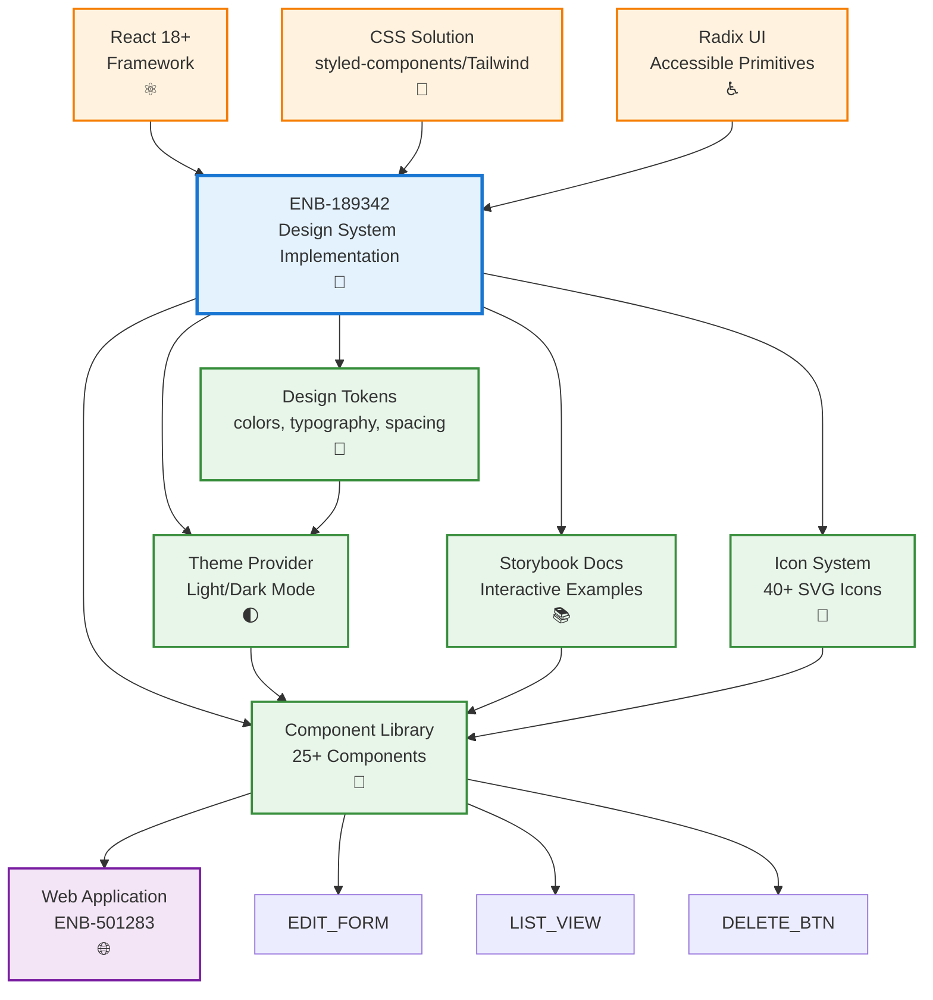

# Style Guide Implementation

## Metadata

- **Name**: Style Guide Implementation
- **Type**: Enabler
- **ID**: ENB-189342
- **Approval**: Approved
- **Capability ID**: CAP-485219
- **Owner**: Product Team
- **Status**: Ready for Implementation
- **Priority**: High
- **Analysis Review**: Required
- **Code Review**: Required

## Technical Overview
### Purpose
Implements a comprehensive design system and component library for the D&D 5e Player Character web application, inspired by GitHub's clean and professional design language. This enabler provides design tokens, reusable React components, theming infrastructure, and development tooling to ensure consistent, accessible, and performant UI across all application features.

## Functional Requirements

| ID | Name | Requirement | Priority | Status | Approval |
|----|------|-------------|----------|--------|----------|
| FR-DS001 | Design Tokens Configuration | The design system SHALL define design tokens in TypeScript/JSON format for colors, typography, spacing, shadows, borders, and animations | High | Ready for Implementation | Approved |
| FR-DS002 | Theme Provider | The design system SHALL provide a ThemeProvider component supporting light and dark modes | High | Ready for Implementation | Approved |
| FR-DS003 | CSS Variables | The design system SHALL expose design tokens as CSS custom properties for runtime theming | High | Ready for Implementation | Approved |
| FR-DS004 | Button Components | The design system SHALL provide Button variants (primary, secondary, outline, ghost, danger) with size options (sm, md, lg) | High | Ready for Implementation | Approved |
| FR-DS005 | Form Components | The design system SHALL provide Input, Select, Checkbox, Radio, Textarea components with validation states | High | Ready for Implementation | Approved |
| FR-DS006 | Layout Components | The design system SHALL provide Container, Grid, Stack, Divider components for flexible layouts | High | Ready for Implementation | Approved |
| FR-DS007 | Card Component | The design system SHALL provide Card component with header, body, footer sections and hover effects | High | Ready for Implementation | Approved |
| FR-DS008 | Navigation Components | The design system SHALL provide Header, Sidebar, Breadcrumbs, Tabs components | High | Ready for Implementation | Approved |
| FR-DS009 | Feedback Components | The design system SHALL provide Alert, Modal, Toast, Tooltip, Badge components | Medium | Ready for Implementation | Approved |
| FR-DS010 | Icon System | The design system SHALL provide 40+ SVG icons as tree-shakable React components | High | Ready for Implementation | Approved |
| FR-DS011 | Typography Components | The design system SHALL provide Heading, Text, Code components with multiple size options | High | Ready for Implementation | Approved |
| FR-DS012 | Table Component | The design system SHALL provide Table component with sorting, striped rows, and dynamic behavior | Medium | Ready for Implementation | Approved |
| FR-DS013 | Form Patterns | The design system SHALL provide FormField wrapper with label, error, and helper text | High | Ready for Implementation | Approved |
| FR-DS014 | Loading States | The design system SHALL provide Spinner, Skeleton, and ProgressBar components | Medium | Ready for Implementation | Approved |
| FR-DS016 | Storybook Documentation | The design system SHALL document all components in Storybook with interactive examples | High | Ready for Implementation | Approved |
| FR-DS017 | Theme Toggle | The design system SHALL provide useTheme hook and ThemeToggle component for user preference | High | Ready for Implementation | Approved |
| FR-DS018 | Accessibility Helpers | The design system SHALL provide VisuallyHidden, FocusTrap, and SkipLink components | High | Ready for Implementation | Approved |

## Non-Functional Requirements

| ID | Name | Type | Requirement | Priority | Status | Approval |
|----|------|------|-------------|----------|--------|----------|
| NFR-DS001 | Bundle Size | Performance | Core design system bundle SHALL be under 100KB gzipped | High | Ready for Implementation | Approved |
| NFR-DS002 | CSS Size | Performance | Design system CSS SHALL be under 50KB gzipped | High | Ready for Implementation | Approved |
| NFR-DS003 | Tree Shaking | Performance | All components SHALL be individually importable for optimal tree shaking | High | Ready for Implementation | Approved |
| NFR-DS004 | Accessibility | Compliance | All components SHALL meet WCAG 2.1 Level AA standards | High | Ready for Implementation | Approved |
| NFR-DS005 | Keyboard Navigation | Accessibility | All interactive components SHALL be fully keyboard accessible | High | Ready for Implementation | Approved |
| NFR-DS006 | Screen Reader Support | Accessibility | All components SHALL provide appropriate ARIA labels and roles | High | Ready for Implementation | Approved |
| NFR-DS007 | Color Contrast | Accessibility | All color combinations SHALL maintain 4.5:1 contrast for text, 3:1 for large text | High | Ready for Implementation | Approved |
| NFR-DS009 | TypeScript Support | Developer Experience | All components SHALL have complete TypeScript type definitions | High | Ready for Implementation | Approved |
| NFR-DS010 | Visual Regression Testing | Quality | Design system SHALL use Chromatic or Percy for visual regression testing | Medium | Ready for Implementation | Approved |
| NFR-DS011 | Theme Switching Performance | Performance | Theme switching SHALL complete within 150ms with smooth transitions | Medium | Ready for Implementation | Approved |
| NFR-DS012 | Documentation Coverage | Maintainability | 100% of components SHALL have Storybook documentation with usage examples | High | Ready for Implementation | Approved |

## Dependencies

### Internal Upstream Dependency

| Enabler ID | Description |
|------------|-------------|
| | None |

### Internal Downstream Impact

| Enabler ID | Description |
|------------|-------------|
| ENB-501283 | Player Character Web Application - Hosts and uses the design system |

### External Dependencies

**External Upstream Dependencies**:  

**External Downstream Impact**: All UI developers must use the design system components

## Technical Specifications

### Enabler Dependency Flow Diagram


### Directory Structure
```
src/
├── design-system/
│   ├── tokens/
│   │   ├── colors.ts              # Color palette and semantic colors
│   │   ├── typography.ts          # Font families, sizes, weights, line heights
│   │   ├── spacing.ts             # Spacing scale (4px base)
│   │   ├── shadows.ts             # Box shadow definitions
│   │   ├── borders.ts             # Border radius, widths
│   │   ├── animations.ts          # Transition and animation tokens
│   │   └── index.ts               # Token exports
│   ├── theme/
│   │   ├── ThemeProvider.tsx      # Theme context provider
│   │   ├── useTheme.ts            # Theme hook
│   │   ├── themes.ts              # Light and dark theme definitions
│   │   ├── globalStyles.ts        # Global CSS reset and base styles
│   │   └── index.ts
│   ├── components/
│   │   ├── Button/
│   │   │   ├── Button.tsx         # Button component
│   │   │   ├── Button.test.tsx    # Unit tests
│   │   │   ├── Button.stories.tsx # Storybook stories
│   │   │   └── index.ts
│   │   ├── Input/
│   │   ├── Card/
│   │   ├── Modal/
│   │   ├── [... 25+ components]
│   │   └── index.ts               # Component barrel export
│   ├── icons/
│   │   ├── IconBase.tsx           # Base icon component
│   │   ├── DiceIcon.tsx
│   │   ├── SwordIcon.tsx
│   │   ├── ShieldIcon.tsx
│   │   ├── [... 40+ icons]
│   │   └── index.ts
│   ├── utils/
│   │   ├── classNames.ts          # Class name utility
│   │   ├── responsive.ts          # Responsive utilities
│   │   └── a11y.ts                # Accessibility helpers
│   └── index.ts                   # Main design system export
├── .storybook/
│   ├── main.js                    # Storybook configuration
│   ├── preview.js                 # Global decorators and parameters
│   └── theme.js                   # Storybook theme customization
└── package.json
```

### Design Tokens Implementation

#### colors.ts
```typescript
export const colors = {
  // Primary - Blue (GitHub-inspired)
  primary: {
    50: '#eff6ff',
    100: '#dbeafe',
    200: '#bfdbfe',
    300: '#93c5fd',
    400: '#60a5fa',
    500: '#3b82f6',  // Primary brand color
    600: '#2563eb',
    700: '#1d4ed8',
    800: '#1e40af',
    900: '#1e3a8a',
  },
  
  // Neutral - Gray
  neutral: {
    50: '#f9fafb',
    100: '#f3f4f6',
    200: '#e5e7eb',
    300: '#d1d5db',
    400: '#9ca3af',
    500: '#6b7280',
    600: '#4b5563',
    700: '#374151',
    800: '#1f2937',
    900: '#111827',
  },
  
  // Success - Green
  success: {
    50: '#f0fdf4',
    100: '#dcfce7',
    500: '#22c55e',
    700: '#15803d',
    900: '#14532d',
  },
  
  // Warning - Amber
  warning: {
    50: '#fffbeb',
    100: '#fef3c7',
    500: '#f59e0b',
    700: '#b45309',
    900: '#78350f',
  },
  
  // Error - Red
  error: {
    50: '#fef2f2',
    100: '#fee2e2',
    500: '#ef4444',
    700: '#b91c1c',
    900: '#7f1d1d',
  },
  
  // D&D Themed Accent - Purple
  accent: {
    50: '#faf5ff',
    100: '#f3e8ff',
    500: '#a855f7',
    700: '#7e22ce',
    900: '#581c87',
  },
};

export const semanticColors = {
  light: {
    background: {
      primary: colors.neutral[50],
      secondary: '#ffffff',
      tertiary: colors.neutral[100],
      elevated: '#ffffff',
    },
    text: {
      primary: colors.neutral[900],
      secondary: colors.neutral[700],
      tertiary: colors.neutral[500],
      inverse: '#ffffff',
    },
    border: {
      default: colors.neutral[200],
      hover: colors.neutral[300],
      focus: colors.primary[500],
    },
    interactive: {
      primary: colors.primary[500],
      primaryHover: colors.primary[600],
      secondary: colors.neutral[100],
      secondaryHover: colors.neutral[200],
    },
  },
  dark: {
    background: {
      primary: '#0d1117',
      secondary: '#161b22',
      tertiary: '#21262d',
      elevated: '#1c2128',
    },
    text: {
      primary: '#e6edf3',
      secondary: '#8b949e',
      tertiary: '#6e7681',
      inverse: '#0d1117',
    },
    border: {
      default: '#30363d',
      hover: '#484f58',
      focus: colors.primary[500],
    },
    interactive: {
      primary: colors.primary[500],
      primaryHover: colors.primary[400],
      secondary: '#21262d',
      secondaryHover: '#30363d',
    },
  },
};
```

#### typography.ts
```typescript
export const typography = {
  fontFamily: {
    base: '-apple-system, BlinkMacSystemFont, "Segoe UI", "Noto Sans", Helvetica, Arial, sans-serif',
    heading: '-apple-system, BlinkMacSystemFont, "Segoe UI", "Noto Sans", Helvetica, Arial, sans-serif',
    mono: 'ui-monospace, SFMono-Regular, "SF Mono", Menlo, Consolas, "Liberation Mono", monospace',
  },
  
  fontSize: {
    xs: '0.75rem',      // 12px
    sm: '0.875rem',     // 14px
    base: '1rem',       // 16px
    lg: '1.125rem',     // 18px
    xl: '1.25rem',      // 20px
    '2xl': '1.5rem',    // 24px
    '3xl': '1.875rem',  // 30px
    '4xl': '2.25rem',   // 36px
    '5xl': '3rem',      // 48px
  },
  
  fontWeight: {
    normal: 400,
    medium: 500,
    semibold: 600,
    bold: 700,
  },
  
  lineHeight: {
    tight: 1.25,
    normal: 1.5,
    relaxed: 1.75,
  },
  
  letterSpacing: {
    tight: '-0.025em',
    normal: '0',
    wide: '0.025em',
  },
};
```

#### spacing.ts
```typescript
// 4px base spacing scale
export const spacing = {
  0: '0',
  1: '0.25rem',   // 4px
  2: '0.5rem',    // 8px
  3: '0.75rem',   // 12px
  4: '1rem',      // 16px
  5: '1.25rem',   // 20px
  6: '1.5rem',    // 24px
  8: '2rem',      // 32px
  10: '2.5rem',   // 40px
  12: '3rem',     // 48px
  16: '4rem',     // 64px
  20: '5rem',     // 80px
  24: '6rem',     // 96px
  32: '8rem',     // 128px
};
```

### Component Implementation Examples

#### Button Component
```typescript
// src/design-system/components/Button/Button.tsx
import React from 'react';
import styled from 'styled-components';

export interface ButtonProps extends React.ButtonHTMLAttributes<HTMLButtonElement> {
  variant?: 'primary' | 'secondary' | 'outline' | 'ghost' | 'danger';
  size?: 'sm' | 'md' | 'lg';
  fullWidth?: boolean;
  isLoading?: boolean;
  leftIcon?: React.ReactNode;
  rightIcon?: React.ReactNode;
}

const StyledButton = styled.button<ButtonProps>`
  /* Base styles */
  display: inline-flex;
  align-items: center;
  justify-content: center;
  gap: ${({ theme }) => theme.spacing[2]};
  font-family: ${({ theme }) => theme.typography.fontFamily.base};
  font-weight: ${({ theme }) => theme.typography.fontWeight.medium};
  border-radius: 6px;
  border: 1px solid transparent;
  cursor: pointer;
  transition: all 0.15s ease;
  white-space: nowrap;
  user-select: none;
  
  /* Disabled state */
  &:disabled {
    opacity: 0.5;
    cursor: not-allowed;
  }
  
  /* Focus state */
  &:focus-visible {
    outline: 2px solid ${({ theme }) => theme.colors.border.focus};
    outline-offset: 2px;
  }
  
  /* Size variants */
  ${({ size = 'md', theme }) => {
    switch (size) {
      case 'sm':
        return `
          font-size: ${theme.typography.fontSize.sm};
          padding: ${theme.spacing[2]} ${theme.spacing[3]};
          min-height: 32px;
        `;
      case 'lg':
        return `
          font-size: ${theme.typography.fontSize.lg};
          padding: ${theme.spacing[3]} ${theme.spacing[6]};
          min-height: 48px;
        `;
      default:
        return `
          font-size: ${theme.typography.fontSize.base};
          padding: ${theme.spacing[2]} ${theme.spacing[4]};
          min-height: 40px;
        `;
    }
  }}
  
  /* Variant styles */
  ${({ variant = 'primary', theme }) => {
    switch (variant) {
      case 'primary':
        return `
          background-color: ${theme.colors.interactive.primary};
          color: ${theme.colors.text.inverse};
          border-color: ${theme.colors.interactive.primary};
          
          &:hover:not(:disabled) {
            background-color: ${theme.colors.interactive.primaryHover};
            border-color: ${theme.colors.interactive.primaryHover};
          }
          
          &:active:not(:disabled) {
            transform: scale(0.98);
          }
        `;
      case 'secondary':
        return `
          background-color: ${theme.colors.interactive.secondary};
          color: ${theme.colors.text.primary};
          border-color: ${theme.colors.border.default};
          
          &:hover:not(:disabled) {
            background-color: ${theme.colors.interactive.secondaryHover};
            border-color: ${theme.colors.border.hover};
          }
        `;
      case 'outline':
        return `
          background-color: transparent;
          color: ${theme.colors.text.primary};
          border-color: ${theme.colors.border.default};
          
          &:hover:not(:disabled) {
            background-color: ${theme.colors.interactive.secondary};
            border-color: ${theme.colors.border.hover};
          }
        `;
      case 'ghost':
        return `
          background-color: transparent;
          color: ${theme.colors.text.primary};
          
          &:hover:not(:disabled) {
            background-color: ${theme.colors.interactive.secondary};
          }
        `;
      case 'danger':
        return `
          background-color: ${theme.colors.error[500]};
          color: ${theme.colors.text.inverse};
          border-color: ${theme.colors.error[500]};
          
          &:hover:not(:disabled) {
            background-color: ${theme.colors.error[700]};
            border-color: ${theme.colors.error[700]};
          }
        `;
    }
  }}
  
  /* Full width */
  ${({ fullWidth }) => fullWidth && 'width: 100%;'}
`;

export const Button: React.FC<ButtonProps> = ({
  children,
  leftIcon,
  rightIcon,
  isLoading,
  disabled,
  ...props
}) => {
  return (
    <StyledButton
      disabled={disabled || isLoading}
      aria-busy={isLoading}
      {...props}
    >
      {isLoading && <span className="spinner" aria-hidden="true">⏳</span>}
      {!isLoading && leftIcon && <span aria-hidden="true">{leftIcon}</span>}
      {children}
      {!isLoading && rightIcon && <span aria-hidden="true">{rightIcon}</span>}
    </StyledButton>
  );
};
```

#### Card Component
```typescript
// src/design-system/components/Card/Card.tsx
import React from 'react';
import styled from 'styled-components';

export interface CardProps {
  children: React.ReactNode;
  variant?: 'elevated' | 'outlined' | 'filled';
  padding?: keyof typeof import('../tokens/spacing').spacing;
  hoverable?: boolean;
  onClick?: () => void;
  className?: string;
}

const StyledCard = styled.div<CardProps>`
  border-radius: 8px;
  transition: all 0.2s ease;
  
  ${({ variant = 'elevated', theme }) => {
    switch (variant) {
      case 'elevated':
        return `
          background-color: ${theme.colors.background.elevated};
          box-shadow: 0 1px 3px rgba(0, 0, 0, 0.12), 0 1px 2px rgba(0, 0, 0, 0.24);
        `;
      case 'outlined':
        return `
          background-color: ${theme.colors.background.secondary};
          border: 1px solid ${theme.colors.border.default};
        `;
      case 'filled':
        return `
          background-color: ${theme.colors.background.tertiary};
        `;
    }
  }}
  
  ${({ padding = '4', theme }) => `
    padding: ${theme.spacing[padding]};
  `}
  
  ${({ hoverable, onClick, theme }) => hoverable && `
    cursor: ${onClick ? 'pointer' : 'default'};
    
    &:hover {
      box-shadow: 0 4px 6px rgba(0, 0, 0, 0.15), 0 2px 4px rgba(0, 0, 0, 0.12);
      transform: translateY(-2px);
      border-color: ${theme.colors.border.hover};
    }
  `}
`;

export const Card: React.FC<CardProps> = ({ children, onClick, ...props }) => {
  return (
    <StyledCard
      onClick={onClick}
      role={onClick ? 'button' : undefined}
      tabIndex={onClick ? 0 : undefined}
      onKeyDown={onClick ? (e) => {
        if (e.key === 'Enter' || e.key === ' ') {
          e.preventDefault();
          onClick();
        }
      } : undefined}
      {...props}
    >
      {children}
    </StyledCard>
  );
};

// Subcomponents
export const CardHeader = styled.div`
  margin-bottom: ${({ theme }) => theme.spacing[4]};
  padding-bottom: ${({ theme }) => theme.spacing[3]};
  border-bottom: 1px solid ${({ theme }) => theme.colors.border.default};
`;

export const CardBody = styled.div`
  flex: 1;
`;

export const CardFooter = styled.div`
  margin-top: ${({ theme }) => theme.spacing[4]};
  padding-top: ${({ theme }) => theme.spacing[3]};
  border-top: 1px solid ${({ theme }) => theme.colors.border.default};
  display: flex;
  gap: ${({ theme }) => theme.spacing[2]};
  justify-content: flex-end;
`;
```

#### Input Component
```typescript
// src/design-system/components/Input/Input.tsx
import React from 'react';
import styled from 'styled-components';

export interface InputProps extends Omit<React.InputHTMLAttributes<HTMLInputElement>, 'size'> {
  label?: string;
  error?: string;
  helperText?: string;
  size?: 'sm' | 'md' | 'lg';
  fullWidth?: boolean;
  leftIcon?: React.ReactNode;
  rightIcon?: React.ReactNode;
}

const InputWrapper = styled.div<{ fullWidth?: boolean }>`
  display: flex;
  flex-direction: column;
  gap: ${({ theme }) => theme.spacing[1]};
  ${({ fullWidth }) => fullWidth && 'width: 100%;'}
`;

const Label = styled.label`
  font-size: ${({ theme }) => theme.typography.fontSize.sm};
  font-weight: ${({ theme }) => theme.typography.fontWeight.medium};
  color: ${({ theme }) => theme.colors.text.primary};
`;

const InputContainer = styled.div<{ hasError?: boolean }>`
  position: relative;
  display: flex;
  align-items: center;
  
  ${({ hasError, theme }) => hasError && `
    .input-field {
      border-color: ${theme.colors.error[500]};
      
      &:focus {
        border-color: ${theme.colors.error[500]};
        box-shadow: 0 0 0 3px ${theme.colors.error[500]}33;
      }
    }
  `}
`;

const StyledInput = styled.input<{ size?: 'sm' | 'md' | 'lg'; hasLeftIcon?: boolean; hasRightIcon?: boolean }>`
  font-family: ${({ theme }) => theme.typography.fontFamily.base};
  color: ${({ theme }) => theme.colors.text.primary};
  background-color: ${({ theme }) => theme.colors.background.secondary};
  border: 1px solid ${({ theme }) => theme.colors.border.default};
  border-radius: 6px;
  width: 100%;
  transition: all 0.15s ease;
  
  ${({ size = 'md', theme }) => {
    switch (size) {
      case 'sm':
        return `
          font-size: ${theme.typography.fontSize.sm};
          padding: ${theme.spacing[2]} ${theme.spacing[3]};
          height: 32px;
        `;
      case 'lg':
        return `
          font-size: ${theme.typography.fontSize.lg};
          padding: ${theme.spacing[3]} ${theme.spacing[4]};
          height: 48px;
        `;
      default:
        return `
          font-size: ${theme.typography.fontSize.base};
          padding: ${theme.spacing[2]} ${theme.spacing[3]};
          height: 40px;
        `;
    }
  }}
  
  ${({ hasLeftIcon, theme }) => hasLeftIcon && `
    padding-left: ${theme.spacing[10]};
  `}
  
  ${({ hasRightIcon, theme }) => hasRightIcon && `
    padding-right: ${theme.spacing[10]};
  `}
  
  &:hover:not(:disabled) {
    border-color: ${({ theme }) => theme.colors.border.hover};
  }
  
  &:focus {
    outline: none;
    border-color: ${({ theme }) => theme.colors.border.focus};
    box-shadow: 0 0 0 3px ${({ theme }) => theme.colors.interactive.primary}33;
  }
  
  &:disabled {
    opacity: 0.5;
    cursor: not-allowed;
    background-color: ${({ theme }) => theme.colors.background.tertiary};
  }
  
  &::placeholder {
    color: ${({ theme }) => theme.colors.text.tertiary};
  }
`;

const IconWrapper = styled.span<{ position: 'left' | 'right' }>`
  position: absolute;
  ${({ position }) => position === 'left' ? 'left: 12px;' : 'right: 12px;'}
  top: 50%;
  transform: translateY(-50%);
  color: ${({ theme }) => theme.colors.text.tertiary};
  display: flex;
  align-items: center;
  pointer-events: none;
`;

const HelperText = styled.span<{ isError?: boolean }>`
  font-size: ${({ theme }) => theme.typography.fontSize.sm};
  color: ${({ isError, theme }) => isError ? theme.colors.error[500] : theme.colors.text.secondary};
`;

export const Input = React.forwardRef<HTMLInputElement, InputProps>(({
  label,
  error,
  helperText,
  size = 'md',
  fullWidth,
  leftIcon,
  rightIcon,
  id,
  ...props
}, ref) => {
  const inputId = id || `input-${Math.random().toString(36).substr(2, 9)}`;
  const errorId = error ? `${inputId}-error` : undefined;
  const helperId = helperText ? `${inputId}-helper` : undefined;
  
  return (
    <InputWrapper fullWidth={fullWidth}>
      {label && <Label htmlFor={inputId}>{label}</Label>}
      <InputContainer hasError={!!error}>
        {leftIcon && <IconWrapper position="left">{leftIcon}</IconWrapper>}
        <StyledInput
          ref={ref}
          id={inputId}
          className="input-field"
          size={size}
          hasLeftIcon={!!leftIcon}
          hasRightIcon={!!rightIcon}
          aria-invalid={!!error}
          aria-describedby={errorId || helperId}
          {...props}
        />
        {rightIcon && <IconWrapper position="right">{rightIcon}</IconWrapper>}
      </InputContainer>
      {error && <HelperText isError id={errorId} role="alert">{error}</HelperText>}
      {!error && helperText && <HelperText id={helperId}>{helperText}</HelperText>}
    </InputWrapper>
  );
});

Input.displayName = 'Input';
```

### Theme Provider Implementation

```typescript
// src/design-system/theme/ThemeProvider.tsx
import React, { createContext, useContext, useState, useEffect } from 'react';
import { ThemeProvider as StyledThemeProvider } from 'styled-components';
import { colors, semanticColors } from '../tokens/colors';
import { typography } from '../tokens/typography';
import { spacing } from '../tokens/spacing';

export type ThemeMode = 'light' | 'dark';

export interface Theme {
  mode: ThemeMode;
  colors: typeof semanticColors.light;
  typography: typeof typography;
  spacing: typeof spacing;
  rawColors: typeof colors;
}

interface ThemeContextValue {
  theme: Theme;
  toggleTheme: () => void;
  setTheme: (mode: ThemeMode) => void;
}

const ThemeContext = createContext<ThemeContextValue | undefined>(undefined);

const createTheme = (mode: ThemeMode): Theme => ({
  mode,
  colors: mode === 'light' ? semanticColors.light : semanticColors.dark,
  typography,
  spacing,
  rawColors: colors,
});

export const ThemeProvider: React.FC<{ children: React.ReactNode; defaultMode?: ThemeMode }> = ({
  children,
  defaultMode = 'light',
}) => {
  const [mode, setMode] = useState<ThemeMode>(() => {
    // Check localStorage
    const stored = localStorage.getItem('theme-mode');
    if (stored === 'light' || stored === 'dark') return stored;
    
    // Check system preference
    if (window.matchMedia && window.matchMedia('(prefers-color-scheme: dark)').matches) {
      return 'dark';
    }
    
    return defaultMode;
  });
  
  const theme = createTheme(mode);
  
  const toggleTheme = () => {
    setMode((prev) => prev === 'light' ? 'dark' : 'light');
  };
  
  const setTheme = (newMode: ThemeMode) => {
    setMode(newMode);
  };
  
  useEffect(() => {
    localStorage.setItem('theme-mode', mode);
    document.documentElement.setAttribute('data-theme', mode);
  }, [mode]);
  
  return (
    <ThemeContext.Provider value={{ theme, toggleTheme, setTheme }}>
      <StyledThemeProvider theme={theme}>
        {children}
      </StyledThemeProvider>
    </ThemeContext.Provider>
  );
};

export const useTheme = () => {
  const context = useContext(ThemeContext);
  if (!context) {
    throw new Error('useTheme must be used within ThemeProvider');
  }
  return context;
};
```

### Storybook Configuration

```javascript
// .storybook/main.js
module.exports = {
  stories: ['../src/design-system/**/*.stories.@(js|jsx|ts|tsx)'],
  addons: [
    '@storybook/addon-links',
    '@storybook/addon-essentials',
    '@storybook/addon-interactions',
    '@storybook/addon-a11y',
  ],
  framework: {
    name: '@storybook/react-vite',
    options: {},
  },
  docs: {
    autodocs: 'tag',
  },
};
```

```javascript
// .storybook/preview.js
import React from 'react';
import { ThemeProvider } from '../src/design-system/theme/ThemeProvider';

export const parameters = {
  actions: { argTypesRegex: '^on[A-Z].*' },
  controls: {
    matchers: {
      color: /(background|color)$/i,
      date: /Date$/,
    },
  },
  backgrounds: {
    default: 'light',
    values: [
      { name: 'light', value: '#f9fafb' },
      { name: 'dark', value: '#0d1117' },
    ],
  },
};

export const decorators = [
  (Story, context) => {
    const mode = context.globals.backgrounds?.value === '#0d1117' ? 'dark' : 'light';
    
    return (
      <ThemeProvider defaultMode={mode}>
        <Story />
      </ThemeProvider>
    );
  },
];
```

### Storybook Story Example

```typescript
// src/design-system/components/Button/Button.stories.tsx
import type { Meta, StoryObj } from '@storybook/react';
import { Button } from './Button';

const meta: Meta<typeof Button> = {
  title: 'Components/Button',
  component: Button,
  parameters: {
    layout: 'centered',
  },
  tags: ['autodocs'],
  argTypes: {
    variant: {
      control: 'select',
      options: ['primary', 'secondary', 'outline', 'ghost', 'danger'],
    },
    size: {
      control: 'select',
      options: ['sm', 'md', 'lg'],
    },
  },
};

export default meta;
type Story = StoryObj<typeof Button>;

export const Primary: Story = {
  args: {
    variant: 'primary',
    children: 'Create Character',
  },
};

export const Secondary: Story = {
  args: {
    variant: 'secondary',
    children: 'Cancel',
  },
};

export const Danger: Story = {
  args: {
    variant: 'danger',
    children: 'Delete Character',
  },
};

export const WithIcons: Story = {
  args: {
    variant: 'primary',
    children: 'Save Character',
    leftIcon: '💾',
  },
};

export const Loading: Story = {
  args: {
    variant: 'primary',
    children: 'Loading...',
    isLoading: true,
  },
};

export const Sizes: Story = {
  render: () => (
    <div style={{ display: 'flex', gap: '16px', alignItems: 'center' }}>
      <Button size="sm">Small</Button>
      <Button size="md">Medium</Button>
      <Button size="lg">Large</Button>
    </div>
  ),
};

export const AllVariants: Story = {
  render: () => (
    <div style={{ display: 'flex', flexDirection: 'column', gap: '16px', width: '300px' }}>
      <Button variant="primary" fullWidth>Primary Button</Button>
      <Button variant="secondary" fullWidth>Secondary Button</Button>
      <Button variant="outline" fullWidth>Outline Button</Button>
      <Button variant="ghost" fullWidth>Ghost Button</Button>
      <Button variant="danger" fullWidth>Danger Button</Button>
    </div>
  ),
};
```

