# Desktop Browser Optimization

## Metadata

- **Name**: Desktop Browser Optimization
- **Type**: Enabler
- **ID**: ENB-189343
- **Approval**: Approved
- **Capability ID**: CAP-485219
- **Owner**: Product Team
- **Status**: Ready for Implementation
- **Priority**: High
- **Analysis Review**: Required
- **Code Review**: Required

## Technical Overview
### Purpose
Optimize the web application for full desktop screen sizes and modern web browsers, ensuring optimal performance, compatibility, and user experience on desktop devices with screen widths of 1280px and above. This enabler defines browser support targets, viewport optimization, desktop-specific features, and quality standards for the desktop-first user experience.

## Functional Requirements

| ID | Name | Requirement | Priority | Status | Approval |
|----|------|-------------|----------|--------|----------|
| FR-DBO001 | Desktop Viewport Optimization | The application SHALL be optimized for desktop viewport widths from 1280px to 2560px and above | Must Have | Ready for Implementation | Approved |
| FR-DBO002 | Chrome Browser Support | The application SHALL fully support Google Chrome versions 120+ (latest 2 major versions) | Must Have | Ready for Implementation | Approved |
| FR-DBO003 | Firefox Browser Support | The application SHALL fully support Mozilla Firefox versions 121+ (latest 2 major versions) | Must Have | Ready for Implementation | Approved |
| FR-DBO004 | Safari Browser Support | The application SHALL fully support Safari versions 17+ (latest 2 major versions) on macOS | Must Have | Ready for Implementation | Approved |
| FR-DBO005 | Edge Browser Support | The application SHALL fully support Microsoft Edge versions 120+ (latest 2 major versions) | Must Have | Ready for Implementation | Approved |
| FR-DBO006 | Desktop Layout | The application SHALL utilize full desktop screen real estate with multi-column layouts and spacious designs | Must Have | Ready for Implementation | Approved |
| FR-DBO007 | Mouse and Keyboard Interactions | The application SHALL support desktop-specific interactions including hover states, context menus, keyboard shortcuts, and drag-and-drop | Must Have | Ready for Implementation | Approved |
| FR-DBO008 | Desktop Navigation | The application SHALL provide persistent navigation elements optimized for desktop (header, sidebar, breadcrumbs) | Must Have | Ready for Implementation | Approved |
| FR-DBO009 | Multi-Window Support | The application SHALL support multiple browser tabs/windows with proper state synchronization | Should Have | Ready for Implementation | Approved |
| FR-DBO010 | Desktop Typography | The application SHALL use desktop-optimized typography with larger base font sizes (16px-18px) and comfortable line heights | Must Have | Ready for Implementation | Approved |

## Non-Functional Requirements

| ID | Name | Type | Requirement | Priority | Status | Approval |
|----|------|------|-------------|----------|--------|----------|
| NFR-DBO001 | Browser Compatibility Testing | Quality | All features MUST be tested on Chrome 120+, Firefox 121+, Safari 17+, and Edge 120+ | Must Have | Ready for Implementation | Approved |
| NFR-DBO002 | Desktop Performance | Performance | Initial page load SHALL complete within 1.5 seconds on desktop broadband connections (10+ Mbps) | Must Have | Ready for Implementation | Approved |
| NFR-DBO003 | Desktop Rendering | Performance | Time to Interactive (TTI) SHALL be under 2.5 seconds on desktop hardware | Must Have | Ready for Implementation | Approved |
| NFR-DBO004 | CSS Grid and Flexbox | Compatibility | The application SHALL leverage modern CSS Grid and Flexbox for desktop layouts | Must Have | Ready for Implementation | Approved |
| NFR-DBO005 | Modern JavaScript Features | Compatibility | The application MAY use ES2020+ features supported by target browsers without polyfills | Should Have | Ready for Implementation | Approved |
| NFR-DBO006 | Desktop-Specific Features | User Experience | The application SHALL leverage desktop capabilities including clipboard API, drag-and-drop API, and local storage | Must Have | Ready for Implementation | Approved |
| NFR-DBO007 | Screen Resolution Support | Display | The application SHALL render correctly on desktop resolutions from 1280x720 to 3840x2160 (4K) | Must Have | Ready for Implementation | Approved |
| NFR-DBO008 | High DPI Support | Display | The application SHALL support high DPI displays (Retina, 4K) with crisp text and vector graphics | Must Have | Ready for Implementation | Approved |
| NFR-DBO009 | Browser DevTools Compatibility | Developer Experience | The application SHALL be compatible with browser developer tools for debugging | Must Have | Ready for Implementation | Approved |
| NFR-DBO010 | Desktop Accessibility | Accessibility | The application SHALL support desktop accessibility tools including screen readers, magnifiers, and keyboard navigation | Must Have | Ready for Implementation | Approved |

## Dependencies

### Internal Upstream Dependency

| Enabler ID | Description |
|------------|-------------|
| ENB-847347 | React + Vite Framework provides build tooling and development environment |
| ENB-189342 | Design System provides components optimized for desktop display |

### Internal Downstream Impact

| Enabler ID | Description |
|------------|-------------|
| ENB-847349 | Testing must include desktop browser compatibility tests |
| ENB-558245 | Linting rules may include browser-specific considerations |

### External Dependencies

**External Upstream Dependencies**: Modern web browser APIs, CSS Grid Level 2, CSS Flexbox, ES2020+ JavaScript

**External Downstream Impact**: Users must use supported desktop browsers for optimal experience

## Technical Specifications

### Enabler Dependency Flow Diagram

```mermaid
flowchart TD
    ENB_189343["ENB-189343<br/>Desktop Browser Optimization<br/>🖥️"]
    
    ENB_847347["ENB-847347<br/>React + Vite<br/>⚛️"]
    ENB_189342["ENB-189342<br/>Design System<br/>🎨"]
    
    CHROME["Chrome 120+<br/>Chromium Engine<br/>🌐"]
    FIREFOX["Firefox 121+<br/>Gecko Engine<br/>🦊"]
    SAFARI["Safari 17+<br/>WebKit Engine<br/>🧭"]
    EDGE["Edge 120+<br/>Chromium Engine<br/>🔷"]
    
    ENB_847347 --> ENB_189343
    ENB_189342 --> ENB_189343
    
    CHROME --> ENB_189343
    FIREFOX --> ENB_189343
    SAFARI --> ENB_189343
    EDGE --> ENB_189343
    
    VIEWPORT["Desktop Viewport<br/>1280px - 2560px+<br/>📐"]
    FEATURES["Desktop Features<br/>Hover, Keyboard, D&D<br/>⌨️"]
    LAYOUT["Multi-Column Layout<br/>Spacious Design<br/>📊"]
    PERF["High Performance<br/>< 2.5s TTI<br/>⚡"]
    
    ENB_189343 --> VIEWPORT
    ENB_189343 --> FEATURES
    ENB_189343 --> LAYOUT
    ENB_189343 --> PERF
    
    ENB_847349["ENB-847349<br/>Testing<br/>🧪"]
    ENB_558245["ENB-558245<br/>Linting<br/>📋"]
    
    ENB_189343 --> ENB_847349
    ENB_189343 --> ENB_558245

    classDef enabler fill:#e3f2fd,stroke:#1976d2,stroke-width:2px
    classDef browser fill:#f3e5f5,stroke:#7b1fa2,stroke-width:2px
    classDef feature fill:#e8f5e9,stroke:#388e3c,stroke-width:2px
    
    class ENB_847347,ENB_189342,ENB_189343,ENB_847349,ENB_558245 enabler
    class CHROME,FIREFOX,SAFARI,EDGE browser
    class VIEWPORT,FEATURES,LAYOUT,PERF feature
```


### API Technical Specifications

| API Type | Operation | Channel / Endpoint | Description | Request / Publish Payload | Response / Subscribe Data |
|----------|-----------|---------------------|-------------|----------------------------|----------------------------|
| Browser API | Feature Detection | navigator.userAgent | Detect browser type and version | None | User agent string |
| Browser API | Viewport Size | window.innerWidth/innerHeight | Get current viewport dimensions | None | Width and height in pixels |
| Browser API | Clipboard Access | navigator.clipboard.writeText() | Copy text to system clipboard | Text string | Promise\<void\> |
| Browser API | Drag and Drop | DataTransfer API | Handle drag and drop operations | DragEvent | Transferred data |
| Browser API | Local Storage | localStorage.setItem() | Persist data locally | Key-value pair | void |
| Browser API | Session Storage | sessionStorage.setItem() | Store session-specific data | Key-value pair | void |
| CSS API | Media Query | window.matchMedia() | Query viewport characteristics | Media query string | MediaQueryList |
| CSS API | Viewport Units | vw, vh, vmin, vmax | Size elements relative to viewport | CSS value | Computed pixel value |

### Data Models


### Class Diagrams


### Sequence Diagrams


### Dataflow Diagrams


### State Diagrams


## Implementation Guidelines

### Browser Support Matrix

| Browser | Minimum Version | Latest Tested | Engine | Market Share | Priority |
|---------|----------------|---------------|---------|--------------|----------|
| **Google Chrome** | 120 (Released Dec 2023) | 121+ | Chromium/Blink | ~65% | Critical |
| **Mozilla Firefox** | 121 (Released Dec 2023) | 122+ | Gecko | ~8% | Critical |
| **Safari** | 17.0 (Released Sep 2023) | 17.2+ | WebKit | ~20% | Critical |
| **Microsoft Edge** | 120 (Released Dec 2023) | 121+ | Chromium/Blink | ~5% | Critical |

**Note**: Versions are current as of November 2025. "Latest 2 versions" policy means supporting the current version and one version back.

### Viewport Specifications

**Target Desktop Resolutions**
```typescript
const DESKTOP_BREAKPOINTS = {
  desktop: 1280,      // Minimum desktop width
  desktopLg: 1440,    // Large desktop
  desktopXl: 1920,    // Full HD
  desktop2k: 2560,    // 2K/QHD
  desktop4k: 3840,    // 4K/UHD
} as const;

// Common aspect ratios
const ASPECT_RATIOS = {
  standard: '16:9',   // Most common
  wide: '21:9',       // Ultrawide
  standard43: '4:3',  // Older displays
} as const;
```

**Viewport Meta Tag**
```html
<!DOCTYPE html>
<html lang="en">
<head>
  <meta charset="UTF-8">
  <meta name="viewport" content="width=device-width, initial-scale=1.0, minimum-scale=1.0">
  <title>D&D Character Manager</title>
</head>
```

### Desktop Layout Patterns

**Multi-Column Layout Example**
```typescript
// DesktopLayout.tsx
import React from 'react';
import styles from './DesktopLayout.module.css';

export const DesktopLayout: React.FC = ({ children }) => {
  return (
    <div className={styles.desktopContainer}>
      <header className={styles.header}>
        {/* Desktop header with full navigation */}
      </header>
      
      <div className={styles.mainContent}>
        <aside className={styles.sidebar}>
          {/* Persistent sidebar navigation */}
        </aside>
        
        <main className={styles.content}>
          {children}
        </main>
        
        <aside className={styles.rightPanel}>
          {/* Optional right panel for additional info */}
        </aside>
      </div>
    </div>
  );
};
```

**CSS for Desktop Layout**
```css
/* DesktopLayout.module.css */
.desktopContainer {
  min-width: 1280px;
  max-width: 2560px;
  margin: 0 auto;
  display: flex;
  flex-direction: column;
  min-height: 100vh;
}

.header {
  height: 64px;
  display: flex;
  align-items: center;
  padding: 0 32px;
  border-bottom: 1px solid var(--border-color);
}

.mainContent {
  display: grid;
  grid-template-columns: 240px 1fr 320px;
  gap: 24px;
  padding: 24px 32px;
  flex: 1;
}

.sidebar {
  position: sticky;
  top: 24px;
  height: fit-content;
}

.content {
  min-width: 0; /* Prevent grid blowout */
}

.rightPanel {
  position: sticky;
  top: 24px;
  height: fit-content;
}

/* For large desktops (1920px+) */
@media (min-width: 1920px) {
  .mainContent {
    grid-template-columns: 280px 1fr 360px;
    gap: 32px;
    padding: 32px 48px;
  }
}

/* For ultrawide displays (2560px+) */
@media (min-width: 2560px) {
  .desktopContainer {
    max-width: 2400px;
  }
}
```

### Browser Detection and Feature Support

**Browser Detection Utility**
```typescript
// browserDetector.ts
export interface BrowserInfo {
  name: 'chrome' | 'firefox' | 'safari' | 'edge' | 'unknown';
  version: number;
  engine: 'chromium' | 'gecko' | 'webkit' | 'unknown';
  isSupported: boolean;
}

export function detectBrowser(): BrowserInfo {
  const ua = navigator.userAgent;
  
  // Detect Chrome
  if (/Chrome\/(\d+)/.test(ua) && !/Edg\//.test(ua)) {
    const version = parseInt(ua.match(/Chrome\/(\d+)/)![1], 10);
    return {
      name: 'chrome',
      version,
      engine: 'chromium',
      isSupported: version >= 120,
    };
  }
  
  // Detect Firefox
  if (/Firefox\/(\d+)/.test(ua)) {
    const version = parseInt(ua.match(/Firefox\/(\d+)/)![1], 10);
    return {
      name: 'firefox',
      version,
      engine: 'gecko',
      isSupported: version >= 121,
    };
  }
  
  // Detect Safari
  if (/Safari\//.test(ua) && !/Chrome/.test(ua)) {
    const versionMatch = ua.match(/Version\/(\d+)/);
    const version = versionMatch ? parseInt(versionMatch[1], 10) : 0;
    return {
      name: 'safari',
      version,
      engine: 'webkit',
      isSupported: version >= 17,
    };
  }
  
  // Detect Edge
  if (/Edg\/(\d+)/.test(ua)) {
    const version = parseInt(ua.match(/Edg\/(\d+)/)![1], 10);
    return {
      name: 'edge',
      version,
      engine: 'chromium',
      isSupported: version >= 120,
    };
  }
  
  return {
    name: 'unknown',
    version: 0,
    engine: 'unknown',
    isSupported: false,
  };
}

export function checkFeatureSupport() {
  return {
    cssGrid: CSS.supports('display', 'grid'),
    flexbox: CSS.supports('display', 'flex'),
    clipboardAPI: !!navigator.clipboard,
    dragDropAPI: 'draggable' in document.createElement('div'),
    localStorage: typeof localStorage !== 'undefined',
    sessionStorage: typeof sessionStorage !== 'undefined',
  };
}
```

**Unsupported Browser Warning Component**
```typescript
// BrowserWarning.tsx
import React, { useEffect, useState } from 'react';
import { detectBrowser } from './browserDetector';

export const BrowserWarning: React.FC = () => {
  const [showWarning, setShowWarning] = useState(false);
  const [browserInfo, setBrowserInfo] = useState<BrowserInfo | null>(null);
  
  useEffect(() => {
    const info = detectBrowser();
    setBrowserInfo(info);
    setShowWarning(!info.isSupported);
  }, []);
  
  if (!showWarning || !browserInfo) return null;
  
  return (
    <div className="browser-warning">
      <h2>Unsupported Browser Detected</h2>
      <p>
        You are using {browserInfo.name} version {browserInfo.version}.
        This application requires:
      </p>
      <ul>
        <li>Chrome 120 or later</li>
        <li>Firefox 121 or later</li>
        <li>Safari 17 or later</li>
        <li>Edge 120 or later</li>
      </ul>
      <p>
        Some features may not work correctly. Please upgrade your browser
        for the best experience.
      </p>
      <button onClick={() => setShowWarning(false)}>
        Continue Anyway
      </button>
    </div>
  );
};
```

### Desktop-Specific Features

**Hover States**
```css
/* Desktop hover states */
.button {
  transition: all 0.2s ease;
}

/* Only apply hover on devices that support hover */
@media (hover: hover) {
  .button:hover {
    background-color: var(--button-hover-bg);
    transform: translateY(-1px);
    box-shadow: 0 4px 8px rgba(0, 0, 0, 0.1);
  }
  
  .card:hover {
    box-shadow: 0 8px 16px rgba(0, 0, 0, 0.15);
  }
}
```

**Keyboard Shortcuts**
```typescript
// keyboardShortcuts.ts
export function setupKeyboardShortcuts() {
  document.addEventListener('keydown', (e) => {
    // Ctrl/Cmd + S: Save
    if ((e.ctrlKey || e.metaKey) && e.key === 's') {
      e.preventDefault();
      // Handle save
    }
    
    // Ctrl/Cmd + K: Search
    if ((e.ctrlKey || e.metaKey) && e.key === 'k') {
      e.preventDefault();
      // Open search
    }
    
    // Ctrl/Cmd + N: New
    if ((e.ctrlKey || e.metaKey) && e.key === 'n') {
      e.preventDefault();
      // Create new
    }
    
    // ESC: Close modal
    if (e.key === 'Escape') {
      // Close modal/dialog
    }
  });
}
```

**Drag and Drop**
```typescript
// DraggableCard.tsx
import React from 'react';

export const DraggableCard: React.FC = ({ id, children }) => {
  const handleDragStart = (e: React.DragEvent) => {
    e.dataTransfer.effectAllowed = 'move';
    e.dataTransfer.setData('text/plain', id);
  };
  
  const handleDragOver = (e: React.DragEvent) => {
    e.preventDefault();
    e.dataTransfer.dropEffect = 'move';
  };
  
  const handleDrop = (e: React.DragEvent) => {
    e.preventDefault();
    const draggedId = e.dataTransfer.getData('text/plain');
    // Handle drop logic
  };
  
  return (
    <div
      draggable
      onDragStart={handleDragStart}
      onDragOver={handleDragOver}
      onDrop={handleDrop}
    >
      {children}
    </div>
  );
};
```

**Clipboard API**
```typescript
// useClipboard.ts
export function useClipboard() {
  const copyToClipboard = async (text: string) => {
    try {
      await navigator.clipboard.writeText(text);
      return true;
    } catch (err) {
      console.error('Failed to copy:', err);
      return false;
    }
  };
  
  const readFromClipboard = async () => {
    try {
      const text = await navigator.clipboard.readText();
      return text;
    } catch (err) {
      console.error('Failed to read clipboard:', err);
      return null;
    }
  };
  
  return { copyToClipboard, readFromClipboard };
}
```

### Desktop Typography

**Desktop-Optimized Font Sizes**
```css
:root {
  /* Base font size for desktop */
  --font-size-base: 16px;
  
  /* Desktop typography scale */
  --font-size-xs: 12px;
  --font-size-sm: 14px;
  --font-size-md: 16px;
  --font-size-lg: 18px;
  --font-size-xl: 20px;
  --font-size-2xl: 24px;
  --font-size-3xl: 30px;
  --font-size-4xl: 36px;
  --font-size-5xl: 48px;
  
  /* Comfortable line heights for desktop reading */
  --line-height-tight: 1.25;
  --line-height-normal: 1.5;
  --line-height-relaxed: 1.75;
  
  /* Letter spacing for desktop screens */
  --letter-spacing-tight: -0.01em;
  --letter-spacing-normal: 0;
  --letter-spacing-wide: 0.025em;
}

body {
  font-size: var(--font-size-base);
  line-height: var(--line-height-normal);
  letter-spacing: var(--letter-spacing-normal);
}

/* Increase base size for large desktops */
@media (min-width: 1920px) {
  :root {
    --font-size-base: 18px;
  }
}
```

### Performance Optimization for Desktop

**Vite Configuration for Desktop**
```typescript
// vite.config.ts
import { defineConfig } from 'vite';
import react from '@vitejs/plugin-react';

export default defineConfig({
  plugins: [react()],
  build: {
    target: ['chrome120', 'firefox121', 'safari17', 'edge120'],
    cssTarget: ['chrome120', 'firefox121', 'safari17', 'edge120'],
    minify: 'terser',
    terserOptions: {
      compress: {
        drop_console: true,
        drop_debugger: true,
      },
    },
    rollupOptions: {
      output: {
        manualChunks: {
          vendor: ['react', 'react-dom'],
          router: ['react-router-dom'],
        },
      },
    },
  },
  server: {
    port: 5173,
    strictPort: false,
  },
});
```

**Performance Monitoring**
```typescript
// performanceMonitor.ts
export function measurePerformance() {
  if (typeof window === 'undefined') return;
  
  const perfData = performance.getEntriesByType('navigation')[0] as PerformanceNavigationTiming;
  
  const metrics = {
    pageLoadTime: perfData.loadEventEnd - perfData.fetchStart,
    domContentLoaded: perfData.domContentLoadedEventEnd - perfData.fetchStart,
    timeToInteractive: perfData.domInteractive - perfData.fetchStart,
    firstPaint: 0,
    firstContentfulPaint: 0,
  };
  
  // Get paint timing
  const paintEntries = performance.getEntriesByType('paint');
  paintEntries.forEach(entry => {
    if (entry.name === 'first-paint') {
      metrics.firstPaint = entry.startTime;
    } else if (entry.name === 'first-contentful-paint') {
      metrics.firstContentfulPaint = entry.startTime;
    }
  });
  
  console.log('Performance Metrics:', metrics);
  
  // Check thresholds
  const thresholds = {
    pageLoadTime: metrics.pageLoadTime < 1500, // < 1.5s
    timeToInteractive: metrics.timeToInteractive < 2500, // < 2.5s
    firstContentfulPaint: metrics.firstContentfulPaint < 1000, // < 1s
  };
  
  return { metrics, thresholds, allPassed: Object.values(thresholds).every(v => v) };
}
```

### Testing on Target Browsers

**Playwright Configuration for Desktop Browsers**
```typescript
// playwright.config.ts
import { defineConfig, devices } from '@playwright/test';

export default defineConfig({
  testDir: './tests',
  fullyParallel: true,
  projects: [
    {
      name: 'chrome-desktop',
      use: { 
        ...devices['Desktop Chrome'],
        viewport: { width: 1920, height: 1080 },
      },
    },
    {
      name: 'firefox-desktop',
      use: { 
        ...devices['Desktop Firefox'],
        viewport: { width: 1920, height: 1080 },
      },
    },
    {
      name: 'safari-desktop',
      use: { 
        ...devices['Desktop Safari'],
        viewport: { width: 1920, height: 1080 },
      },
    },
    {
      name: 'edge-desktop',
      use: { 
        ...devices['Desktop Edge'],
        viewport: { width: 1920, height: 1080 },
      },
    },
    {
      name: 'large-desktop',
      use: { 
        ...devices['Desktop Chrome'],
        viewport: { width: 2560, height: 1440 },
      },
    },
  ],
});
```

### Browser-Specific CSS Handling

**CSS with Browser Fallbacks**
```css
/* Modern CSS with fallbacks for older supported versions */
.grid-container {
  /* Fallback for browsers without subgrid */
  display: grid;
  grid-template-columns: repeat(auto-fit, minmax(300px, 1fr));
  gap: 24px;
  
  /* Subgrid for supported browsers (Chrome 117+, Firefox 71+) */
  @supports (grid-template-rows: subgrid) {
    grid-template-rows: subgrid;
  }
}

/* Container queries with fallback */
.card {
  width: 100%;
  
  /* Media query fallback */
  @media (min-width: 1280px) {
    width: 400px;
  }
  
  /* Container query for supported browsers */
  @container (min-width: 400px) {
    width: 100%;
  }
}
```

## Acceptance Criteria

- [ ] Application fully supports Chrome 120+, Firefox 121+, Safari 17+, and Edge 120+
- [ ] All features tested and working on target desktop browsers
- [ ] Application optimized for viewport widths 1280px to 2560px+
- [ ] Browser detection implemented with appropriate warnings
- [ ] Multi-column desktop layout implemented
- [ ] Hover states work correctly on desktop devices
- [ ] Keyboard shortcuts registered and functional
- [ ] Drag-and-drop functionality implemented for desktop
- [ ] Clipboard API integrated for copy/paste operations
- [ ] Desktop typography with 16-18px base font size
- [ ] Page load time under 1.5 seconds on broadband
- [ ] Time to Interactive under 2.5 seconds
- [ ] CSS Grid and Flexbox used for layouts
- [ ] High DPI (Retina/4K) displays render correctly
- [ ] Performance metrics monitored and meet thresholds
- [ ] Browser compatibility tests pass in CI/CD
- [ ] No mobile-specific code or responsive breakpoints below 1280px
- [ ] Documentation includes browser support matrix

## Notes

- This enabler explicitly targets desktop-only experience, no mobile or tablet optimization
- Browser version numbers reflect "latest 2 versions" policy as of November 2025
- Modern CSS features (Grid, Flexbox, CSS Variables) can be used without polyfills
- ES2020+ JavaScript features are supported by all target browsers
- High DPI support is critical for Retina MacBook and 4K monitors
- Performance thresholds assume broadband connection (10+ Mbps)
- Keyboard shortcuts should not conflict with browser defaults
- Consider edge cases for ultrawide monitors (21:9 aspect ratio)
- Test on both Windows and macOS versions of browsers
- Browser detection is for warnings only, not feature gating
- All desktop-specific features should degrade gracefully if unavailable
