# Home Page

## Metadata

- **Name**: Home Page
- **Type**: Enabler
- **ID**: ENB-299518
- **Approval**: Approved
- **Capability ID**: CAP-924443
- **Owner**: Product Team
- **Status**: Ready for Implementation
- **Priority**: High
- **Analysis Review**: Required
- **Code Review**: Not Required

## Technical Overview
### Purpose
Implements a modern, visually engaging home page featuring a hero section with compelling imagery, clear value proposition, feature highlights, call-to-action buttons, and smooth scrolling sections. The design emphasizes clean typography, ample white space, subtle animations, and a responsive layout that creates an excellent first impression across all devices.

## Functional Requirements

| ID | Name | Requirement | Priority | Status | Approval |
|----|------|-------------|----------|--------|----------|
| FR-299001 | Hero Section | Home page must feature a full-viewport hero section with large headline, subheadline, and primary CTA button | High | Ready for Implementation | Not Approved |
| FR-299002 | Hero Background | Hero section must support background image or gradient with overlay for text readability | High | Ready for Implementation | Not Approved |
| FR-299003 | Primary CTA | Hero must include a prominent primary call-to-action button (e.g., "Get Started", "Create Character") with contrasting color | High | Ready for Implementation | Not Approved |
| FR-299004 | Features Grid | Home page must display key features in a 3-column grid on desktop, 1-column on mobile | High | Ready for Implementation | Not Approved |
| FR-299005 | Feature Cards | Each feature must be presented in a card with icon, title, and description | Medium | Ready for Implementation | Not Approved |
| FR-299006 | Visual Hierarchy | Content sections must have clear visual separation using spacing, backgrounds, or dividers | High | Ready for Implementation | Not Approved |
| FR-299007 | Secondary CTA Section | Home page must include a secondary call-to-action section near bottom encouraging user action | Medium | Ready for Implementation | Not Approved |
| FR-299008 | Scroll Indicators | Hero section must include a subtle scroll indicator (chevron or text) encouraging users to explore | Low | Ready for Implementation | Not Approved |
| FR-299009 | Testimonials/Social Proof | Home page should include a section for testimonials, stats, or social proof elements | Low | Ready for Implementation | Not Approved |
| FR-299010 | Responsive Images | All images must be responsive with appropriate srcset for different screen sizes | High | Ready for Implementation | Not Approved |
| FR-299011 | Content Sections | Home page must support multiple content sections: About, Features, How It Works, CTA | Medium | Ready for Implementation | Not Approved |
| FR-299012 | Smooth Scroll | Navigation links to page sections must use smooth scrolling behavior | Medium | Ready for Implementation | Not Approved |

## Non-Functional Requirements

| ID | Name | Type | Requirement | Priority | Status | Approval |
|----|------|------|-------------|----------|--------|----------|
| NFR-299001 | Fast Load Time | Performance | Home page must load and render above-the-fold content within 2 seconds on 3G connection | High | Ready for Implementation | Not Approved |
| NFR-299002 | Image Optimization | Performance | Hero and feature images must be optimized (WebP format) and lazy-loaded below fold | High | Ready for Implementation | Not Approved |
| NFR-299003 | Scroll Animations | Usability | Scroll-triggered animations must use Intersection Observer API with fade-in/slide-up effects | Medium | Ready for Implementation | Not Approved |
| NFR-299004 | Animation Performance | Performance | All animations must maintain 60fps and use CSS transforms for performance | High | Ready for Implementation | Not Approved |
| NFR-299005 | Mobile First Design | Usability | Home page must be designed mobile-first with touch-optimized buttons (min 44x44px) | High | Ready for Implementation | Not Approved |
| NFR-299006 | Accessibility Standards | Accessibility | Home page must meet WCAG 2.1 Level AA with proper heading hierarchy and alt text | High | Ready for Implementation | Not Approved |
| NFR-299007 | SEO Optimization | Discoverability | Home page must include semantic HTML, meta tags, and structured data for search engines | High | Ready for Implementation | Not Approved |
| NFR-299008 | Typography Scale | Usability | Text must use responsive typography scaling from 16px base on mobile to 18px on desktop | Medium | Ready for Implementation | Not Approved |
| NFR-299009 | Color Contrast | Accessibility | All text must maintain minimum 4.5:1 contrast ratio, hero text over images 7:1 | High | Ready for Implementation | Not Approved |
| NFR-299010 | Consistent Branding | Maintainability | Home page design must align with style guide colors, typography, and spacing system | High | Ready for Implementation | Not Approved |

## Dependencies

### Internal Upstream Dependency

| Enabler ID | Description |
|------------|-------------|
| ENB-189342 | Style Guide Implementation - provides color palette, typography scale, spacing system |
| ENB-951534 | Header - includes site header with navigation |
| ENB-874140 | Layout - provides layout structure and responsive grid system |

### Internal Downstream Impact

| Enabler ID | Description |
|------------|-------------|
| ENB-501283 | Player Character Web Application - home page serves as landing/entry point to application |

### External Dependencies

**External Upstream Dependencies**: None identified.

**External Downstream Impact**: None identified.

## Technical Specifications (Template)

### Enabler Dependency Flow Diagram

```mermaid
flowchart TD
    ENB_189342["ENB-189342<br/>Style Guide Implementation<br/>🎨"]
    ENB_951534["ENB-951534<br/>Header<br/>📡"]
    ENB_874140["ENB-874140<br/>Layout<br/>📐"]
    ENB_299518["ENB-299518<br/>Home Page<br/>🏠"]
    ENB_501283["ENB-501283<br/>Player Character Web Application<br/>🌐"]

    ENB_189342 --> ENB_951534
    ENB_189342 --> ENB_874140
    ENB_951534 --> ENB_874140
    ENB_189342 --> ENB_299518
    ENB_951534 --> ENB_299518
    ENB_874140 --> ENB_299518
    ENB_299518 --> ENB_501283

    classDef enabler fill:#e3f2fd,stroke:#1976d2,stroke-width:2px
    class ENB_189342,ENB_951534,ENB_874140,ENB_299518,ENB_501283 enabler
```

### API Technical Specifications (if applicable)

| API Type | Operation | Channel / Endpoint | Description | Request / Publish Payload | Response / Subscribe Data |
|----------|-----------|---------------------|-------------|----------------------------|----------------------------|
| | | | | | |

### Data Models

### Class Diagrams

### Sequence Diagrams

### Dataflow Diagrams

### State Diagrams

