# Linter

## Metadata

- **Name**: Linter
- **Type**: Enabler
- **ID**: ENB-558245
- **Approval**: Approved
- **Capability ID**: CAP-529947
- **Owner**: Product Team
- **Status**: Ready for Implementation
- **Priority**: High
- **Analysis Review**: Required
- **Code Review**: Not Required

## Technical Overview
### Purpose
Ensure code quality by identifying and resolving ALL linting issues using ESLint and enforcing consistent code formatting with Prettier. The codebase MUST have zero linting errors and zero linting warnings before completion.

## Functional Requirements

| ID | Name | Requirement | Priority | Status | Approval |
|----|------|-------------|----------|--------|----------|
| FR-558246 | ESLint Configuration | Configure ESLint with React, TypeScript, and recommended rules for comprehensive code analysis | Must Have | Ready for Implementation | Approved |
| FR-558247 | Linter Execution | Discover all linting issues with ESLint v8+ across all TypeScript and React files | Must Have | Ready for Implementation | Approved |
| FR-558248 | Linter Results | Resolve ALL errors found by ESLint - zero errors required | Must Have | Ready for Implementation | Approved |
| FR-558249 | Linter Warnings | Resolve ALL warnings found by ESLint - zero warnings required | Must Have | Ready for Implementation | Approved |
| FR-558250 | Code Formatting | Ensure all files are properly formatted with Prettier (no formatting issues) | Must Have | Ready for Implementation | Approved |
| FR-558251 | React Rules | Apply React-specific linting rules including hooks and component best practices | Must Have | Ready for Implementation | Approved |
| FR-558252 | TypeScript Rules | Enforce TypeScript-specific rules for type safety and best practices | Must Have | Ready for Implementation | Approved |
| FR-558253 | Verification | Run `npm run lint` and verify output shows zero errors and zero warnings | Must Have | Ready for Implementation | Approved |

## Non-Functional Requirements

| ID | Name | Type | Requirement | Priority | Status | Approval |
|----|------|------|-------------|----------|--------|----------|
| NFR-558254 | Zero Tolerance | Quality | No linting errors or warnings are acceptable - 100% clean code required | Must Have | Ready for Implementation | Approved |
| NFR-558255 | Build Gate | Quality | Linting must pass before any build or deployment | Must Have | Ready for Implementation | Approved |
| NFR-558256 | Continuous Compliance | Quality | All code changes must maintain zero linting issues | Must Have | Ready for Implementation | Approved |
| NFR-558257 | Complete Coverage | Quality | All TypeScript/JavaScript/React files in the project must be linted with zero issues | Must Have | Ready for Implementation | Approved |
| NFR-558258 | Format Consistency | Quality | All files must follow Prettier formatting rules consistently | Must Have | Ready for Implementation | Approved |

## Dependencies

### Internal Upstream Dependency

| Enabler ID | Description |
|------------|-------------|
| ENB-847347 | React + Vite Framework provides the codebase to lint |
| ENB-847343 | NPM Package Management installs ESLint and Prettier |

### Internal Downstream Impact

| Enabler ID | Description |
|------------|-------------|
| ENB-189342 | Design System components must pass linting |
| ENB-XXXXXX | Test files must pass linting standards |

### External Dependencies

**External Upstream Dependencies**: ESLint v8+, Prettier v3+, TypeScript ESLint parser and plugin

**External Downstream Impact**: All React application code quality depends on passing lint checks

## Technical Specifications

### Enabler Dependency Flow Diagram

### API Technical Specifications

| API Type | Operation | Channel / Endpoint | Description | Request / Publish Payload | Response / Subscribe Data |
|----------|-----------|---------------------|-------------|----------------------------|----------------------------|
| CLI | Command | npm run lint | Run ESLint on all source files | None | Lint results with errors/warnings |
| CLI | Command | npm run lint:fix | Run ESLint with auto-fix enabled | None | Fixed files + remaining issues |
| CLI | Command | npm run format | Run Prettier to format all files | None | Formatted files list |
| CLI | Command | npm run format:check | Check if files are formatted | None | Format violations report |
| CLI | Command | npx eslint . --ext .ts,.tsx | Lint specific file extensions | File patterns | Detailed lint report |
| CLI | Command | npx prettier --write "src/**/*.{ts,tsx,css}" | Format specific patterns | File patterns | Formatted file paths |

### Data Models

### Class Diagrams

### Sequence Diagrams

### Dataflow Diagrams

```mermaid
flowchart TD
    Start[Developer Initiates Lint] --> Install[Install ESLint + Prettier]
    Install --> InstallPlugins[Install TypeScript ESLint + React plugins]
    InstallPlugins --> CheckConfig{Check configs}
    
    CheckConfig -->|Missing| CreateConfig[Create .eslintrc.cjs + .prettierrc]
    CheckConfig -->|Exists| ValidateConfig[Validate config]
    CreateConfig --> ValidateConfig
    
    ValidateConfig -->|Deprecated rules| FixConfig[Update to current rules]
    ValidateConfig -->|Valid| RunLint
    FixConfig --> RunLint
    
    RunLint[Run: npm run lint] --> ParseOutput{Parse output}
    
    ParseOutput -->|Warnings found| FixWarnings[Fix ALL warnings]
    ParseOutput -->|Errors found| FixErrors[Fix ALL errors]
    ParseOutput -->|Format issues| Format[Run: npm run format]
    ParseOutput -->|React rules| FixReact[Fix React violations]
    ParseOutput -->|Hook rules| FixHooks[Fix hooks violations]
    ParseOutput -->|TS issues| FixTypes[Fix TypeScript issues]
    ParseOutput -->|Clean output| Verify
    
    FixWarnings --> RunLint
    FixErrors --> RunLint
    Format --> RunLint
    FixReact --> RunLint
    FixHooks --> RunLint
    FixTypes --> RunLint
    
    Verify{Zero issues?} -->|No| Fail[❌ Linting Failed]
    Verify -->|Yes| TypeCheck[npm run typecheck]
    
    TypeCheck --> TypeOK{Types Valid?}
    TypeOK -->|No| Fail
    TypeOK -->|Yes| Build[npm run build]
    
    Build --> BuildCheck{Build OK?}
    BuildCheck -->|No| Fail
    BuildCheck -->|Yes| Complete[✓ Linting Complete: Zero Issues]
    
    Fail --> End[Must fix all issues]
    Complete --> End
```

### State Diagrams

