# Containerization

## Metadata

- **Name**: Containerization
- **Type**: Enabler
- **ID**: ENB-847329
- **Approval**: Approved
- **Capability ID**: CAP-529947
- **Owner**: DevOps Team
- **Status**: Ready for Implementation
- **Priority**: High
- **Analysis Review**: Not Required
- **Code Review**: Not Required

## Technical Overview
### Purpose
Containerize the web service application using Docker to ensure consistent deployment across different environments, simplify dependency management, and enable scalable orchestration.

## Functional Requirements

| ID | Name | Requirement | Priority | Status | Approval |
|----|------|-------------|----------|--------|----------|
| FR-847330 | Dockerfile Creation | Create optimized Dockerfile with multi-stage builds for production deployment. CRITICAL: Base image must use Go 1.23+ (e.g., golang:1.23-alpine) to match application dependencies. Verify go.mod Go version matches Dockerfile Go version | Must Have | Ready for Implementation | Approved |
| FR-847331 | Container Configuration | Configure container with appropriate environment variables, exposed ports, and volume mounts | Must Have | Ready for Implementation | Approved |
| FR-847332 | Docker Compose Support | Provide docker-compose.yml for local development and testing | Must Have | Ready for Implementation | Approved |
| FR-847333 | Health Check Integration | Include Docker health checks to monitor container status | Must Have | Ready for Implementation | Approved |
| FR-168522 | Unique Port | The default server port must be unique and avoid commonly used port numbers (e.g., 80, 443, 3000, 5000, 8000, 8080, 8443, 9000). Choose a port number that is unlikely to conflict with other services. The port should still be configurable via environment variables for deployment flexibility. | Must Have | Ready for Implementation | Approved |

## Non-Functional Requirements

| ID | Name | Type | Requirement | Priority | Status | Approval |
|----|------|------|-------------|----------|--------|----------|
| NFR-847334 | Image Size Optimization | Performance | Minimize Docker image size using Alpine or distroless base images | Must Have | Ready for Implementation | Approved |
| NFR-847335 | Build Time | Performance | Optimize Docker build time using layer caching and multi-stage builds | Must Have | Ready for Implementation | Approved |
| NFR-847336 | Security Hardening | Security | Run container as non-root user and scan for vulnerabilities | Must Have | Ready for Implementation | Approved |
| NFR-847337 | Portability | Compatibility | Ensure container runs consistently across different platforms (Linux, Windows, macOS) | Must Have | Ready for Implementation | Approved |

## Dependencies

### Internal Upstream Dependency

| Enabler ID | Description |
|------------|-------------|
| ENB-XXXXXX | RESTful API Endpoints must be containerized |
| ENB-XXXXXX | Health Check Endpoint used for Docker health checks |

### Internal Downstream Impact

| Enabler ID | Description |
|------------|-------------|
| | |

### External Dependencies

**External Upstream Dependencies**: Docker Engine, Docker Compose (for local development)

**External Downstream Impact**: Container orchestration platforms (Kubernetes, Docker Swarm, ECS, etc.)

## Technical Specifications

### Enabler Dependency Flow Diagram

```mermaid
flowchart TD
    ENB_847329["ENB-847329<br/>Docker Containerization<br/>🐳"]
    
    ENB_847292["ENB-XXXXXX<br/>RESTful API Endpoints<br/>🔌"]
    ENB_847295["ENB-XXXXXX<br/>Health Check Endpoint<br/>🏥"]
    
    DOCKERFILE["Dockerfile<br/>Container Definition<br/>📄"]
    COMPOSE["docker-compose.yml<br/>Local Development<br/>🛠️"]
    IMAGE["Docker Image<br/>Deployable Artifact<br/>📦"]
    REGISTRY["Container Registry<br/>Image Storage<br/>🗄️"]
    
    ENB_847292 --> ENB_847329
    ENB_847295 --> ENB_847329
    
    ENB_847329 --> DOCKERFILE
    ENB_847329 --> COMPOSE
    DOCKERFILE --> IMAGE
    IMAGE --> REGISTRY

    classDef enabler fill:#e3f2fd,stroke:#1976d2,stroke-width:2px
    classDef artifact fill:#f3e5f5,stroke:#7b1fa2,stroke-width:2px
    
    class ENB_847292,ENB_847295,ENB_847329 enabler
    class DOCKERFILE,COMPOSE,IMAGE,REGISTRY artifact
```

### API Technical Specifications

| API Type | Operation | Channel / Endpoint | Description | Request / Publish Payload | Response / Subscribe Data |
|----------|-----------|---------------------|-------------|----------------------------|----------------------------|
| Docker CLI | Command | docker build -t app:latest . | Build Docker image from Dockerfile | Build context directory | Docker image |
| Docker CLI | Command | docker run -p 8080:8080 app:latest | Run containerized application | Runtime configuration | Running container |
| Docker CLI | Command | docker-compose up | Start multi-container application | docker-compose.yml | Running services |
| Docker API | Endpoint | /containers/{id}/health | Check container health status | None | Health status response |

### Data Models

### Class Diagrams

### Sequence Diagrams

### Dataflow Diagrams

### State Diagrams

