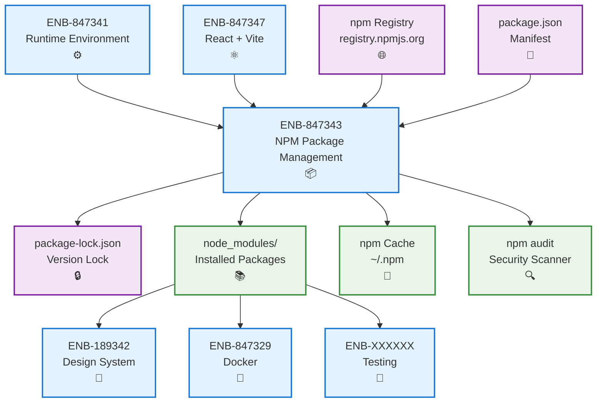
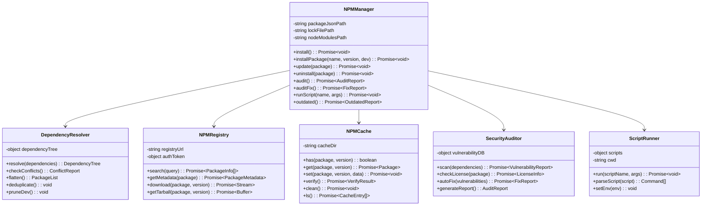
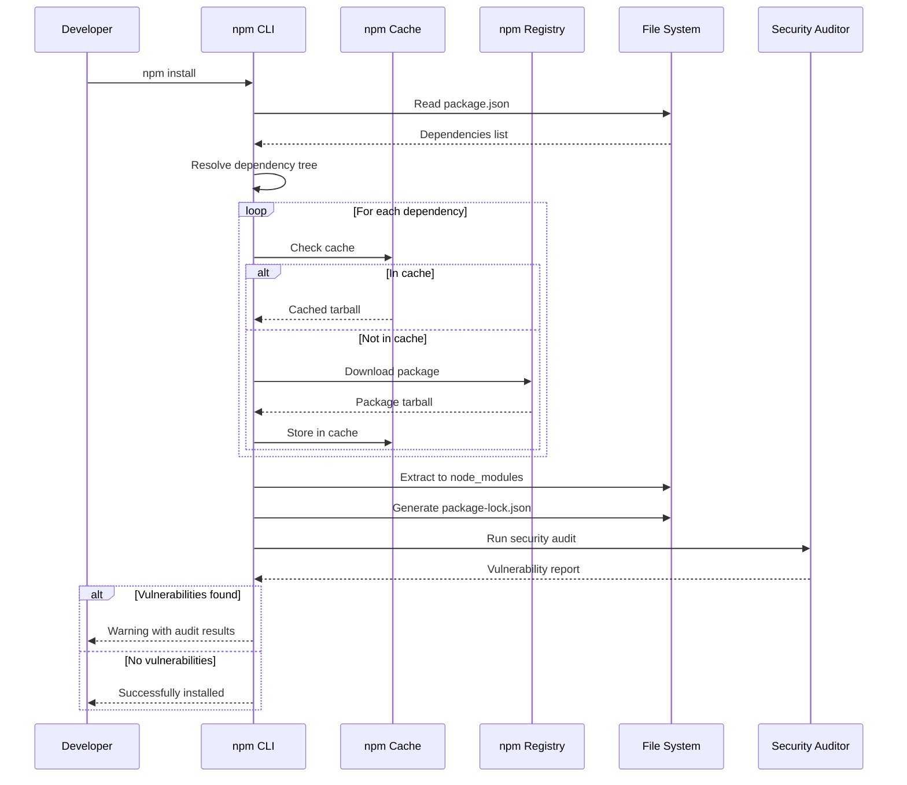
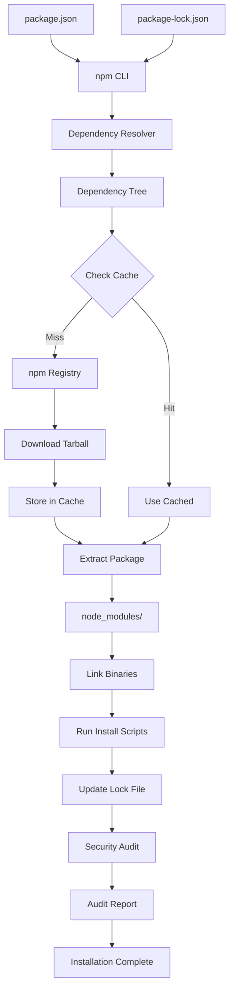
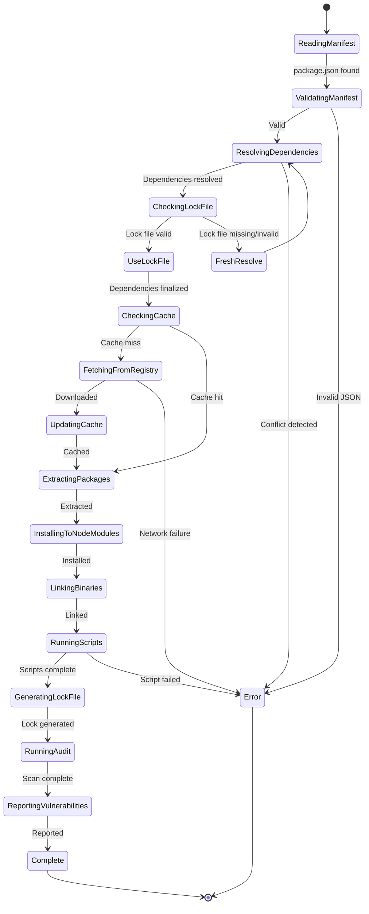

# NPM Package Management

## Metadata

- **Name**: NPM Package Management
- **Type**: Enabler
- **ID**: ENB-847343
- **Approval**: Approved
- **Capability ID**: CAP-529947
- **Owner**: Development Team
- **Status**: Ready for Implementation
- **Priority**: High
- **Analysis Review**: Not Required
- **Code Review**: Not Required

## Technical Overview
### Purpose
Manage React application dependencies, third-party packages, and libraries using npm (Node Package Manager) with version locking, vulnerability scanning, automated updates, and workspace management for the frontend web application.

## Functional Requirements

| ID | Name | Requirement | Priority | Status | Approval |
|----|------|-------------|----------|--------|----------|
| FR-847430 | Package Installation | Install and manage project dependencies using npm with package.json | Must Have | Ready for Implementation | Approved |
| FR-847431 | Version Locking | Lock dependency versions using package-lock.json to ensure reproducible builds | Must Have | Ready for Implementation | Approved |
| FR-847432 | Dependency Resolution | Resolve dependency conflicts and transitive dependencies automatically | Must Have | Ready for Implementation | Approved |
| FR-847433 | Package Scripts | Support custom npm scripts for dev, build, test, lint, and deployment tasks | Must Have | Ready for Implementation | Approved |

## Non-Functional Requirements

| ID | Name | Type | Requirement | Priority | Status | Approval |
|----|------|------|-------------|----------|--------|----------|
| NFR-847434 | Vulnerability Scanning | Security | Scan dependencies for known security vulnerabilities using npm audit | Must Have | Ready for Implementation | Approved |
| NFR-847435 | Install Performance | Performance | Optimize dependency installation time using npm cache and ci command | Must Have | Ready for Implementation | Approved |
| NFR-847436 | License Compliance | Compliance | Track and validate dependency licenses for OSS compliance | Must Have | Ready for Implementation | Approved |
| NFR-847437 | Offline Support | Reliability | Support offline installation using npm cache for reliability | Must Have | Ready for Implementation | Approved |

## Dependencies

### Internal Upstream Dependency

| Enabler ID | Description |
|------------|-------------|
| ENB-847347 | React + Vite Framework requires npm for dependency management |
| ENB-847341 | Runtime environment provides Node.js and npm |

### Internal Downstream Impact

| Enabler ID | Description |
|------------|-------------|
| ENB-189342 | Design System components depend on npm packages |
| ENB-847329 | Docker containerization includes npm install step |
| ENB-XXXXXX | Testing framework dependencies installed via npm |

### External Dependencies

**External Upstream Dependencies**: npm registry (registry.npmjs.org), Node.js runtime

**External Downstream Impact**: All React application code depends on npm-installed packages

## Technical Specifications

### Enabler Dependency Flow Diagram


### API Technical Specifications

| API Type | Operation | Channel / Endpoint | Description | Request / Publish Payload | Response / Subscribe Data |
|----------|-----------|---------------------|-------------|----------------------------|----------------------------|
| CLI | Command | npm install | Install all dependencies from package.json | None | Installation log with timing |
| CLI | Command | npm install <package> | Install specific package and save to dependencies | Package name[@version] | Installation confirmation |
| CLI | Command | npm install -D <package> | Install package as devDependency | Package name[@version] | Installation confirmation |
| CLI | Command | npm ci | Clean install from lock file (CI/CD) | None | Fast installation log |
| CLI | Command | npm update [package] | Update dependencies to latest allowed versions | Optional package name | Update log with changes |
| CLI | Command | npm audit | Scan for security vulnerabilities | None | Vulnerability report with severity |
| CLI | Command | npm audit fix | Automatically fix vulnerabilities | None | Fix report and updated packages |
| CLI | Command | npm outdated | Check for outdated packages | None | Table of current vs latest versions |
| CLI | Command | npm run <script> | Execute custom package script | Script name and args | Script execution output |
| CLI | Command | npm list | Display dependency tree | None | Tree of installed packages |
| CLI | Command | npm cache clean --force | Clear npm cache | None | Cache cleared confirmation |
| CLI | Command | npm dedupe | Optimize dependency tree | None | Deduplication log |

### Data Models

```mermaid
erDiagram
    PackageJSON {
        string name
        string version
        string description
        object dependencies
        object devDependencies
        object peerDependencies
        object scripts
        string license
        array keywords
        object engines
    }
    
    PackageLockJSON {
        string name
        string version
        int lockfileVersion
        object packages
        object dependencies
    }
    
    PackageEntry {
        string name
        string version
        string resolved
        string integrity
        boolean dev
        object requires
        object dependencies
    }
    
    NodeModules {
        string packageName
        string installedVersion
        string path
        object packageJson
    }
    
    VulnerabilityReport {
        string packageName
        string severity
        string vulnerability
        string recommendation
        string url
        array via
    }
    
    AuditResult {
        int vulnerabilities_info
        int vulnerabilities_low
        int vulnerabilities_moderate
        int vulnerabilities_high
        int vulnerabilities_critical
    }
    
    PackageJSON ||--|| PackageLockJSON : generates
    PackageLockJSON ||--o{ PackageEntry : contains
    PackageEntry ||--|| NodeModules : installs_to
    NodeModules ||--o{ VulnerabilityReport : may_have
    VulnerabilityReport }o--|| AuditResult : aggregates_to
```


### Class Diagrams


### Sequence Diagrams


### Dataflow Diagrams


### State Diagrams


## Implementation Guidelines

### package.json Configuration

**Essential package.json structure**
```json
{
  "name": "dnd-character-app",
  "version": "1.0.0",
  "private": true,
  "type": "module",
  "description": "D&D 5e Character Management Application",
  "license": "MIT",
  "engines": {
    "node": ">=18.0.0",
    "npm": ">=9.0.0"
  },
  "scripts": {
    "dev": "vite",
    "build": "tsc && vite build",
    "preview": "vite preview",
    "test": "vitest",
    "test:ui": "vitest --ui",
    "test:coverage": "vitest --coverage",
    "lint": "eslint src --ext ts,tsx --report-unused-disable-directives --max-warnings 0",
    "lint:fix": "eslint src --ext ts,tsx --fix",
    "format": "prettier --write \"src/**/*.{ts,tsx,css,md}\"",
    "typecheck": "tsc --noEmit",
    "audit:check": "npm audit --audit-level=moderate",
    "audit:fix": "npm audit fix",
    "outdated": "npm outdated",
    "clean": "rm -rf node_modules package-lock.json",
    "reinstall": "npm run clean && npm install"
  },
  "dependencies": {
    "react": "^18.3.0",
    "react-dom": "^18.3.0",
    "react-router-dom": "^6.20.0"
  },
  "devDependencies": {
    "@types/react": "^18.3.0",
    "@types/react-dom": "^18.3.0",
    "@typescript-eslint/eslint-plugin": "^6.0.0",
    "@typescript-eslint/parser": "^6.0.0",
    "@vitejs/plugin-react": "^4.2.0",
    "eslint": "^8.55.0",
    "eslint-plugin-react-hooks": "^4.6.0",
    "eslint-plugin-react-refresh": "^0.4.5",
    "prettier": "^3.1.0",
    "typescript": "^5.3.0",
    "vite": "^5.0.0",
    "vitest": "^1.0.0"
  }
}
```

### Common npm Commands

**Installation**
```bash
# Install all dependencies
npm install

# Install specific package
npm install <package-name>

# Install as devDependency
npm install -D <package-name>

# Install specific version
npm install <package-name>@<version>

# Install from GitHub
npm install <username>/<repo>

# Clean install (CI/CD)
npm ci
```

**Package Management**
```bash
# Update packages
npm update
npm update <package-name>

# Remove package
npm uninstall <package-name>

# List installed packages
npm list
npm list --depth=0  # Top level only

# Check outdated packages
npm outdated

# Deduplicate dependencies
npm dedupe

# Prune extraneous packages
npm prune
```

**Security & Maintenance**
```bash
# Security audit
npm audit
npm audit --json
npm audit --audit-level=high

# Fix vulnerabilities
npm audit fix
npm audit fix --force  # May break changes

# View package info
npm view <package-name>
npm view <package-name> versions

# Search packages
npm search <keyword>
```

**Cache Management**
```bash
# View cache location
npm config get cache

# Verify cache integrity
npm cache verify

# Clean cache
npm cache clean --force

# List cached packages
npm cache ls
```

**Script Execution**
```bash
# Run defined scripts
npm run dev
npm run build
npm run test

# Run with arguments
npm run test -- --watch
npm run build -- --mode production

# List all available scripts
npm run
```

### Best Practices

**1. Version Pinning**
- Use exact versions for critical dependencies
- Use `^` for minor updates, `~` for patch updates
- Lock devDependencies more strictly than dependencies

**2. Security**
```bash
# Run audit regularly
npm audit

# Set up pre-commit hooks
npm install -D husky
npx husky install
npx husky add .husky/pre-commit "npm audit"
```

**3. Performance Optimization**
```bash
# Use npm ci in CI/CD pipelines
npm ci

# Enable package caching
npm config set cache /path/to/cache

# Use --prefer-offline for faster installs
npm install --prefer-offline
```

**4. Workspace Management**
```json
{
  "workspaces": [
    "packages/*"
  ]
}
```

**5. .npmrc Configuration**
```
# .npmrc
save-exact=true
package-lock=true
engine-strict=true
audit-level=moderate
fund=false
```

### Package.json Scripts Best Practices

**Prefix conventions:**
- `pre<script>` - Runs before the script
- `post<script>` - Runs after the script
- `dev` - Development server
- `build` - Production build
- `test` - Testing
- `lint` - Linting
- `format` - Code formatting

**Example with pre/post hooks:**
```json
{
  "scripts": {
    "prebuild": "npm run lint && npm run typecheck",
    "build": "vite build",
    "postbuild": "echo 'Build complete!'"
  }
}
```

### Troubleshooting Common Issues

**Dependency Conflicts**
```bash
# Clear everything and reinstall
rm -rf node_modules package-lock.json
npm install

# Force resolution
npm install --force

# Use legacy peer deps (React 18+)
npm install --legacy-peer-deps
```

**Audit Issues**
```bash
# Review audit report
npm audit

# Fix automatically
npm audit fix

# Force fix (may introduce breaking changes)
npm audit fix --force

# Skip audit during install
npm install --no-audit
```

**Cache Corruption**
```bash
# Clear cache
npm cache clean --force

# Verify cache
npm cache verify

# Reinstall
npm ci
```

### CI/CD Integration

**GitHub Actions Example**
```yaml
- name: Setup Node.js
  uses: actions/setup-node@v4
  with:
    node-version: '18'
    cache: 'npm'

- name: Install dependencies
  run: npm ci

- name: Run audit
  run: npm audit --audit-level=high

- name: Run tests
  run: npm test

- name: Build
  run: npm run build
```

### Dependency Management Strategy

**Production Dependencies (dependencies)**
- Runtime requirements only
- Keep minimal for smaller bundle size
- Version with `^` for minor updates

**Development Dependencies (devDependencies)**
- Build tools, testing, linting
- Not included in production bundle
- Can be more flexible with versions

**Peer Dependencies (peerDependencies)**
- For library packages
- Specify compatible versions
- Let consuming app provide the package

## Acceptance Criteria

- [ ] npm successfully manages project dependencies
- [ ] package.json contains all required dependencies
- [ ] package-lock.json generated and committed to version control
- [ ] npm ci works without errors for reproducible builds
- [ ] npm audit shows no high/critical vulnerabilities
- [ ] All npm scripts (dev, build, test, lint) execute successfully
- [ ] npm cache configured for optimal performance
- [ ] Dependency tree has no conflicts
- [ ] License compliance checked for all dependencies
- [ ] node_modules excluded from version control via .gitignore
- [ ] .npmrc configured with project standards
- [ ] Documentation includes all common npm commands
- [ ] CI/CD pipeline uses npm ci for installations

## Notes

- Always commit package-lock.json to ensure reproducible builds
- Use `npm ci` in CI/CD for faster, deterministic installations
- Run `npm audit` regularly to catch security vulnerabilities
- Keep dependencies up to date but test thoroughly before upgrading
- Use exact versions for critical dependencies
- Consider using npm workspaces for monorepo setups
- Enable strict engine checking to prevent version mismatches
- Use .npmrc to standardize team npm configuration
- Leverage npm scripts for common development tasks
- Monitor bundle size impact when adding new dependencies

