# React + Vite Framework

## Metadata

- **Name**: React + Vite Framework
- **Type**: Enabler
- **ID**: ENB-847347
- **Approval**: Approved
- **Capability ID**: CAP-529947
- **Owner**: Development Team
- **Status**: Ready for Implementation
- **Priority**: High
- **Analysis Review**: Not Required
- **Code Review**: Not Required

## Technical Overview
### Purpose
Implement the web application frontend using React (JavaScript library) with the Vite build tool to provide high-performance, component-based user interface with fast development experience, hot module replacement, and optimized production builds.

## Functional Requirements

| ID | Name | Requirement | Priority | Status | Approval |
|----|------|-------------|----------|--------|----------|
| FR-847390 | React Runtime | Implement frontend application in React 18+ for component-based UI development with hooks and modern features | Must Have | Ready for Implementation | Approved |
| FR-847391 | Vite Build Tool Integration | Use Vite as the build tool and development server for instant HMR and optimized bundling | Must Have | Ready for Implementation | Approved |
| FR-847392 | Structured Project Layout | Organize code following React best practices (src/components/, src/pages/, src/hooks/, src/utils/ structure) | Must Have | Ready for Implementation | Approved |
| FR-847393 | Dependency Management | Use npm for dependency management and versioning with package.json and lock files | Must Have | Ready for Implementation | Approved |

## Non-Functional Requirements

| ID | Name | Type | Requirement | Priority | Status | Approval |
|----|------|------|-------------|----------|--------|----------|
| NFR-847394 | Performance | Performance | Initial page load under 2 seconds on 3G connections | Must Have | Ready for Implementation | Approved |
| NFR-847395 | Bundle Optimization | Performance | Code splitting and lazy loading for optimal bundle sizes | Must Have | Ready for Implementation | Approved |
| NFR-847396 | Development Speed | Performance | Hot Module Replacement (HMR) with sub-100ms update times | Must Have | Ready for Implementation | Approved |
| NFR-847397 | Build Output Optimization | Deployment | Minified, tree-shaken, and compressed production builds | Must Have | Ready for Implementation | Approved |
| NFR-847398 | Component Reusability | Maintainability | Modular component architecture enabling reuse across features | Must Have | Ready for Implementation | Approved |

## Dependencies

### Internal Upstream Dependency

| Enabler ID | Description |
|------------|-------------|
| ENB-847341 | Runtime environment provides Node.js runtime and build tools |

### Internal Downstream Impact

| Enabler ID | Description |
|------------|-------------|
| ENB-189342 | Design System components built using React |
| ENB-847293 | Logging service uses browser console and structured logging |
| ENB-XXXXXX | API documentation consumed by React components |
| ENB-XXXXXX | JWT authentication implemented in React context/hooks |
| ENB-847329 | Docker container serves built React static assets |

### External Dependencies

**External Upstream Dependencies**: Node.js 18+, npm/yarn/pnpm package manager

**External Downstream Impact**: All Web Application enablers depend on React + Vite implementation

## Technical Specifications

### Enabler Dependency Flow Diagram

```mermaid
flowchart TD
    ENB_847347["ENB-847347<br/>React + Vite Framework<br/>🚀"]
    
    ENB_847341["ENB-847341<br/>Runtime Environment<br/>⚙️"]
    
    NODE_RUNTIME["Node.js Runtime<br/>Node.js 18+<br/>🔧"]
    REACT_LIB["React Library<br/>UI Framework<br/>⚛️"]
    VITE_BUILD["Vite<br/>Build Tool<br/>⚡"]
    NPM_PKG["npm/yarn/pnpm<br/>Package Manager<br/>📦"]
    
    ENB_847341 --> NODE_RUNTIME
    NODE_RUNTIME --> ENB_847347
    REACT_LIB --> ENB_847347
    VITE_BUILD --> ENB_847347
    NPM_PKG --> ENB_847347
    
    ENB_189342["ENB-189342<br/>Design System<br/>🎨"]
    ENB_847293["ENB-847293<br/>Logging<br/>📝"]
    ENB_847294["ENB-XXXXXX<br/>API Docs<br/>📚"]
    ENB_847328["ENB-XXXXXX<br/>JWT Auth<br/>🔐"]
    ENB_847329["ENB-847329<br/>Docker<br/>🐳"]
    
    ENB_847347 --> ENB_189342
    ENB_847347 --> ENB_847293
    ENB_847347 --> ENB_847294
    ENB_847347 --> ENB_847328
    ENB_847347 --> ENB_847329

    classDef enabler fill:#e3f2fd,stroke:#1976d2,stroke-width:2px
    classDef runtime fill:#f3e5f5,stroke:#7b1fa2,stroke-width:2px
    classDef downstream fill:#e8f5e8,stroke:#388e3c,stroke-width:2px
    
    class ENB_847341,ENB_847347,ENB_189342,ENB_847293,ENB_847294,ENB_847328,ENB_847329 enabler
    class NODE_RUNTIME,REACT_LIB,VITE_BUILD,NPM_PKG runtime
```

### API Technical Specifications

| API Type | Operation | Channel / Endpoint | Description | Request / Publish Payload | Response / Subscribe Data |
|----------|-----------|---------------------|-------------|----------------------------|----------------------------|
| CLI | Command | npm run dev | Run development server with HMR | None | Dev server starts on port 5173 |
| CLI | Command | npm run build | Build optimized production bundle | None | Compiled static assets in dist/ |
| CLI | Command | npm run preview | Preview production build locally | None | Preview server on port 4173 |
| CLI | Command | npm test | Run component tests | None | Test results and coverage |
| Internal | Hook | useState(initialValue) | React state management hook | Initial state value | [state, setState] tuple |
| Internal | Hook | useEffect(effect, deps) | React side effect hook | Effect function, dependencies | Cleanup function |
| Internal | API | ReactDOM.createRoot(container) | Create React root for rendering | DOM container element | Root render instance |

### Data Models

### Class Diagrams

### Sequence Diagrams

### Dataflow Diagrams

### State Diagrams

