# UI Component Unit Testing

## Metadata

- **Name**: UI Component Unit Testing
- **Type**: Enabler
- **ID**: ENB-847349
- **Approval**: Approved
- **Capability ID**: CAP-426542
- **Owner**: Development Team
- **Status**: Ready for Implementation
- **Priority**: High
- **Analysis Review**: Not Required
- **Code Review**: Not Required

## Technical Overview
### Purpose
Implement comprehensive unit tests for all React components, custom hooks, utility functions, and services using Vitest and React Testing Library, covering component rendering, user interactions, state management, side effects, error handling, and edge cases to ensure application reliability and prevent regressions.

## Functional Requirements

| ID | Name | Requirement | Priority | Status | Approval |
|----|------|-------------|----------|--------|----------|
| FR-847440 | Component Rendering Tests | Unit tests for all components verifying correct rendering with various props and states | Must Have | Ready for Implementation | Approved |
| FR-847441 | User Interaction Tests | Tests for all user interactions including clicks, form submissions, keyboard events, and drag/drop | Must Have | Ready for Implementation | Approved |
| FR-847442 | State Management Tests | Tests for component state changes, React Context updates, and state synchronization | Must Have | Ready for Implementation | Approved |
| FR-847443 | Custom Hooks Tests | Unit tests for all custom hooks verifying behavior, dependencies, and cleanup | Must Have | Ready for Implementation | Approved |
| FR-847444 | API Integration Tests | Tests for service layer calls, data fetching, error handling, and loading states | Must Have | Ready for Implementation | Approved |
| FR-847445 | Form Validation Tests | Tests for all form validation rules, error messages, and submission handling | Must Have | Ready for Implementation | Approved |
| FR-847446 | Error Boundary Tests | Tests for error boundaries, error handling, and error recovery scenarios | Must Have | Ready for Implementation | Approved |
| FR-847447 | Accessibility Tests | Tests for accessibility requirements including ARIA attributes, keyboard navigation, and screen reader support | Must Have | Ready for Implementation | Approved |
| FR-847448 | Edge Case Tests | Tests for boundary conditions, null values, empty data, and malformed inputs | Must Have | Ready for Implementation | Approved |

## Non-Functional Requirements

| ID | Name | Type | Requirement | Priority | Status | Approval |
|----|------|------|-------------|----------|--------|----------|
| NFR-847449 | Test Coverage | Quality | Achieve minimum 85% code coverage for all components, hooks, and utilities | Must Have | Ready for Implementation | Approved |
| NFR-847450 | Test Execution Speed | Performance | All unit tests should complete within 10 seconds | Must Have | Ready for Implementation | Approved |
| NFR-847451 | Test Isolation | Quality | Each test should be independent with proper setup and teardown | Must Have | Ready for Implementation | Approved |
| NFR-847452 | Test Maintainability | Maintainability | Tests should use best practices with clear descriptions and organized structure | Must Have | Ready for Implementation | Approved |
| NFR-847453 | Automated Execution | Automation | Tests should run automatically on every code commit via CI/CD | Must Have | Ready for Implementation | Approved |
| NFR-847454 | Watch Mode Support | Developer Experience | Tests should support watch mode for rapid development feedback | Must Have | Ready for Implementation | Approved |

## Dependencies

### Internal Upstream Dependency

| Enabler ID | Description |
|------------|-------------|
| ENB-847347 | React + Vite Framework provides components to test |
| ENB-847343 | NPM Package Management installs testing libraries |
| ENB-189342 | Design System components require comprehensive testing |

### Internal Downstream Impact

| Enabler ID | Description |
|------------|-------------|
| ENB-558245 | Linting rules apply to test files |
| ENB-847329 | Docker container may include test execution |

### External Dependencies

**External Upstream Dependencies**: Vitest, React Testing Library, @testing-library/user-event, jsdom

**External Downstream Impact**: CI/CD pipeline quality gates and test reports

## Technical Specifications

### Enabler Dependency Flow Diagram

### API Technical Specifications

| API Type | Operation | Channel / Endpoint | Description | Request / Publish Payload | Response / Subscribe Data |
|----------|-----------|---------------------|-------------|----------------------------|----------------------------|
| CLI | Command | npm test | Run all tests once | None | Test results summary |
| CLI | Command | npm test -- --watch | Run tests in watch mode | None | Continuous test feedback |
| CLI | Command | npm test -- --coverage | Run tests with coverage report | None | Coverage statistics |
| CLI | Command | npm test -- --ui | Open Vitest UI | None | Interactive test UI |
| CLI | Command | npm test -- Button | Run tests matching pattern | Test name pattern | Filtered test results |
| Internal | Function | render(component) | Render component for testing | React component | Rendered queries |
| Internal | Function | screen.getByRole(role) | Query elements by role | ARIA role | DOM element |
| Internal | Function | userEvent.click(element) | Simulate user click | DOM element | Promise\<void\> |
| Internal | Function | waitFor(callback) | Wait for async updates | Callback function | Promise\<void\> |

### Data Models

### Class Diagrams

### Sequence Diagrams

```mermaid
sequenceDiagram
    participant Dev as Developer
    participant CLI as npm test
    participant Vitest as Vitest
    participant RTL as React Testing Library
    participant Component as React Component
    participant DOM as Virtual DOM
    
    Dev->>CLI: npm test
    CLI->>Vitest: Initialize test environment
    Vitest->>Vitest: Setup jsdom
    Vitest->>Vitest: Load test files
    
    loop For each test
        Vitest->>RTL: render(Component, props)
        RTL->>Component: Create element
        Component->>DOM: Mount to virtual DOM
        DOM-->>RTL: Rendered output
        
        RTL->>RTL: Query elements
        RTL->>RTL: Simulate user events
        RTL->>Component: Trigger interactions
        Component->>Component: Update state
        Component->>DOM: Re-render
        
        RTL->>RTL: Assert expectations
        
        alt Test passes
            RTL-->>Vitest: ✓ Pass
        else Test fails
            RTL-->>Vitest: ✗ Fail with error
        end
        
        RTL->>Component: Cleanup
        Component->>DOM: Unmount
    end
    
    Vitest->>Vitest: Calculate coverage
    Vitest-->>CLI: Test results + coverage
    CLI-->>Dev: Display results
    
    alt Coverage below threshold
        CLI-->>Dev: ❌ Coverage insufficient
    else Coverage meets threshold
        CLI-->>Dev: ✓ All tests passed
    end
```

### Dataflow Diagrams

### State Diagrams

