# Layout

## Metadata

- **Name**: Layout
- **Type**: Enabler
- **ID**: ENB-874140
- **Approval**: Approved
- **Capability ID**: CAP-924443
- **Owner**: Product Team
- **Status**: Ready for Implementation
- **Priority**: High
- **Analysis Review**: Required
- **Code Review**: Not Required

## Technical Overview
### Purpose
Implements a responsive, GitHub-inspired layout structure featuring a fixed header, centered content area with maximum width constraints, and a clean, minimalist design. The layout provides consistent spacing, responsive breakpoints, and a professional appearance across all pages of the website.

## Functional Requirements

| ID | Name | Requirement | Priority | Status | Approval |
|----|------|-------------|----------|--------|----------|
| FR-874001 | Fixed Header Layout | The layout must include a fixed header at the top that remains visible during scrolling | High | Ready for Implementation | Not Approved |
| FR-874002 | Main Content Container | The layout must have a main content container with a maximum width of 1280px, centered horizontally | High | Ready for Implementation | Not Approved |
| FR-874003 | Content Padding | The main content area must have consistent horizontal padding of 16px on mobile and 24px on desktop | High | Ready for Implementation | Not Approved |
| FR-874004 | Vertical Spacing | Content sections must have consistent vertical spacing of 24px between major sections | Medium | Ready for Implementation | Not Approved |
| FR-874005 | Full-Width Sections | The layout must support full-width background sections while keeping content within max-width constraints | Medium | Ready for Implementation | Not Approved |
| FR-874006 | Responsive Grid | The layout must implement a 12-column responsive grid system for content organization | High | Ready for Implementation | Not Approved |
| FR-874007 | Sidebar Support | The layout must support an optional left or right sidebar with 256px width on desktop screens | Low | Ready for Implementation | Not Approved |
| FR-874008 | Footer Section | The layout must include a footer section at the bottom with full-width background and centered content | Medium | Ready for Implementation | Not Approved |
| FR-874009 | Page Wrapper | All page content must be wrapped in a root container with min-height of 100vh to ensure footer stays at bottom | Medium | Ready for Implementation | Not Approved |
| FR-874010 | Breakpoint System | The layout must implement responsive breakpoints at 768px (tablet), 1024px (desktop), and 1280px (wide) | High | Ready for Implementation | Not Approved |

## Non-Functional Requirements

| ID | Name | Type | Requirement | Priority | Status | Approval |
|----|------|------|-------------|----------|--------|----------|
| NFR-874001 | Mobile-First Design | Usability | Layout must be designed mobile-first and scale up gracefully to larger screens | High | Ready for Implementation | Not Approved |
| NFR-874002 | Performance Optimization | Performance | Layout rendering must complete within 50ms to avoid layout shift | High | Ready for Implementation | Not Approved |
| NFR-874003 | Cross-Browser Consistency | Compatibility | Layout must render identically across Chrome, Firefox, Safari, and Edge | High | Ready for Implementation | Not Approved |
| NFR-874004 | Flexbox/Grid Support | Technology | Layout must use modern CSS Grid and Flexbox for positioning (no floats) | Medium | Ready for Implementation | Not Approved |
| NFR-874005 | Accessibility Navigation | Accessibility | Layout must support keyboard navigation and screen reader landmark regions | High | Ready for Implementation | Not Approved |
| NFR-874006 | Print Styling | Usability | Layout must include print-specific CSS for proper document printing | Low | Ready for Implementation | Not Approved |
| NFR-874007 | Component Isolation | Maintainability | Layout components must be modular and reusable across different page types | Medium | Ready for Implementation | Not Approved |
| NFR-874008 | CSS Variables | Maintainability | Layout dimensions and spacing must use CSS custom properties for easy theming | Medium | Ready for Implementation | Not Approved |

## Dependencies

### Internal Upstream Dependency

| Enabler ID | Description |
|------------|-------------|
| ENB-189342 | Style Guide Implementation - provides spacing scale, breakpoint values, and grid system |
| ENB-951534 | Header - the fixed header component that integrates with the layout |

### Internal Downstream Impact

| Enabler ID | Description |
|------------|-------------|
| ENB-501283 | Player Character Web Application - uses the layout structure for all application pages |

### External Dependencies

**External Upstream Dependencies**: None identified.

**External Downstream Impact**: None identified.

## Technical Specifications (Template)

### Enabler Dependency Flow Diagram

```mermaid
flowchart TD
    ENB_189342["ENB-189342<br/>Style Guide Implementation<br/>🎨"]
    ENB_951534["ENB-951534<br/>Header<br/>📡"]
    ENB_874140["ENB-874140<br/>Layout<br/>📐"]
    ENB_501283["ENB-501283<br/>Player Character Web Application<br/>🌐"]

    ENB_189342 --> ENB_951534
    ENB_189342 --> ENB_874140
    ENB_951534 --> ENB_874140
    ENB_874140 --> ENB_501283

    classDef enabler fill:#e3f2fd,stroke:#1976d2,stroke-width:2px
    class ENB_189342,ENB_951534,ENB_874140,ENB_501283 enabler
```

### API Technical Specifications (if applicable)

| API Type | Operation | Channel / Endpoint | Description | Request / Publish Payload | Response / Subscribe Data |
|----------|-----------|---------------------|-------------|----------------------------|----------------------------|
| | | | | | |

### Data Models

### Class Diagrams

### Sequence Diagrams

### Dataflow Diagrams

### State Diagrams

