# Header

## Metadata

- **Name**: Header
- **Type**: Enabler
- **ID**: ENB-951534
- **Approval**: Approved
- **Capability ID**: CAP-924443
- **Owner**: Product Team
- **Status**: Ready for Implementation
- **Priority**: High
- **Analysis Review**: Required
- **Code Review**: Not Required

## Technical Overview
### Purpose
Implements a responsive header component similar to GitHub's design, featuring a fixed-height navigation bar with logo, title, and navigation elements. The header provides consistent branding and navigation across all pages of the website.

## Functional Requirements

| ID | Name | Requirement | Priority | Status | Approval |
|----|------|-------------|----------|--------|----------|
| FR-951001 | Header Container | The header must be a fixed-height container at the top of every page with a height of 64px | High | Ready for Implementation | Not Approved |
| FR-951002 | Logo Display | The header must display a logo on the left side with dimensions 32x32px, positioned 16px from the left edge | High | Ready for Implementation | Not Approved |
| FR-951003 | Title Display | The header must display the website title text immediately adjacent to the logo (8px spacing), using a clear, readable font at 20px size | High | Ready for Implementation | Not Approved |
| FR-951004 | Horizontal Layout | Logo and title must be arranged horizontally in a flex container with centered vertical alignment | High | Ready for Implementation | Not Approved |
| FR-951005 | Navigation Items | The header must support additional navigation items positioned to the right of the title | Medium | Ready for Implementation | Not Approved |
| FR-951006 | Dark Background | The header must have a dark background color (#24292f or similar) to match GitHub's aesthetic | Medium | Ready for Implementation | Not Approved |
| FR-951007 | Text Contrast | Title and navigation text must be light colored (white or near-white) for contrast against the dark background | High | Ready for Implementation | Not Approved |
| FR-951008 | Logo Link | The logo and title must function as a clickable link to return to the home page | Medium | Ready for Implementation | Not Approved |

## Non-Functional Requirements

| ID | Name | Type | Requirement | Priority | Status | Approval |
|----|------|------|-------------|----------|--------|----------|
| NFR-951001 | Responsive Design | Usability | The header must maintain its layout and proportions across desktop, tablet, and mobile screen sizes (min-width: 320px) | High | Ready for Implementation | Not Approved |
| NFR-951002 | Load Performance | Performance | Header assets (logo image) must load within 200ms on standard connections | Medium | Ready for Implementation | Not Approved |
| NFR-951003 | Browser Compatibility | Compatibility | The header must render consistently across Chrome, Firefox, Safari, and Edge browsers | High | Ready for Implementation | Not Approved |
| NFR-951004 | Accessibility | Accessibility | The header must meet WCAG 2.1 Level AA standards with proper semantic HTML and ARIA labels | High | Ready for Implementation | Not Approved |
| NFR-951005 | Sticky Positioning | Usability | The header must remain fixed at the top of the viewport during page scrolling | Medium | Ready for Implementation | Not Approved |
| NFR-951006 | Visual Consistency | Maintainability | Header styling must use CSS variables for colors and dimensions to enable theme customization | Low | Ready for Implementation | Not Approved |

## Dependencies

### Internal Upstream Dependency

| Enabler ID | Description |
|------------|-------------|
| ENB-189342 | Style Guide Implementation - provides color scheme, typography, and spacing standards |

### Internal Downstream Impact

| Enabler ID | Description |
|------------|-------------|
| ENB-501283 | Player Character Web Application - uses the header component on all application pages |

### External Dependencies

**External Upstream Dependencies**: None identified.

**External Downstream Impact**: None identified.

## Technical Specifications (Template)

### Enabler Dependency Flow Diagram

```mermaid
flowchart TD
    ENB_189342["ENB-189342<br/>Style Guide Implementation<br/>🎨"]
    ENB_951534["ENB-951534<br/>Header<br/>📡"]
    ENB_501283["ENB-501283<br/>Player Character Web Application<br/>🌐"]

    ENB_189342 --> ENB_951534
    ENB_951534 --> ENB_501283

    classDef enabler fill:#e3f2fd,stroke:#1976d2,stroke-width:2px
    class ENB_189342,ENB_951534,ENB_501283 enabler
```

### API Technical Specifications (if applicable)

| API Type | Operation | Channel / Endpoint | Description | Request / Publish Payload | Response / Subscribe Data |
|----------|-----------|---------------------|-------------|----------------------------|----------------------------|
| | | | | | |

### Data Models

### Class Diagrams

### Sequence Diagrams

### Dataflow Diagrams

### State Diagrams

