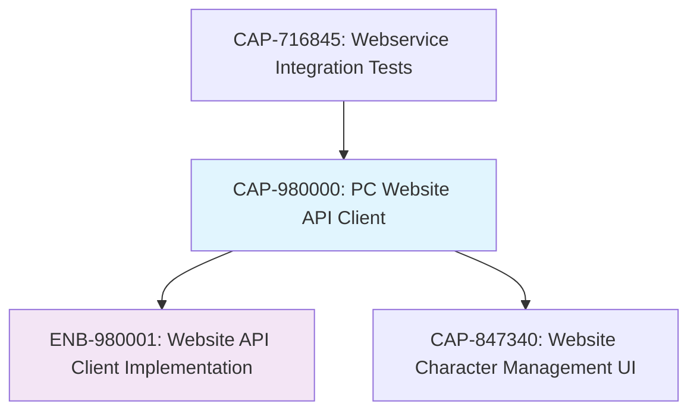

# PC Website API Client

## Metadata

- **Name**: PC Website API Client
- **Type**: Capability
- **System**: pc
- **Component**: web-site
- **ID**: CAP-980000
- **Approval**: Approved
- **Owner**: Development Team
- **Status**: Ready for Implementation
- **Priority**: High
- **Analysis Review**: Required

## Technical Overview
### Purpose
Create a client-side JavaScript/TypeScript library that wraps all API calls to the PC webservice, providing a clean interface for the website to interact with character data through the REST API.

## Enablers

| Enabler ID | Description |
|------------|-------------|
| ENB-980001 | Website API Client Implementation |

## Dependencies

### Internal Upstream Dependency

| Capability ID | Description |
|---------------|-------------|
| CAP-716845 | Webservice Integration Tests |

### Internal Downstream Impact

| Capability ID | Description |
|---------------|-------------|
| CAP-847340 | Website Character Management UI |

### External Dependencies

**External Upstream Dependencies**: REST API, HTTP Client (fetch/XMLHttpRequest)

**External Downstream Impact**: Website user interface components

## Technical Specifications

### Capability Dependency Flow Diagram



### API Operations to Wrap

#### Character CRUD Operations
- **Create Character**: POST /api/characters
- **Get Character**: GET /api/characters/{id}
- **List Characters**: GET /api/characters (with pagination)
- **Update Character**: PUT /api/characters/{id}
- **Delete Character**: DELETE /api/characters/{id}

### Client Interface Requirements

#### Core Functionality
- Asynchronous API calls with Promise-based interface
- Automatic JSON serialization/deserialization
- Error handling and user-friendly error messages
- Request/response logging for debugging
- Configurable base URL for different environments

#### Data Types
- Character model matching webservice API
- Pagination metadata for list operations
- Error response structures
- Request/response type definitions

#### Error Handling
- Network error handling (connection failures, timeouts)
- HTTP error status code handling (400, 404, 500, etc.)
- Validation error parsing and display
- Retry logic for transient failures

## Implementation Approach

### Technology Stack
- **Language**: TypeScript for type safety
- **HTTP Client**: Native fetch API or axios
- **Build Tool**: Webpack/Vite for bundling
- **Testing**: Jest for unit tests, integration tests

### Project Structure
```
website/
├── src/
│   ├── api/
│   │   ├── client.ts          # Main API client class
│   │   ├── character.ts       # Character-specific API methods
│   │   ├── types.ts           # TypeScript type definitions
│   │   └── errors.ts          # Error handling utilities
│   └── utils/
│       └── http.ts            # HTTP utilities
├── tests/
│   ├── unit/                  # Unit tests
│   └── integration/           # Integration tests
└── package.json
```

### Key Components

#### API Client Class
```typescript
class CharacterAPIClient {
  constructor(baseURL: string, options?: ClientOptions)

  // CRUD operations
  createCharacter(character: Character): Promise<Character>
  getCharacter(id: string): Promise<Character>
  getCharacters(params?: ListParams): Promise<CharacterList>
  updateCharacter(id: string, character: Character): Promise<Character>
  deleteCharacter(id: string): Promise<void>
}
```

#### Type Definitions
```typescript
interface Character {
  id: string
  name: string
  // ... other character fields
}

interface CharacterList {
  characters: Character[]
  pagination: {
    page: number
    limit: number
    total: number
    hasNext: boolean
    hasPrev: boolean
  }
}

interface APIError {
  message: string
  status: number
  details?: any
}
```

## Quality Assurance

### Testing Strategy
- **Unit Tests**: Mock HTTP responses for individual API methods
- **Integration Tests**: Test against running webservice instance
- **Error Scenarios**: Test network failures, invalid responses, server errors
- **Type Safety**: Full TypeScript coverage with strict mode

### Performance Requirements
- Response times under 500ms for typical operations
- Efficient pagination handling for large character lists
- Minimal bundle size impact on website loading
- Caching strategy for frequently accessed data

## Success Criteria

### Functional Completeness
- All webservice API endpoints wrapped with client methods
- Consistent error handling across all operations
- Type-safe interfaces matching webservice contracts
- Comprehensive test coverage (90%+)

### Technical Excellence
- Clean, maintainable TypeScript code
- Proper error boundaries and user feedback
- Environment-specific configuration support
- Documentation for all public APIs

### Integration Readiness
- Compatible with existing website build process
- Easy integration with UI components
- Proper dependency management
- Version compatibility with webservice API