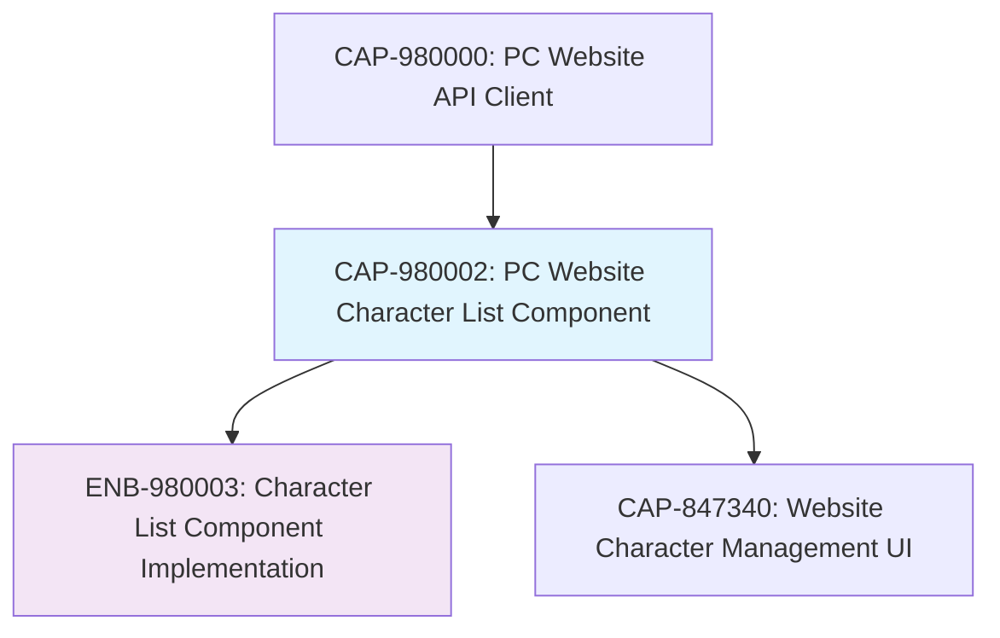

# PC Website Character List Component

## Metadata

- **Name**: PC Website Character List Component
- **Type**: Capability
- **System**: pc
- **Component**: web-site
- **ID**: CAP-980002
- **Approval**: Approved
- **Owner**: Development Team
- **Status**: Ready for Implementation
- **Priority**: High
- **Analysis Review**: Required

## Technical Overview
### Purpose
Create a responsive, tiled list component for displaying all player characters with pagination, where each character is shown in an identifiable tile with basic information and an edit link. The component will use the PC Website API Client to fetch character data.

## Enablers

| Enabler ID | Description |
|------------|-------------|
| ENB-980003 | Character List Component Implementation |

## Dependencies

### Internal Upstream Dependency

| Capability ID | Description |
|---------------|-------------|
| CAP-980000 | PC Website API Client |

### Internal Downstream Impact

| Capability ID | Description |
|---------------|-------------|
| CAP-847340 | Website Character Management UI |

### External Dependencies

**External Upstream Dependencies**: React/Vue/Angular framework, CSS Grid/Flexbox

**External Downstream Impact**: Website user experience, character management workflow

## Technical Specifications

### Capability Dependency Flow Diagram



### User Interface Requirements

#### Layout and Design
- **Tile Layout**: Responsive grid of character tiles
- **Pagination**: 20 characters per page with navigation controls
- **Responsive**: Adapts to different screen sizes (mobile, tablet, desktop)
- **Loading States**: Skeleton loading, error states, empty states

#### Character Tile Content
- **Basic Information**: Character name, race, class, level
- **Visual Design**: Card-based design with hover effects
- **Edit Link**: Prominent call-to-action for editing character
- **Accessibility**: Proper ARIA labels and keyboard navigation

#### Navigation and Interaction
- **Pagination Controls**: Previous/Next buttons, page numbers
- **Search/Filter**: Optional character name search (future enhancement)
- **Sorting**: Optional sorting by name, level, etc. (future enhancement)

### Data Integration

#### API Client Usage
- **Data Source**: CharacterAPIClient.getCharacters() method
- **Pagination**: Proper page/limit parameter handling
- **Error Handling**: Network errors, empty results, server errors

#### Data Display
- **Character Fields**: Display all available character information
- **Data Formatting**: Proper formatting for levels, dates, etc.
- **Image Support**: Placeholder for future character avatars/portraits

## Implementation Approach

### Technology Stack
- **Framework**: React/Vue/Angular (consistent with existing website)
- **Styling**: CSS Modules, Styled Components, or Tailwind CSS
- **State Management**: React Context, Vuex, or NgRx
- **Routing**: React Router, Vue Router, or Angular Router

### Component Architecture

```
CharacterList/
├── CharacterList.tsx          # Main list component
├── CharacterTile.tsx          # Individual character tile
├── Pagination.tsx             # Pagination controls
├── LoadingSkeleton.tsx        # Loading state component
├── EmptyState.tsx             # Empty state component
├── hooks/
│   ├── useCharacterList.ts    # Data fetching hook
│   └── usePagination.ts       # Pagination logic hook
├── types.ts                   # Component type definitions
└── styles/
    ├── CharacterList.module.css
    ├── CharacterTile.module.css
    └── Pagination.module.css
```

### Key Components

#### CharacterList Component
```typescript
interface CharacterListProps {
  pageSize?: number;
  onCharacterEdit?: (characterId: string) => void;
}

const CharacterList: React.FC<CharacterListProps> = ({
  pageSize = 20,
  onCharacterEdit
}) => {
  // Component implementation
};
```

#### CharacterTile Component
```typescript
interface CharacterTileProps {
  character: Character;
  onEdit: (characterId: string) => void;
}

const CharacterTile: React.FC<CharacterTileProps> = ({
  character,
  onEdit
}) => {
  return (
    <div className="character-tile">
      <h3>{character.name}</h3>
      <p>{character.race} {character.class}</p>
      <p>Level {character.level}</p>
      <button onClick={() => onEdit(character.id!)}>
        Edit Character
      </button>
    </div>
  );
};
```

#### Pagination Component
```typescript
interface PaginationProps {
  currentPage: number;
  totalPages: number;
  onPageChange: (page: number) => void;
}

const Pagination: React.FC<PaginationProps> = ({
  currentPage,
  totalPages,
  onPageChange
}) => {
  // Pagination implementation
};
```

## Data Flow

### State Management
1. **Initial Load**: Fetch first page of characters on component mount
2. **Pagination**: Update page parameter and refetch data
3. **Error Handling**: Display error messages and retry options
4. **Loading States**: Show skeleton loaders during data fetching

### API Integration
```typescript
// Custom hook for character list data
const useCharacterList = (page: number, limit: number) => {
  const [characters, setCharacters] = useState<Character[]>([]);
  const [pagination, setPagination] = useState<PaginationInfo | null>(null);
  const [loading, setLoading] = useState(false);
  const [error, setError] = useState<string | null>(null);

  useEffect(() => {
    const fetchCharacters = async () => {
      setLoading(true);
      setError(null);

      try {
        const client = new CharacterAPIClient(API_BASE_URL);
        const result = await client.getCharacters({ page, limit });

        setCharacters(result.characters);
        setPagination(result.pagination);
      } catch (err) {
        setError(err.message);
      } finally {
        setLoading(false);
      }
    };

    fetchCharacters();
  }, [page, limit]);

  return { characters, pagination, loading, error };
};
```

## Responsive Design

### Breakpoints
- **Mobile** (< 768px): Single column, stacked tiles
- **Tablet** (768px - 1024px): 2-3 columns
- **Desktop** (> 1024px): 4-5 columns

### Touch Interactions
- **Swipe**: Horizontal swipe for pagination on mobile
- **Tap**: Character tile tap to view/edit
- **Long Press**: Context menu options (future enhancement)

## Accessibility

### WCAG Compliance
- **Keyboard Navigation**: Tab through tiles and pagination
- **Screen Reader**: Proper ARIA labels and descriptions
- **Color Contrast**: High contrast ratios for text and backgrounds
- **Focus Indicators**: Visible focus outlines

### Semantic HTML
- **List Structure**: Use proper list semantics
- **Heading Hierarchy**: Appropriate heading levels
- **Button Roles**: Proper button/link semantics

## Performance Considerations

### Optimization Strategies
- **Virtual Scrolling**: For very large character lists (future enhancement)
- **Image Lazy Loading**: When character portraits are added
- **Memoization**: React.memo for tile components
- **Debounced Search**: For search functionality (future enhancement)

### Loading Performance
- **Skeleton Screens**: Immediate feedback during loading
- **Progressive Loading**: Load visible tiles first
- **Caching**: Browser caching for static assets

## Testing Strategy

### Component Testing
- **Unit Tests**: Individual component rendering and interactions
- **Integration Tests**: API integration and data flow
- **Visual Tests**: Responsive design across breakpoints

### User Experience Testing
- **Usability Testing**: Character identification and navigation
- **Performance Testing**: Loading times and responsiveness
- **Accessibility Testing**: Screen reader compatibility

## Success Criteria

### Functional Completeness
- Display all characters in responsive tile layout
- Pagination working with 20 characters per page
- Edit links functional for each character
- Proper error handling and loading states

### Technical Excellence
- Clean, maintainable component code
- Responsive design across all devices
- Full accessibility compliance
- Performance optimized for large character lists

### User Experience
- Intuitive navigation and interaction patterns
- Fast loading and smooth transitions
- Clear visual hierarchy and information architecture
- Consistent with overall website design system