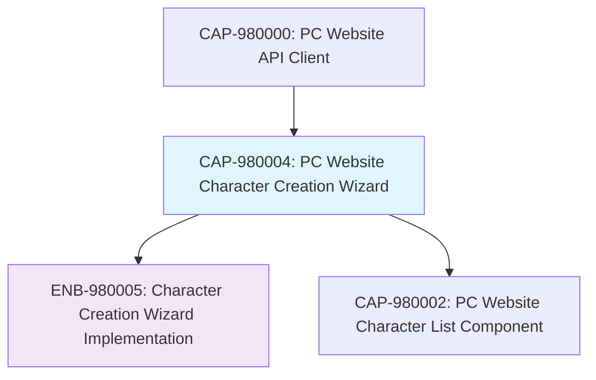

# PC Website Character Creation Wizard

## Metadata

- **Name**: PC Website Character Creation Wizard
- **Type**: Capability
- **System**: pc
- **Component**: web-site
- **ID**: CAP-980004
- **Approval**: Approved
- **Owner**: Development Team
- **Status**: Ready for Implementation
- **Priority**: High
- **Analysis Review**: Required

## Technical Overview
### Purpose
Create a comprehensive, user-friendly character creation wizard that guides users through building a D&D 5e character in logical steps, with validation at each step and final submission to the PC Website API Client.

## Enablers

| Enabler ID | Description |
|------------|-------------|
| ENB-980005 | Character Creation Wizard Implementation |

## Dependencies

### Internal Upstream Dependency

| Capability ID | Description |
|---------------|-------------|
| CAP-980000 | PC Website API Client |

### Internal Downstream Impact

| Capability ID | Description |
|---------------|-------------|
| CAP-980002 | PC Website Character List Component |

### External Dependencies

**External Upstream Dependencies**: Character schema validation, Form libraries

**External Downstream Impact**: Character creation user experience, data quality

## Technical Specifications

### Capability Dependency Flow Diagram



### Wizard Flow Design

#### Step 1: Basic Information
- **Character Name**: Required, unique identifier
- **Player Name**: Optional, player identification
- **Race Selection**: Required, with subrace options
- **Validation**: Name format, race/subrace compatibility

#### Step 2: Class Selection
- **Primary Class**: Required, main character class
- **Subclass**: Optional, class specialization
- **Multiclass Options**: Optional, additional classes with levels
- **Validation**: Class requirements, level distribution

#### Step 3: Ability Scores
- **Score Assignment**: Strength, Dexterity, Constitution, Intelligence, Wisdom, Charisma
- **Point Buy System**: Standard array or point buy method
- **Racial Bonuses**: Automatic application of racial ability score increases
- **Validation**: Score ranges (8-20), racial bonus application

#### Step 4: Background & Details
- **Background Selection**: Character background with associated features
- **Alignment**: Moral and ethical alignment
- **Starting Level**: Character level (default: 1)
- **Experience Points**: Starting XP (default: 0)
- **Validation**: Background features, alignment consistency

### Validation & Error Handling

#### Schema Validation
- **Real-time Validation**: Instant feedback as user types/selects
- **Step Validation**: Complete validation before allowing progression
- **Cross-field Validation**: Dependencies between selections
- **Server-side Validation**: Final validation before API submission

#### Error Presentation
- **Clear Messages**: Human-readable error descriptions
- **Field Highlighting**: Visual indicators for invalid fields
- **Help Text**: Contextual guidance for corrections
- **Progressive Disclosure**: Show errors only after user interaction

### User Experience

#### Navigation & Flow
- **Linear Progression**: Step-by-step wizard with clear progression
- **Back Navigation**: Allow returning to previous steps for edits
- **Progress Indicator**: Visual progress bar showing completion status
- **Save Draft**: Optional draft saving for incomplete characters

#### Data Persistence
- **Session Storage**: Maintain wizard state during creation
- **Form Recovery**: Restore data if user navigates away accidentally
- **Validation State**: Remember validation status for each step

## Implementation Approach

### Technology Stack
- **Framework**: React with TypeScript
- **Form Management**: React Hook Form with Zod validation
- **Wizard Logic**: Custom step management with context/state
- **Validation**: Zod schema validation matching character schema
- **Styling**: CSS Modules or styled-components

### Component Architecture

```
CharacterCreationWizard/
├── CharacterCreationWizard.tsx     # Main wizard container
├── WizardStep.tsx                  # Generic step wrapper
├── StepNavigation.tsx              # Next/Previous buttons
├── ProgressIndicator.tsx           # Step progress display
├── steps/
│   ├── BasicInfoStep.tsx           # Step 1: Name, race, etc.
│   ├── ClassStep.tsx               # Step 2: Class selection
│   ├── AbilityScoresStep.tsx       # Step 3: Ability score assignment
│   └── BackgroundStep.tsx          # Step 4: Background & details
├── validation/
│   ├── characterSchema.ts          # Zod validation schemas
│   ├── stepValidation.ts           # Step-specific validation
│   └── errorMessages.ts            # User-friendly error messages
├── hooks/
│   ├── useWizard.ts                # Wizard state management
│   ├── useCharacterCreation.ts     # Character data management
│   └── useValidation.ts            # Validation state management
├── utils/
│   ├── abilityScoreCalculator.ts   # Point buy calculations
│   ├── racialBonuses.ts            # Race ability bonuses
│   └── characterDefaults.ts        # Default values
└── styles/
    ├── CharacterCreationWizard.module.css
    ├── WizardStep.module.css
    └── StepNavigation.module.css
```

### Key Components

#### CharacterCreationWizard
```typescript
interface CharacterCreationWizardProps {
  onComplete: (character: Character) => void;
  onCancel: () => void;
  initialData?: Partial<Character>;
}

const CharacterCreationWizard: React.FC<CharacterCreationWizardProps> = ({
  onComplete,
  onCancel,
  initialData
}) => {
  // Wizard implementation with step management
};
```

#### WizardStep Wrapper
```typescript
interface WizardStepProps {
  title: string;
  description?: string;
  isValid: boolean;
  children: React.ReactNode;
  onNext?: () => void;
  onPrevious?: () => void;
  isFirstStep?: boolean;
  isLastStep?: boolean;
}

const WizardStep: React.FC<WizardStepProps> = ({
  title,
  description,
  isValid,
  children,
  onNext,
  onPrevious,
  isFirstStep,
  isLastStep
}) => {
  // Step wrapper with validation and navigation
};
```

### Validation Strategy

#### Zod Schema Validation
```typescript
// Basic info validation
const basicInfoSchema = z.object({
  characterName: z.string()
    .min(1, "Character name is required")
    .max(50, "Character name must be 50 characters or less")
    .regex(/^[a-zA-Z\s'-]+$/, "Character name contains invalid characters"),
  playerName: z.string().optional(),
  race: z.enum(raceOptions, "Please select a valid race"),
  subrace: z.string().optional()
});

// Ability scores validation
const abilityScoresSchema = z.object({
  strength: z.number().min(8).max(20),
  dexterity: z.number().min(8).max(20),
  constitution: z.number().min(8).max(20),
  intelligence: z.number().min(8).max(20),
  wisdom: z.number().min(8).max(20),
  charisma: z.number().min(8).max(20)
}).refine(scores => {
  // Point buy validation logic
  return calculatePointCost(scores) <= 27;
}, "Ability score combination exceeds point buy limit");
```

#### Step-by-Step Validation
- **Immediate Feedback**: Validate as user types
- **Step Completion**: Full validation before next step
- **Progressive Validation**: Build upon previous step validations
- **Final Submission**: Complete character validation before API call

## Data Management

### Character Data Structure
```typescript
interface CharacterCreationData {
  // Step 1: Basic Info
  characterName: string;
  playerName?: string;
  race: string;
  subrace?: string;

  // Step 2: Class
  class: string;
  subclass?: string;
  multiclass?: Array<{
    class: string;
    subclass?: string;
    level: number;
  }>;

  // Step 3: Ability Scores
  abilityScores: {
    strength: number;
    dexterity: number;
    constitution: number;
    intelligence: number;
    wisdom: number;
    charisma: number;
  };

  // Step 4: Background & Details
  background?: string;
  alignment?: string;
  level: number;
  experiencePoints: number;
}
```

### State Management
- **Wizard State**: Current step, completion status, navigation history
- **Character Data**: Accumulating character data across steps
- **Validation State**: Per-field and per-step validation status
- **UI State**: Loading states, error states, success states

## API Integration

### Submission Process
1. **Final Validation**: Complete character schema validation
2. **Data Transformation**: Convert wizard data to API format
3. **API Submission**: Call CharacterAPIClient.createCharacter()
4. **Response Handling**: Success navigation or error display
5. **Error Recovery**: Allow user to fix issues and retry

### Error Scenarios
- **Validation Errors**: Schema violations with field-specific messages
- **Network Errors**: Connection issues with retry options
- **Server Errors**: API failures with user-friendly explanations
- **Duplicate Names**: Character name conflicts

## Accessibility & UX

### Keyboard Navigation
- **Tab Order**: Logical navigation through form fields
- **Enter/Submit**: Progress through steps and submit forms
- **Escape**: Cancel wizard or clear selections
- **Arrow Keys**: Navigate dropdowns and radio buttons

### Screen Reader Support
- **Step Announcements**: Current step and progress announcements
- **Field Descriptions**: ARIA labels and descriptions for all inputs
- **Error Announcements**: Screen reader error notifications
- **Progress Updates**: Step completion status updates

### Visual Design
- **Step Indicators**: Clear visual progress representation
- **Validation States**: Success/error visual feedback
- **Responsive Layout**: Mobile-friendly wizard design
- **Consistent Styling**: Match overall website design system

## Testing Strategy

### Component Testing
- **Wizard Flow**: Step navigation and state management
- **Form Validation**: Field-level and step-level validation
- **Error Handling**: Various error scenarios and recovery
- **API Integration**: Mock API responses and error handling

### User Experience Testing
- **Accessibility**: Screen reader and keyboard navigation
- **Mobile Experience**: Touch interactions and responsive design
- **Error Recovery**: User ability to fix validation errors
- **Performance**: Wizard loading and validation performance

## Success Criteria

### Functional Completeness
- Complete 4-step character creation wizard
- Full character schema validation at each step
- Successful API submission with proper error handling
- All required and optional character fields supported

### User Experience Excellence
- Intuitive step-by-step character creation
- Clear validation messages and error recovery
- Responsive design for all devices
- Accessibility compliance (WCAG 2.1 AA)

### Technical Quality
- Type-safe TypeScript implementation
- Comprehensive test coverage (90%+)
- Clean, maintainable component architecture
- Performance optimized for smooth user experience

### Data Integrity
- Complete validation against character schema
- Prevention of invalid character creation
- Proper error handling and user feedback
- Successful integration with character list display