# PC Website Character Editing Wizard

## Metadata

- **Name**: PC Website Character Editing Wizard
- **Type**: Capability
- **System**: pc
- **Component**: web-site
- **ID**: CAP-980006
- **Approval**: Approved
- **Owner**: Development Team
- **Status**: Approved
- **Priority**: High
- **Analysis Review**: Not Required

## Technical Overview
### Purpose
[What is the purpose?]

## Enablers

| Enabler ID |
|------------|
| |

## Dependencies

### Internal Upstream Dependency

| Capability ID | Description |
|---------------|-------------|
| | |

### Internal Downstream Impact

| Capability ID | Description |
|---------------|-------------|
| | |

### External Dependencies

**External Upstream Dependencies**: React, TypeScript, React Hook Form, Zod

**External Downstream Impact**: Character data management, user workflow consistency

## Technical Specifications (Template)

### Capability Dependency Flow Diagram
> **Note for AI**: When designing this section, show the direct relationships and dependencies between capabilities (NOT enablers). Focus on capability-to-capability interactions, business value flows, and how capabilities work together to deliver end-to-end business outcomes. Include:
> - **Current Capability**: The capability being defined and its role in the business value chain
> - **Internal Dependencies**: Dependencies on other capabilities within the same organizational boundary/domain
> - **External Dependencies**: Dependencies on capabilities across organizational boundaries.
> - **Business Flow**: How business value and data flows between capabilities
> - **Exclude**: Enabler-level details, technical implementation specifics, infrastructure components

```mermaid
flowchart TD
    %% Current Capability
    CURRENT["Current Capability<br/>Primary Business Function<br/>🎯"]
    
    %% Internal Capabilities (Same Organization)
    INT1["Supporting Capability A<br/>Core Service<br/>⚙️"]
    INT2["Supporting Capability B<br/>Data Management<br/>📊"]
    INT3["Supporting Capability C<br/>Business Logic<br/>🔧"]
    
    %% External Capabilities (Different Organization)
    EXT1["External Capability A<br/>Third-party Service<br/>🌐"]
    EXT2["External Capability B<br/>Integration Point<br/>🔗"]
    
    %% Internal Dependencies Flow
    INT1 --> CURRENT
    CURRENT --> INT2
    INT2 --> INT3
    
    %% External Dependencies Flow
    EXT1 --> CURRENT
    CURRENT --> EXT2
    
    %% Styling
    classDef current fill:#e3f2fd,stroke:#1976d2,stroke-width:3px
    classDef internal fill:#e8f5e8,stroke:#388e3c,stroke-width:2px
    classDef external fill:#f3e5f5,stroke:#7b1fa2,stroke-width:2px
    
    class CURRENT current
    class INT1,INT2,INT3 internal
    class EXT1,EXT2 external
    
    %% Capability Grouping
    subgraph ORG1 ["Internal Organization"]
        subgraph DOMAIN1 ["Current Domain"]
            CURRENT
        end
        subgraph DOMAIN2 ["Supporting Domain"]
            INT1
            INT2
            INT3
        end
    end
    
    subgraph ORG2 ["External Organization"]
        EXT1
        EXT2
    end
```

